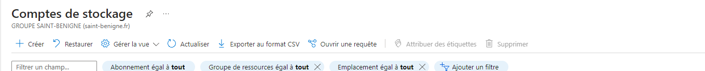

AM

1.  Choisir un template bootstrap
    1.  Qu'est-ce que bootstrap

Un Boostrap est un framework open-source pour le development web. Il est utilisé en fichier css et javascript permettant de fournir une collection de style de modèles de conception tel que bouton, grille, formulaires, et modèles de navigation.

2.  Où trouver un template
Ils existent plusieurs sites avec des exemples différents de templates :

- [Accueil - Canva](https://www.canva.com/)
- [Free Templates - Download Designs, Docs, Forms \| Template.net](https://www.template.net/)
1.  Comment le modifier

Avant de modifier un template il faut s'assurer que toute extension est installez sur l'IDE qui permettera de modifier le templates

Ouvrez visual studio code

Assurez-vous d'avoir télécharger le templates et qu'il soit sur Vscode

Télécharger l'extension Live server ou five server

Dans visual studio code recherché dans le menu extension en bas à gauche recherchez dans le menu zone de recherche et cliquez sur l'extension live server

Si Live server est installer vous pouvez commencez à créer votre repos sur Azure dev ops

Rendez-vous sur le site <https://dev.azure.com/>

Démarrer en session gratuite

Puis créer un nouveau project si ce n'est pas déjà fait dans new project

Dans le nouveau projet séléctionez dans version control " Git " et Work item process "Basic" puis cliquez sur create

Créer un nouveau repo on peut le nommé par exemple " portfolio sites "

En repository type " Git "

Dans add .gitignore dans none sélectionnez " VisualStudio "

Ensuite cliquez sur create

Une fois que le repos est créer

Cloner le repos pour enregistrer les projet à ajouter dans azure dev ops

Cloner à partir de visual studio code

Cliquez sur "clone in VS code"

Cliquer sur "open"

Cliquez une nouvelle fois sur open sur VScode

Sélectionner le répertoire pour le repos

Patientez quelque instant

Cliquez une nouvelle fois sur open

Cliquez sur "Yes, I trust the authors"'

Glisser le contenu template sur le repos puis effectuer un commit sur la branch

Ensuite créer un commit pour préparer l'envoie des fichiers

Pour trouver un element à modifier sur une page HTML sur le petit curseur avec un rectangle arondi

Déployer un site web sur Azure portal connectez vous sur azure portal cliquez sur commencez gratuitement

Dans le menu accueil d'azure allez en haut à gauche sur les trois traits un menu déroulant apparaît cliquez sur espace de stockage

Dans le menu compte de stockage cliquez sur créer

L'outil de création de compte de stockage démarre

Laisser par défaut Azure for students, nommez un nouveau groupe de ressource par exemple "portfolio"
Région méter europe central france
Nom le nom du compte de stockage du site et laisser par défaut standard en performances et géoredondant (GRS) en redondance ainsi que les avancé réseau protection des données chiffrement étiquettes verifier.

Une fois que la vérification est terminé cliquer sur créer

Dans le menu acceuille deux ressources sont ajouté aller dans votre compte de stockage

Dans l'espace compte de stockage aller dans gestions de données cliquer sur site web statique en décédant au milieu

Dans sites web statique par défaut l'option est désactivé il faut l'activé pour publier la page web une fois que cela est fait

Allez dans naviguateur de fichier tout en haut

Le contenu pour permettre de mettre la page web va être placer par défaut dans \$web

Placer tous les fichier que vous voulez publier sur le web en cliquant sur charger

Glisser et déposser tous les fichier à ajouté

Retournez sur site web statique

Sur le site un url principal et secondaire à été créer pour accordé l'accès à tous le monde de votre site

Ajouter le fichier principal de votre page web par exemple index.html puis enregistrer

Normalement si vous copier votre page html le lien devrait fonctionner et se diriger vers votre site que vous avez créer.

1.  Mettre son site en ligne
    2.  Azure
3.  Modifier votre template afin d'avoir un menu
1.  Il doit comporter toutes les entrées que nous avons déterminées
