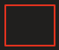
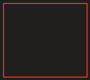
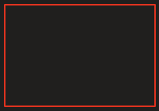
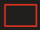

- Recentrer les principes des modèle Agile

1.  Définir un sprint qui consiste à réaliser une étape dans le projet

2.  Définir les étapes importantes (les besoins = (RU Récit utilisateur) US)

\+ Critères d'acceptance

3.  Les tâche qui correspond à un individue et un correspondant.

Un concept de jeux qui permet de découvrir notre projet en imposant des question

Problématique : Pourquoi votre projet est important ?

4.  Architecture

DATA

Client

DATA

applications

Jeux

Architecture du sprint 1

QR .json

BR.json
C#

Unity

Site web

2/10

1.  Définir les question sur Unity

2.  Définir les réponse sur Unity

3.  Déployer le site

4.  Communiquer

5.  Déployer

6.  Afficher la question

7.  Ranger des réponses sur le serveur

8.  Envoyer ses réponses

9.  Calculer les réponses

10. Afficher les réponses

Tager les compétence B1 R.U B2 Les tâches

