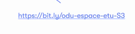

-------------------------------------------------------------------------------------------

Conférence Lattitude

Participation de l'open Data

Consiste à travailler dans l'écosystème pour la réutilisation des données

L'objectif est de relevez les défis en choissisant une thématique

Notion :  

[**https://bit.ly/odu-inscription-etus**](https://bit.ly/odu-inscription-etus)

*À partir de l’adresse \<<https://fr2.octoconf.com/html5client/join?sessionToken=uv7g683uq7wld1x2>\>*

Dévelopement de la partie graphique du site en graphique du projet.

Pour les composants

Acertenity UI

<https://ui.shadcn.com/docs>

