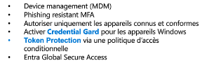
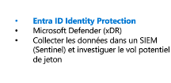
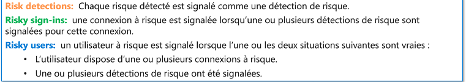
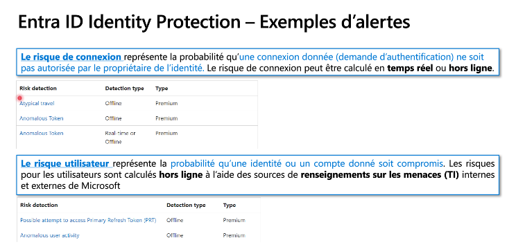
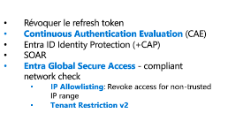

Chrisophe Guerre Cloud solution architect

Haifa Bouraoui

Jenner Vernal

Qu'est ce qu'un jeton d'authentification ?

Un jeton permet d'authentifier des utilisateurs

Jeton de type biral donc considérer comme authentifier.

Authentification artifacts

Permet la connexion au session, à une long periode de vie, il peut être réactualiser.

PRT (Primary Refresh Token) est combiné par une session

Pourquoi protéger les jetons ?

Les jetons doivent être protéger en raison des attaques sur internet utilisant des grand moyen pour récupérer les jetons d'accès.

On peut sité plusieurs attaques :

Post authentification Ataks, MFA attacks

Adeversary-in-the-midlle (AitM)
C'est une attaque malvaillante qui insérer une infrastructure entre l'utilisateur et l'pplication légitime à laquelle l'utilisateur tente d'accèder.

Pass the cookie attack
Récupere le jeton, un cookie est créer

Comment protéger les jeton d'authentification ?

La base vise à protéger, détecter et répondre

Credential Guard

Permet de sécurisé des jeton, c'est une technologie
Qui créait des lieu virtuel pour empêcher au attanquant d'accèder au donné.

Utilisation des technologies de virtualisation
Création d'une zone sécuriser

Zone protégée
Les informations d'identification sont innaccessibles aux applications

Protection contre les attaques
Protection contre les attaques par copie de mémoire, rendant les tentatives d'accès non autorisé

Activation par défaut
Système d'OS à jour et récent

Politique de token protection pour entra sign in sessions

Il ne peuvent pas utilisés sans clé de liaison de l'appareil

Passage au jeton liés au lieu de jetons d'authentiication.

Entra Sign in Sessions

Token Protection

Permet d'utiliser des jeton pour sécurisé les authentification .

Détection

Uitlisation d'outil pour la gestion d'incident

Identity Protection :

Permet d'analyser le risque sur le statut de l'utilisateur, les risques de connexion ainsi que les risque d'application.

Réponse

Continuous Authentification Evaluation

Verifie les fuites de mot de passe pour le réinitialiser ou le changé
Changement d'utilisateur.

Global Secure Access

Se sont des solutions de sécurité pour empêcher le vole de jteon

Entra Internet Acess
Permet de protéger des trafic internet

Entra private Accesss
Avoir un accès à toutes applications et ressources privés

Focus sur Microsoft Entra Internet Access

Créer des tunel pour l'accès au application office

Universal TRv2 Data Layer Protection

Permet de bloquer les demande d'enthentification en dehors de SSE

L'utilisateur obtient un jeton valide depuis un IDP tiers

L'utilisateur copie le jeton

Verification de la conformité du réseau

Arrêter le contournement d'une ile de sécurité par l'utilisateur et se protégez des vol de jeton.

Global Secure Access: Universal Continuous Acess

Ip Allowlisting : Location

Limittation des connexion de session, restriction des sessions d'application.

