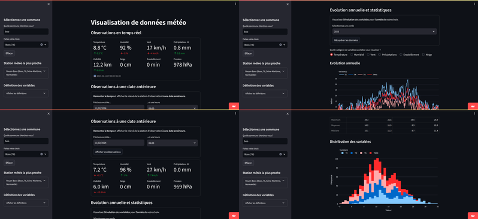

Projet map API

[Map at a specified location - Maps API for JavaScript - HERE Developer](https://developer.here.com/documentation/examples/maps-js)

- Données météo :

Donné mentiel depuis l'année 1996 en code ASCII

- Température
- Prévision météorologique
- Vent
- Carte météorologique

Script d'aide pour nextjs

[next-learn/dashboard/final-example at main · vercel/next-learn (github.com)](https://github.com/vercel/next-learn/tree/main/dashboard/final-example)

Canva

<https://www.canva.com/design/DAGQi1AeyIA/b7LTfYKLbdVqknY7e1mXmw/edit>

Next.js

[Learn Next.js: Getting Started \| Next.js (nextjs.org)](https://nextjs.org/learn/dashboard-app/getting-started)

Objectif :

Recherche des différentes données que l'on peut introduire dans notre projet Meteo

Analyse des différents outils à utiliser

Voir site :

[MétéoViz · visualisation des données d'observation à partir des API de Météo-France - data.gouv.fr](https://www.data.gouv.fr/fr/reuses/meteoviz-visualisation-des-donnees-dobservation-a-partir-des-api-de-meteo-france/)

Ceci est une API permettant de visualiser la température,humidité, la force… . Cet API ce base sur des informations en temps réelle et années précédente.

Il suffit simplement d'entrer une commune au choix pour visualiser les données météorologique.

