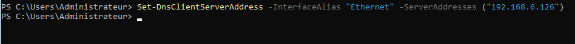

AM

ouvrir le pare feu sur invite de commande

*From \<<https://chat.openai.com/c/ba2429ae-130b-43c1-8ef6-6bbdea3b6878>\>*

Pour ouvrir le pare-feu Windows via l'invite de commande sur un serveur Windows Server 2022, vous pouvez utiliser l'utilitaire Netsh. Voici comment ouvrir le pare-feu à l'aide de Netsh :

1\. \*\*Ouvrir une invite de commande en tant qu'administrateur\*\* :
\- Cliquez avec le bouton droit sur le menu Démarrer et sélectionnez "Invite de commandes (Admin)" ou "Windows PowerShell (Admin)".

2\. \*\*Afficher l'état actuel du pare-feu\*\* (optionnel) :
\- Pour afficher l'état actuel du pare-feu, vous pouvez exécuter la commande suivante :
\`\`\`
netsh advfirewall show allprofiles
\`\`\`

3\. \*\*Activer le pare-feu\*\* :
\- Pour activer le pare-feu, exécutez la commande suivante :
\`\`\`
netsh advfirewall set allprofiles state on
\`\`\`

4\. \*\*Désactiver le pare-feu\*\* :
\- Pour désactiver le pare-feu, exécutez la commande suivante :
\`\`\`
netsh advfirewall set allprofiles state off
\`\`\`

5\. \*\*Ajouter une règle de pare-feu\*\* (optionnel) :
\- Si vous avez besoin d'ajouter des règles de pare-feu spécifiques, vous pouvez utiliser la commande \`netsh advfirewall firewall\` suivie des options appropriées. Par exemple, pour autoriser le trafic sur un port spécifique (par exemple, le port 80 pour HTTP), vous pouvez utiliser :
\`\`\`
netsh advfirewall firewall add rule name="HTTP" protocol=TCP dir=in localport=80 action=allow
\`\`\`

6\. \*\*Vérifier les règles de pare-feu\*\* (optionnel) :
\- Pour vérifier les règles de pare-feu configurées, vous pouvez utiliser la commande suivante :
\`\`\`
netsh advfirewall firewall show rule name=all
\`\`\`

7\. \*\*Fermer l'invite de commande\*\* :
\- Une fois que vous avez terminé, vous pouvez fermer l'invite de commande.

Ces commandes vous permettront de gérer le pare-feu Windows à partir de l'invite de commande sur Windows Server 2022. Assurez-vous d'exécuter ces commandes avec les privilèges administratifs appropriés.

Restart-Computer
