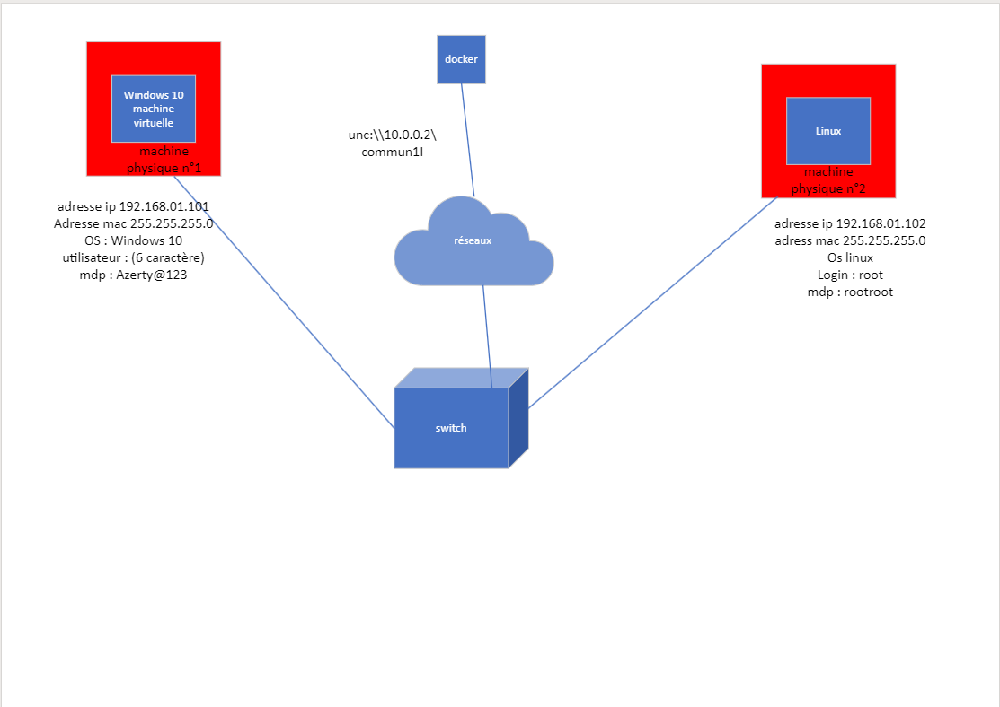

AM

Objectif du TD2 :

Réseau utiliser comme

P2P soit peer to peer soit poste à poste soit dans le domaine local WORKGROUP

Poste à poste

Viable si il y a \< 10 postes et \< utilisateurs

Les poste peuvent être client ou serveur

Cet fonction permet de déployer \< 10 utilisateur sur chaque poste

Sur 10 endroits différent

Aucune solution de centralisation

\< = moins

Client/serveur

Mettre un nombres possible d'utilisateurs par postes + serveur + pare-feu + AD (Active directory) qui est un annuaire. On peut

Créer des groupes

Ouverture d'horaire

Création de droit

Déploiement de logiciel automatique

4 machine adresse ip nom des machine et workgroup

Réseau

[Dessin2](https://groupesb-my.sharepoint.com/:u:/r/personal/alex_rigaud_saint-benigne_fr/_layouts/15/doc2.aspx?sourcedoc=%7B96FCCA3A-696E-4B47-8E54-199C01672F87%7D&file=Dessin2.vsdx&action=default&mobileredirect=true&DefaultItemOpen=1&ct=1697626896233&wdOrigin=OFFICECOM-WEB.MAIN.REC&cid=bbda635b-1025-4d4b-9951-5d41d59c7cd9&wdPreviousSessionSrc=HarmonyWeb&wdPreviousSession=5f0da0d1-3d1f-4534-9ca6-872774315964)

Groupe 4

Pas de workgroup pour linux installez samba

Ajouter un utilisateur et un mot de passe

Pour ajouter un groupe il faut aller dans gestion de l'ordinateur

Utilisateur et groupes

Dans le dossier groupes

Faite clique droit sur nouveau utilisateur

Pour ajouter on peut l'appeler par exemple Administratif

Ajouter l'utilisateur pour qu'il appartienne au groupe

za

