[Les éléments matériels qui semblent important sur le schéma – Copie.docx](resources/88a941e6a9b344a4b21170321fcfa607.docx)

Travail N°2

4.  **Qu'est ce que Virtual box ?**
VirtualBox est un logiciel permettant de faire de la virtualisation cet-à-dire créer des machine virtuelle sur un hôte développer par Oracle.

5.  **Qu'est ce qu'une machine hôte**

Une machine hôte est une machine réelle soit l'environnement principale sur lequel fonctionne un logiciel de virtualisation comme Vmware ou VirtualBox fonctionnent avec des composant tel que :

- Un processeur

- De la Mémoire vive RAM (random access mémory)

- Un disque dur

- Une carte réseau

- Un OS (operating system) comme Windows MacOs ou Linux

6.  **Qu'est ce qu'une machine virtuelle sous virtual box ?**

Une machine virtuelle sous VirtualBox est une machine simuler par VirtualBox qui est un logiciel d'hyperviseur. Une machine virtuelle est une machine isolé fonctionnant de façon autonome fonctionnant à l'intérieur de l'hôte dont VirtualBox ou VMWare est installé.

7.  **Qu'est ce qu'un disque virtuel ? Où est-il stocké ? Quel est son type ? Quelle capacité ?**

Un disque virtuel est créer sur un logiciel d'hyperviseur on peut généralement introduire une quantité de stockage en fonction de la capacité du disque de l'hôte généralement stocker sur un répertoire créer sur le logiciel son format est généralement en vdi sur virtualbox ou VMDK sur vmware elle peut comporter une grande capacité allant de 10 Go à 1To tous dépend de la taille du disque de la machine physique.

8.  **Que faut-il faire pour mettre en œuvre une machine virtuelle dans Virtual Box.**
**Citez les étapes.**

Etape 1 : Tous d'abord il faut télécharger virtualbox

Sur le site <https://www.virtualbox.org>

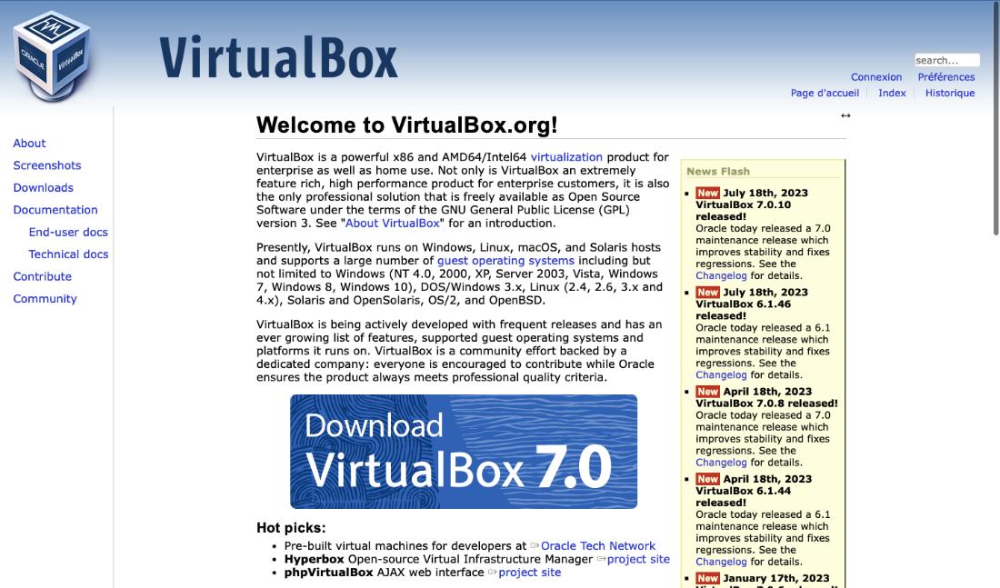

Exécuter le programme d'installation

Etape 2 : Télécharger une image ISO comme (Windows, Mac os ou Linux)

par exemple Windows

Etape 3 :Création d'une machine virtuelle

Cliquez sur le bouton "Nouvelle" dans la barre d'outils pour créer une nouvelle machine virtuelle.

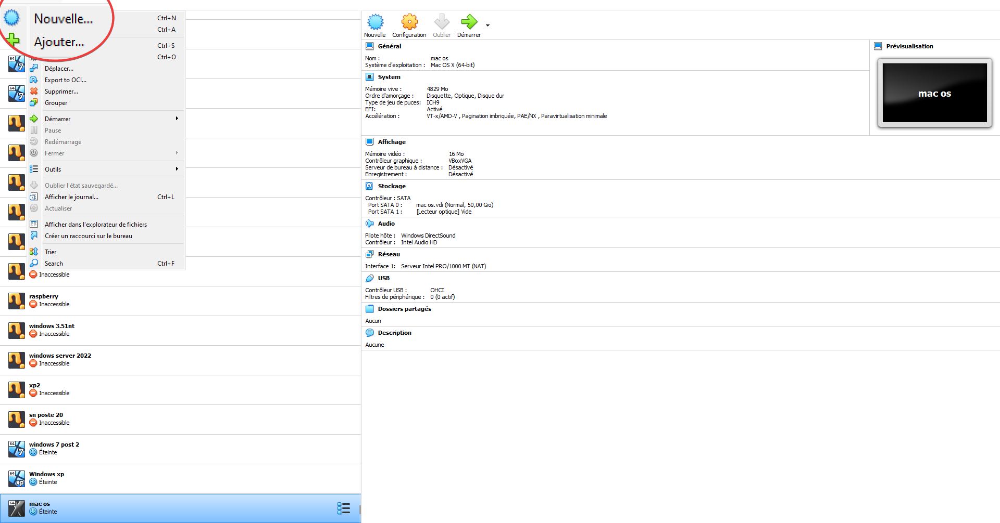

Suivez l'assistant de création de machine virtuelle. Vous devrez spécifier :
- Le nom de la machine virtuelle.
- Le type de système d'exploitation invité (par exemple, Windows, Linux, macOS).
- La version du système d'exploitation invité (par exemple, Windows 7, Ubuntu 20.04).
Ainsi que son architecture

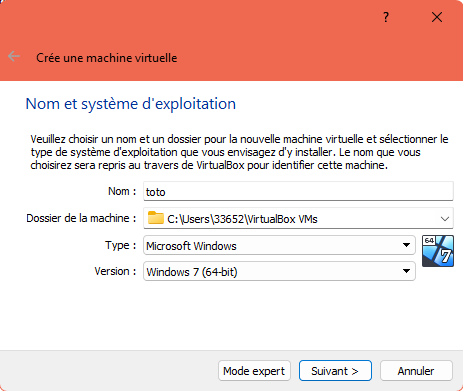

- La quantité de mémoire RAM allouée à la machine virtuelle.

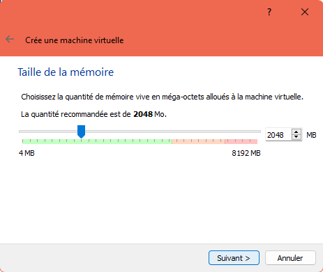

- L'utilisation d'un nouveau disque dur virtuel (création d'un disque virtuel) ou l'utilisation d'un disque existant. (par défaut sélectionner par "créer un disque dur virtuel maintenant")
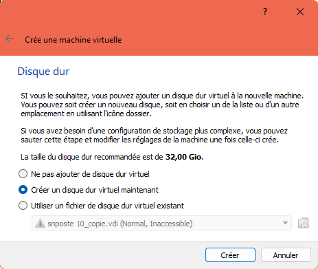

- La taille du disque virtuel (capacité) et le type de stockage (dynamiquement alloué ou fixe).

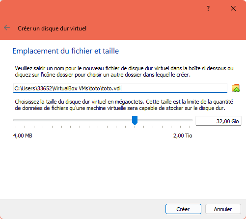

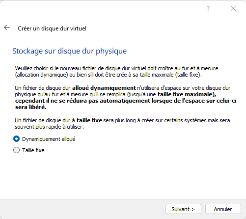

Etape 4: Configurations de la machine virtuelle

1.  Sélectionnez la machine virtuelle que vous venez de créer dans la liste de VirtualBox.

2.  Cliquez sur le bouton "Configuration" pour ouvrir les paramètres de la machine virtuelle.

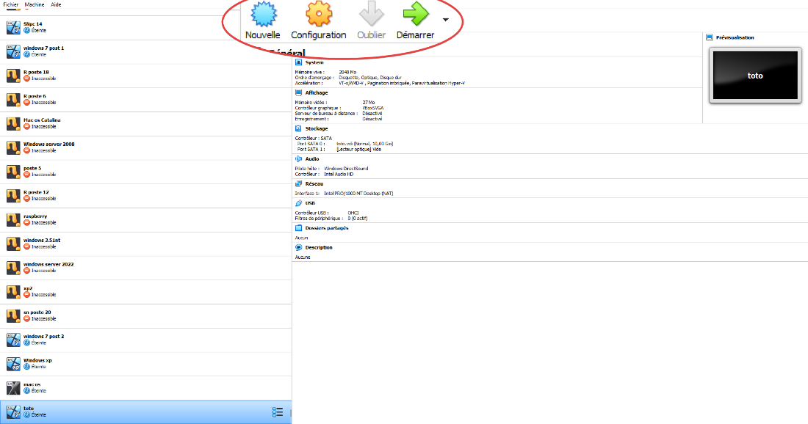

3.  Dans les paramètres, vous pouvez configurer divers aspects de la machine virtuelle, tels que les périphériques, les options de démarrage, le stockage, le réseau, etc.

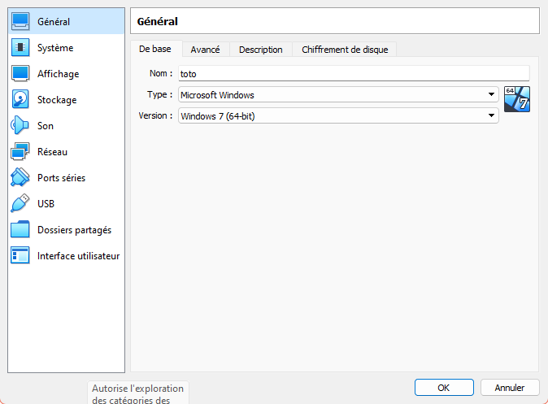

Etape 5: Installation du système d'exploitation invité

1.  Démarrez la machine virtuelle en cliquant sur le bouton "Démarrer" dans VirtualBox.

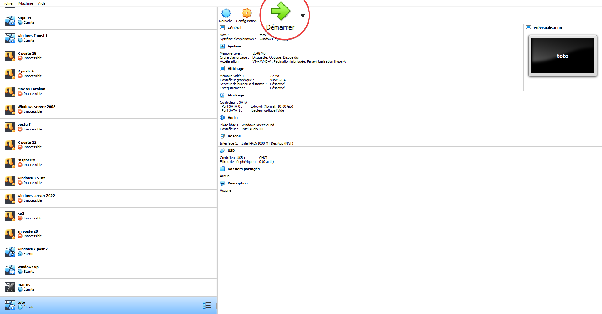

2.  Suivez les instruction d'installation

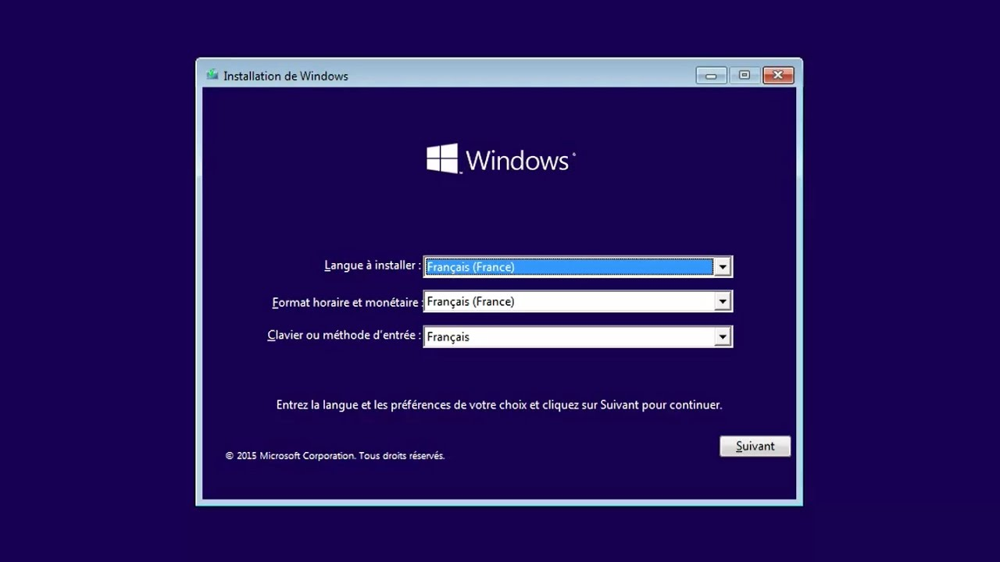

9.  **Qu’est-ce qu’une image iso ?**

Une image ISO est une archive numérique reprenant un disque optique en DVD en CD ou Blue-ray contenant des donnés ou une installation d'un OS. Ce type de fichier permet de représenter une image d'un disque optique.

10. **Référencer les paramètres utiles de Virtual Box. Justifiez les éléments**

La liste des paramètres les plus utiles sont :

1.  **Nom de la machine :** Identification de la machine parmi d'autres création de machine virtuelles, on peut également une description pour une gestion plus aisé

2.  **Type et version du système invité :** Soit définir le système d'exploitation pour la machine virtuelle, soit pour aider VirtualBox à adapter les paramètre afin d'avoir une bonne compatibilité

3.  **Mémoire (RAM) :** La quantité de cet mémoire vive affecte les performances de la machine virtuelle, plus on ajoute de RAM plus la machine fonctionne correctement.

4.  **Processeur :** On peut spécifier le nombre de cœurs de processeur sur la machine
Attention !!! Cela peut avoir un impact sur la machine physique assurez-vous qu'elle soit suffisamment puissante pour pouvoir ajouter plus de cœur à votre machine virtuelle.

5.  **Stockage :** configurer un disque virtuel pour la machine virtuelle. Cela comprend sa capacité et le type de stockage soit dynamique alloué ou fixe.

6.  **Carte réseau :** Configurer des adaptateurs réseau de la machine virtuelle pour la connexion internet soit par un réseau local ou isoler complètement.

7.  **Périphériques :** Activer ou désactiver les périphériques virtuels comme l'USB, audio, webcam etc... afin de pouvoir connecter des appareil externe sur une machine virtuelle.

8.  **Options d'affichages :** Ajustement de la mémoire vidéo, l'accélération 3D et la résolution d'écran de la machine virtuelle.

9.  **Stockage optique :** Montez une image ISO comme connecteur optique virtuelle permettant d'installer un système d'exploitation sur une machine virtuelle afin qu'il soit fonctionnel.

10. **Dossier partagés :** partager des fichier entre l'hôte et la machine virtuelle pour un transfert.

11. **Snapshots :** Capture l'état de la machine à un moment donné soit pour revenir à un état précédent de la machine c'est-à-dire par exemple si une machine virtuelle a été attaquer soit par un logiciel malveillant, l'option snapshot peut servir à revenir à l'état ou l'attaque n'a eu lieu.

12. **Réglages système avancés :** paramètres avancé tels que la virtualisation matérielle, l'accélération VT-x (pour améliorer les performance et l'efficacité des environnements de virtualisation) …)
Attention !!! Comme pour l'ajout du nombre de cœur sur une machine virtuelle, cela peut avoir un impact avec la machine physique assurez-vous qu'elle soit suffisamment puissante pour utiliser ces paramètres.

11. **Référencer les composants de votre machine virtuelle. Justifiez les éléments nécessaires aux fonctionnements de votre machine.**

Ma machine virtuelle possède :

1.  **Hyperviseur :** Logiciel permettant de créer et gérer des machines virtuelles.

2.  **Système hôte (hôte physique) :** Système physique sur lequel l'hyperviseur est installé permettant de créer des machine virtuel, gère les composant telles que le processeur, la RAM le stockage etc...

3.  **Machine virtuelle (VM) :** instance isolée d'un système d'exploitation et d'une application exécutant l'hôte physique.

4.  **Système d'exploitation invité (Guest OS):** système d'exploitation invité différent de l'hôte physique configurée avec ses propres ressources.

5.  **Ressources allouées :**

- **Processeur** : L'hyperviseur alloue un ou plusieurs cœurs de processeur à chaque machine virtuelle.

- **Mémoire RAM** : Chaque machine virtuelle dispose d'une allocation de mémoire RAM.

- **Stockage** : Les machines virtuelles utilisent des disques virtuels pour stocker leur système d'exploitation et leurs données. Les ressources de stockage sont également allouées.

6.  **Réseau virtuel :** configure des adaptateurs réseau virtuels pour chaque machine virtuelle, permettant la connexion à d'autre machine ou sur réseau physique

7.  **Interface de gestion :** Les administrateurs utilisent une interface de gestion d'hyperviseur permettant de créer configurer et surveiller les machine virtuelles

8.  **Snapshot :** Copie instantané de l'état des machines virtuelles soit pour récupérer des états précédent de la machine virtuelle pour revenir avant l'attaque par logiciel malveillant par exemple.

12. **Définir les différents accès (accès par pont, interne, privé, NAT) pour une carte réseau virtuelle.**

Schéma des différent réseau d’une VM

Schéma hôte physique pont bridge

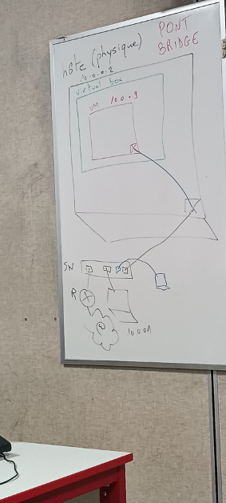

Schéma Hôte (physique) réseau interne (internal network) = intnet (pas d’internet)

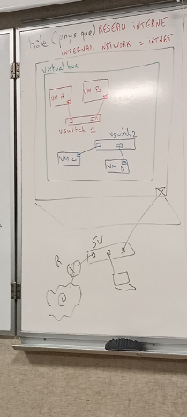

Schéma Hôte (physique), réseau privée interne (réseau privé hôte)

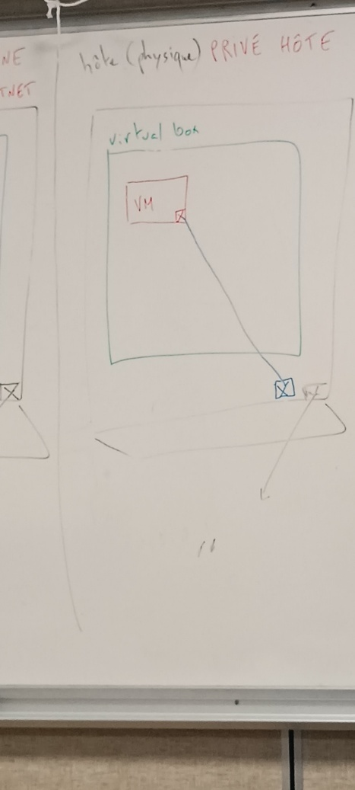

Schéma hôte physique réseau NAT (PAT)

Network address translation (port and address translation)

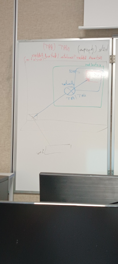

13. **Comment configure t-on la carte réseau de la machine virtuelle ? Justifier en produisant une vidéo flipgrid de maximum 5’ qui montre comment on configure l’accès par pont sous Virtaul Box**

Lien de la vidéo

[Le réseau avec VirtualBox : NAT, Bridge, Host-Only, réseau interne, etc.](https://youtu.be/iPPKNc3appk)

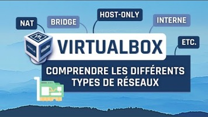

14. **Comment Windows gère t-il les cartes réseaux pour Virtual Box ?**

Windows gère les paramètre de la carte réseaux en utilisant un composant créer par VirtualBox

"VirtualBox Host-Only Ethernet Adapter"(Adaptateur Ethernet VirtualBox en mode hôte) permetant d'intéragir avec les adaptateurs virtuel.

Les méthodes possibles pour accéder aux informations de la machine hôte depuis une machine virtuelle sont :

- Partage de dossier en mode shared : permettant à la machine virtuelle d'accèder au dossier hôte

- Réseaux (network) : permettant d'accèder à d'autre machine virruelle local ou server.

**Création d'une machine virtuelle**

1.  Allez dans "new" soit da
2.  ns nouveau sur VirtualBox nomez votre machine virtuelle

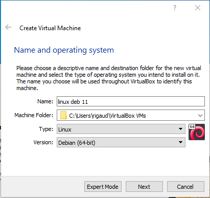

3.Ajouter de la mémoire vive, allez jusqu'au maximum.

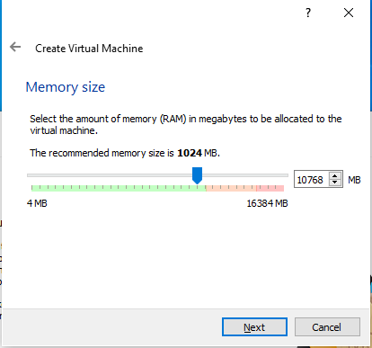

Ajout d'un disque dur existant ce disque va être utiliser pour installer debian 11

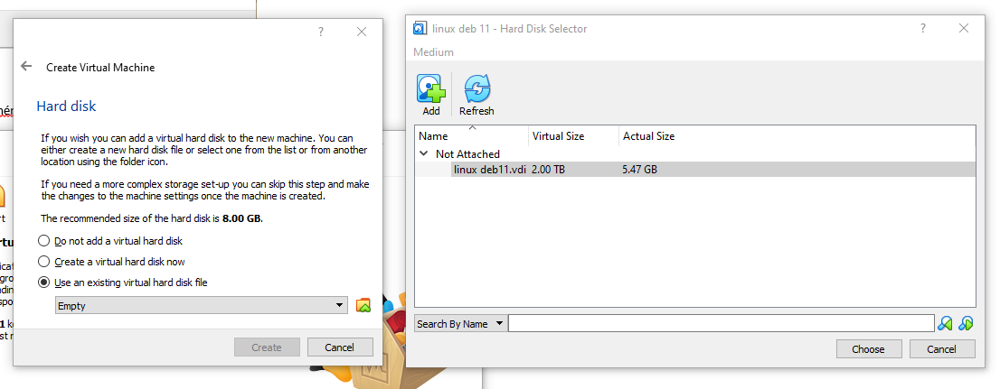

Cliquez sur create et démarrez la machine virtuelle

Entrez le nom d'utilisateur et le mot de passe

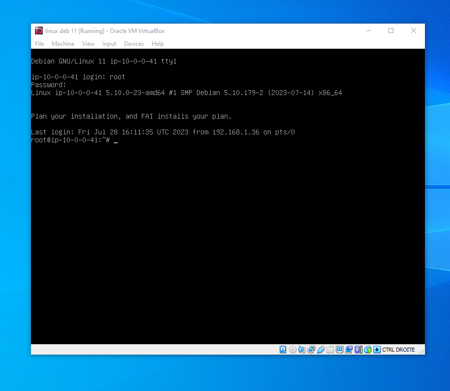

Si une disque est existant et qu'on veut suprimer le répertoire dans virtualbox allez dans file \> virual media manager

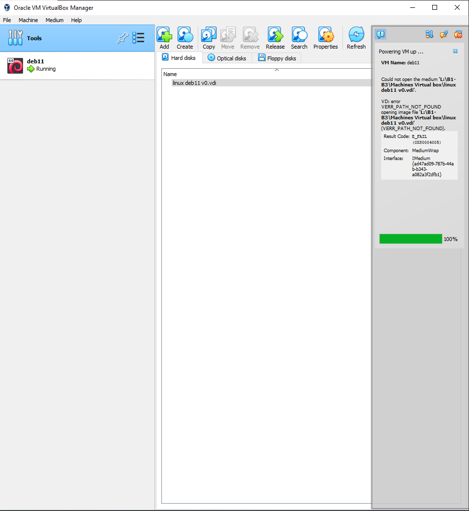

