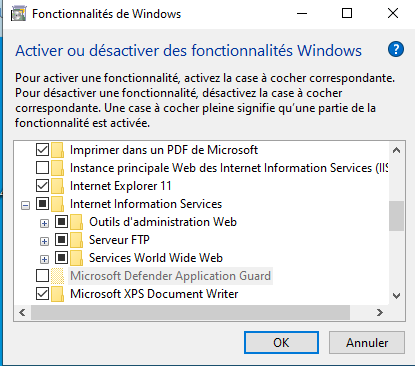

1\.

1.  Aucun droit

2.  Qulles commandes pour ip Linux et Windows

Ip a

Ipconfig

3\.

Quels sont les comptes définies

Administrateur
Invité

4\.

Soit l'adresse suivante 192.1.0.2 qu'elle adresse peut rejoindre

192.1.0.25

5\.

Que peut en configurer en réseau sur virtualbox

Internet

Nat

Privé

Accès part pont

6\.

Plage d'adresse ip de loopback

127.0.0.0 127.255.255.255

7\.

Un chemin UNC est :

[\\nomserveur\nompartage](file://nomserveur/nompartage)

[\\adresseIP\nompartage](file://adresseIP/nompartage)

8\.

223.255.255.10

Adresse réseau
223.255.255.0

Première adresse
223.255.255.1

Dernière adresse
223.255.255.254

Classe C

SGF windows

NTFS 64 2^64

FAT 32 2^21

FAT 16 2^16

9.  

En NTFS, si un utilisateur a comme droit lecture sur un dossier. Il appartient au groupe Compta avec comme droit aucun accès. Quel sera son droit au final sur le dossier ?

- Aucun accès

10\.

En NTFS, si un utilisateur a comme droit lecture sur un dossier. Il appartient au groupe Compta qui a pour droit control total

-contrôle total

L'utilisateur Liam fait partie du groupe info, que pourra t-il faire sur le fichier

-Executer

11\.

Qu'est ce que la topologie

- Des noms de machines
- Adresse ip
- Phériphérique

13\.

Schéma

- Interne

14\.

A quoi sert le fichier interfaces sous linux ? Il est stocké dans quel dossier

Debian

15\.

710

En UGO

U -rwx

G --X

O ---

R = 4

W = 2

X =1

710

16\.

17\.

Systemctl start networking.service

18\.

Les outils intranet

\- des services intégré dans le réseaux

L'accès a des services internet à l'intérieur

19\.

Les outils extranet

- Des services internet intégrés dans le réseau local qui sont accessibles à l'extérieure

20\.

Quel sont les droit en 644

Rw r-- r--

21\.

126.255.255.20 en CIDR

/8

22\.

Plage d'adresse privées

10.0.0.0/8 10.0.0.1-10.255.255.254
172.16.0.0/16 172.16.0.1 - 172.16.255.254

…

172.31.0.0/16
192.168.0.0/24

…

192.168.255.0

23

Qu'est ce que Docker

- Outil pour la gestion de conteneur

24

Dans quel fichier sont stocker les compte sous Linux ?

-passwd

25\.

Modifer

26\.

Préciser ce qu'on doit mettre dans le b et le c

2.  Script.bat

3.  %username%\adresse ip\fichier de partage

27\.

Docker Host

Docker Host Machine physique contenant le processus Docker

Docker Client

Execution des commandes sur l'espace client

Docker Registry

Gestion des image pour transfert dans le docker hub

28\.

Créer un dossier, et le partagez

Accordez l'autorisation sur ce dossier

Fournissez le chemin d'accès

Autorisation NTFS

30\.

La virtualisation consiste a faire fonctionne sur plusieurs système d'exploitation

31\.

Création de script

Ouvrir les propriété du compte crée

Mettre le nom du script dans netlogon

Création en extension .bat

Taper net use k: [\\@ip\nomdepartage\dossier](file://@ip/nomdepartage/dossier)

32\.

Stockage de compte sur Windows

Dans la SAM

Modèle de pile TCP\IP

Modèle OSI Application présentation Session

Protocole HTTP, DNS, DHCP, FTP

Mod!Modèle TCP/IP

IPv6

128bits

- La création de l'IPv6 vient du manque d'adresse ip car ces dernières ont toute été acheter

- Incompatible entre elle mais on peut utiliser des tunnel pour convertion

Cet espace est fourni en 2^128
Adresses,
Soit 3,4 \* 10^38

Site achat d'adresse IP RIPE AFNIC

IPv6 est activé par défaut dans Windows 7,10,11 et Windows server 2019

Ipv4 32bit

Adresse IPv6
Une partie ou il y a réseaux et hôte
Il n'y a plus d'adresse de diffusion
Préfixe avec 4 caractère par 4
Soit au total 16 caractère

20001::

Adressage IPv6

Règle n°1 ommettre les zéros en début de segment
Si on met 10: on peut simplifier

Règle n°2 : ommettre les segmentss composés uniquement de zéros

- 2001:0DB8:0000:1133:0000:0000:0000:0200
2001:DB8:0:1133::200

- 2001:0DB8:CAFE:0000:1111:0000:0200
2001:DB8:CAFE:0:1111:~~0~~:200

- 2001:0DB8:000A:0000:0000:0000:1000
2001:DB8:A::1000

- 2001:0DB8:ACAD:1234:0000:0000:0000:0000
2001:DB8:ACAD:1234::

- 2001:0DB8:0000:1111:0020:0000:ACAD:0000
2001:DB8::1111:20::ACAD:0:

- FF02:0000:0000:0000:0000:0000:0000:0001
FF02:::1:

- FE80:0000:0000:0000:0000:0000:0000:0003
FE80:::3:

- 0000:0000:0000:0000:0000:0000:0000:0000
::

Loopback ::1

exT

ID réseaux

TD5

Pour activer le serveur FTP

