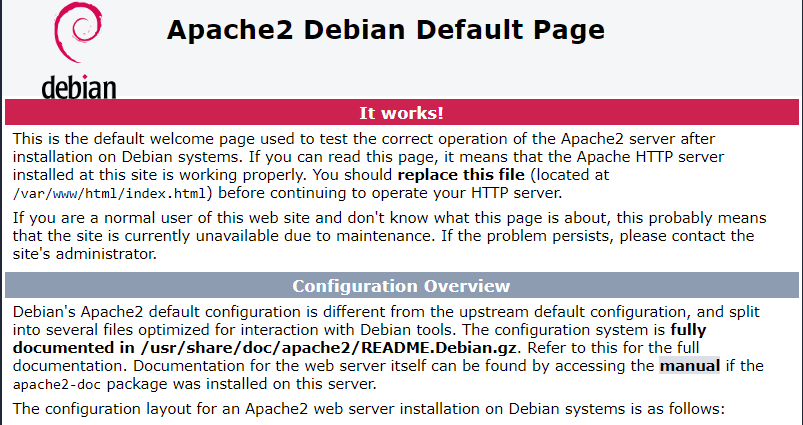

TD 8 web authentication 02/07/2024
Wednesday, February 7, 2024
2:09 PM

Permission ssh root

Aller dans

sudo nano /etc/ssh/sshd_config

Ajouter ou metter dans la ligne

PermitRootLogin yes

\<Directory "/var/www/html"\>
AuthType Basic
AuthName "Restricted Content"
AuthUserFile /etc/apache2/.htpasswd
Require valid-user
\</Directory\>

Syntax error on line 23 of /etc/apache2/sites-enabled/000-default.conf:
