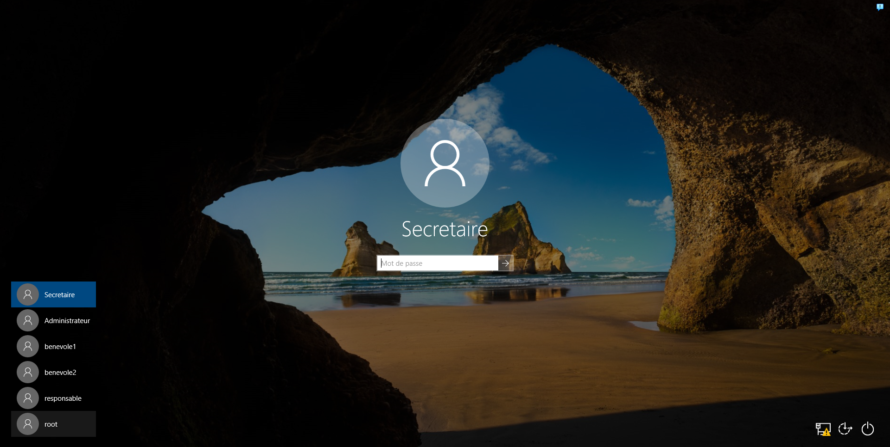
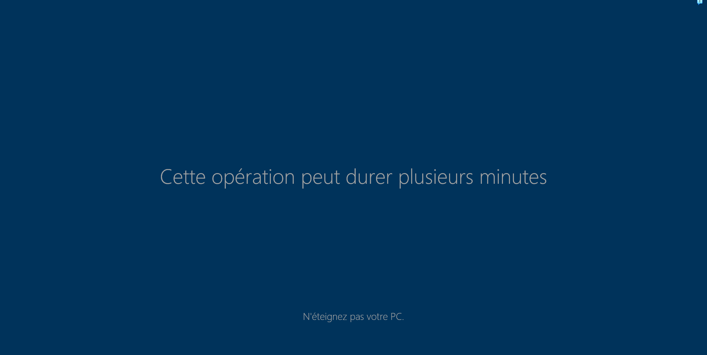
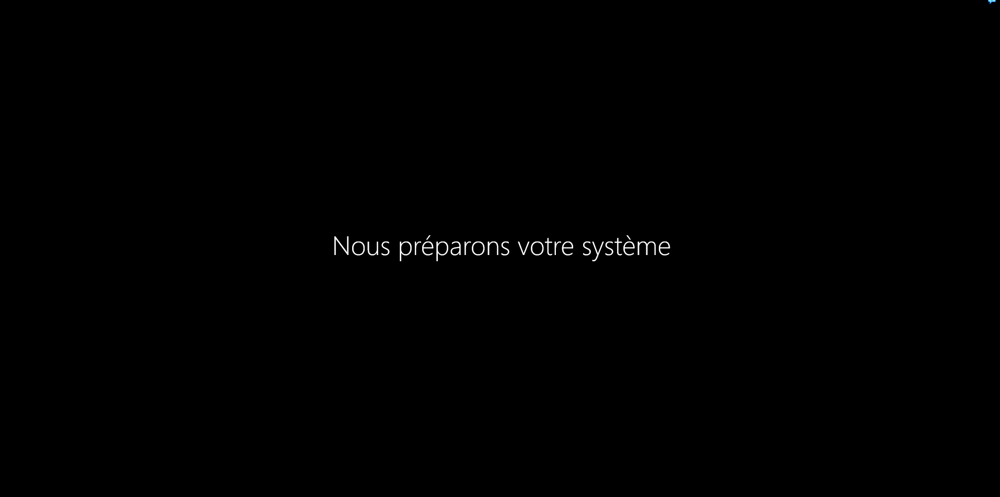
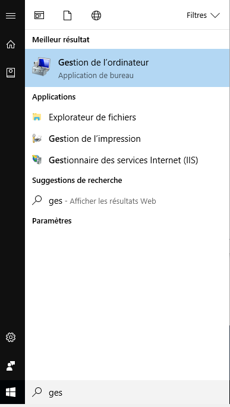
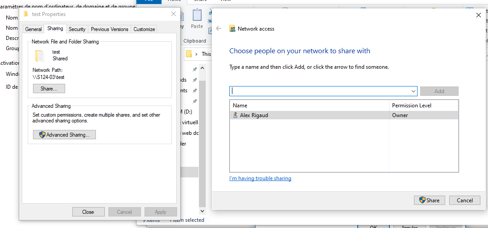
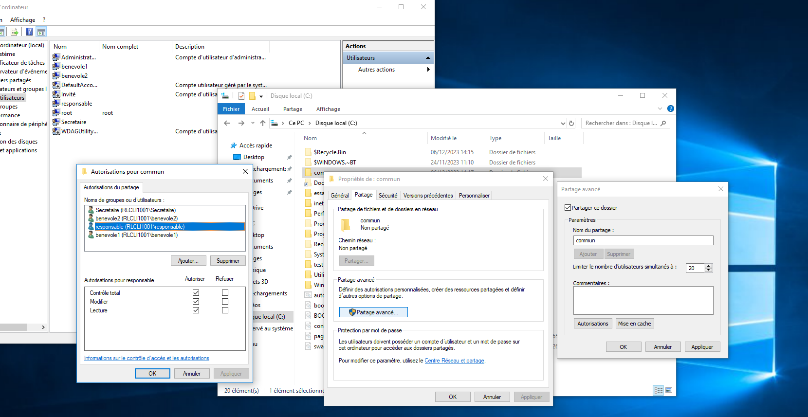

Partage de la machine

Net share

Accès en chemin UNC

Net (sans majuscule) use k: [\\10.0.0.2\dataetud\commun](file://10.0.0.2/dataetud/commun) exemple de chemin UNC de démonstration

Mmc =\> Console permetant de générer des consoles fournissant une interface graphique (Microsoft management console)

Chmod

Si on tape par exemple u+x c'est pour définir les droits du fichier pour un utilisateurs
O soit (over) c’est-à-dire pour tous le monde

En résumer cette commande permet de changer les droits de fichier pour utilisateur

Chown

Change le propriètaire du fichier

Création des lien :

Ln soit link permet de créer un lien du fichier ayant la même inode les deux fichiers avec la même inode seront enregistrer de manière synchrone.

"docker run -it debian "répertoire sur laquelle est stocker le conteneur""

Mapper le conteneur sur le port 8080:80

docker run -p 8080:80 --name srwebjlt mon_image

