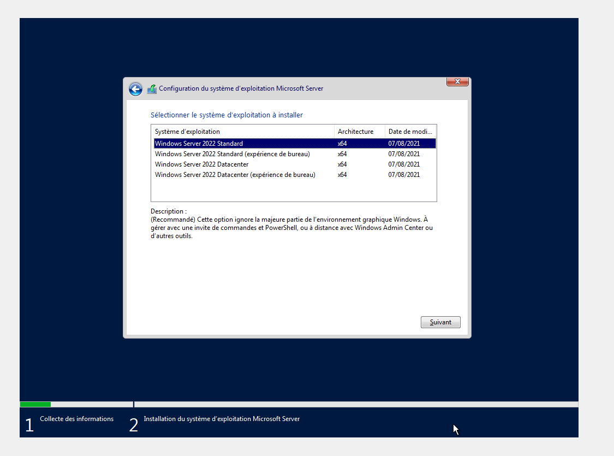

TP Active Directory
Wednesday, March 20, 2024
1:55 PM

Réseau 6

Domaine 192.168.6.255 adresse de diffusion
Domaine 192.168.6.0 adresse réseau

Le type de système d'exploitation

Vérifier la capacité de stockage du server

Mémoire vive

Mot de passe de l'administrateur

- Data 10
- System 40id=

COMMUN Lecture/écriture

