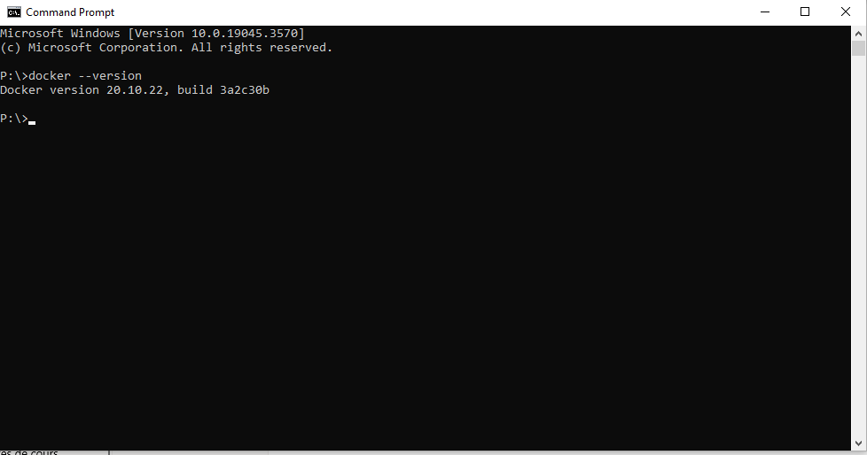
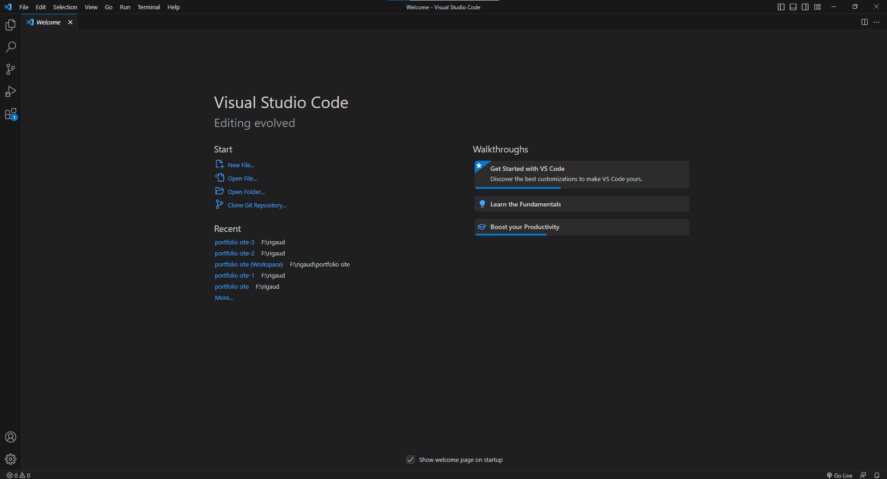
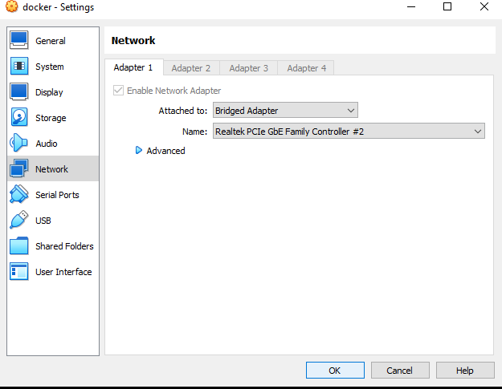

AM

Verifier la version de docker

Avec un éditeur Vscode

Mettre un accès par pont soit Bridged adaptater en méttant la bonne carte réseau connecter à un internet.

Prompt

Invite de commande utiliser soit par susyème d'exploitation comme MSDOS powershell CMD, terminal, SSH

Sur linux l'identifiant se présente comme ceci
En anglais
Login

~ qui est tilde soit le dossier personnel du poste

@ souvant nommé at

Hostname : nom de l'hôte

/home : Dossier personnel de l'utilisateur

/root : Dossier personnel de l'amdinistrateur à la racine

Pwd : cet commande affiche le répertoire de fichier du fichier

\$ : Connectez en utilisant des commande utilisateur pas de possibilité d'utiliser les commande root

\# : Droit des commande racine (soit droit administrateur) ou superutilisateur toute commande autorisé

Cd : permet de se diriger vers un répertoire

La toûche tab permet de completer un répertoire difficile à trouve par exemple

Ls : permet de lister les fichier d'un repertoire

Nano : permet d'ouvrir le bloc note sur Linux

Clear : effacer le contenu du terminal

Éditeur nano :

\# commentaire utiliser pour le bloc-notes

\*Tous fichiers

Source /etc/network/interface.d/\*

Sur léditeur l'interface réseau loopback
Utiliser sur le réseau local

Configurer un réseau principal

Hotplug soit une carte brancher à chaud

Iface interface soit représenter avec une configuration en enp0s3

Soit configuré en dhcp

Retour sur terminal

Ifdown : en tant qu'interface le processus va être interompue

Ip a : ressemblant à ipconfig permettant d'afficher les cartes résaux

Ifup : réactive le processus choisi sur l'interface

Configurations static :

Attention adresse français ne s'écrit pas pareil en anglais dont address avec 2 d et pas de e

Gateway !!!

Ping : même chose que sur Windows on peut effectuer un envoie de requête pour communiquer avec des machine ou des adresse ip serveur client.

Reboot :redémarrage de la machine Linux

Exit : Quitez le mode administrateur ou déconnexion du client

Service networking stop : Permet d'arrêter le service réseau

Service networking start : Permet de démarrer le service réseau

Service networking restart : Permet de redémarrer le service réseau

Annexe :

Commande permettant d'ajouter un utilisateur à un groupe

(sudo) usermod -aG mon_groupe utilisateur_existant

Commande permettant de renommer le nom d'utilisateur

(sudo) usermod -l nouveau_nom ancien_nom

Commande pour renommer un groupe d'utilisateur

(Sudo) groupmod -n nouveau_nom ancien_nom

Afficher tous les groupes

cat /etc/group

Suprimer un groupe

sudo groupdel nom_du_groupe

Suprimer un utilisateur du groupe

sudo gpasswd -d utilisateur nom_du_groupe

Verifier les membres d'un groupe spécifier

Getent group nom_du_groupe

Afficher le répertoire de l'utilisateur

getent passwd nom_utilisateur \| cut -d: -f6

Ajout d'un utilisateur dans le groupe root

Addgroup "utilisateur" root

RIGLEC

