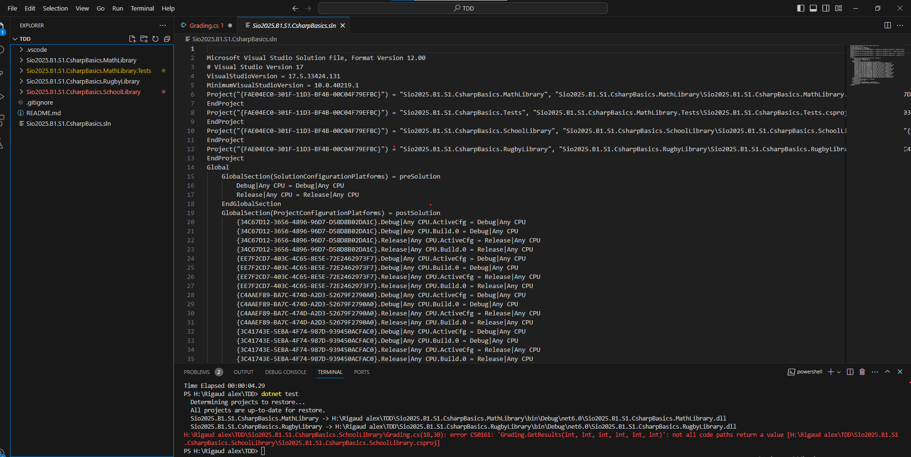

12/10/2023
Thursday, October 12, 2023
8:20 AM

Dans cet exercice les solution sont présenter dans Sio2025.B1.S1.CsharpBasics.sln

Comme on peut voir 4 projets

Il existe plusieurs projet comme console et librairy

Un projet de type test sert à executer des test de projet

À l'aide de la commande

dotnet test

1.  Ajouter une methode dans mathlibrary

2.  Ajouter un test de cette methode

Fonction return le triple d'une valeur passer en parrallèle
