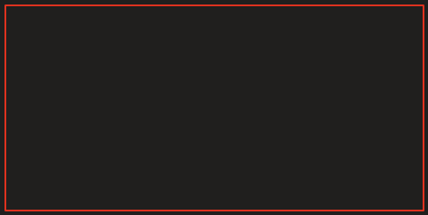

- Ranger les script dans un dossier

- Création de script Controller est une classe =\> attaché GameObject

- Méthode update() appel de la mise à jour du script

- Méthode start() lancement du jeux

- Méthode Sprite

- GameObject

- Debuglog

- Deltatime = modification de la vitesse de la forme

- Private = Fonction à l'intérieur de la class

- Public

- Tous les games object sont important

Direction = 1

Un objet un considérer comme un

