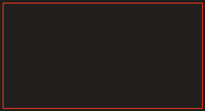

Question :

Structurecase

Switchcase

Quelle la difficulté d'utiliser

If (A \|\| B \|\| C)

Ou

If (x = 2 && y = 3 && Z = 4 && t \> 24)

X

Else

Parent soit le gameobject

gros rectangle

Petit carré

E1 : Quelle direction partir ?

=\> stocker info

=\> propriété

=\> initialisé la propriéter
-\> methode start()

Initialisation du début

Déplacement à droite (right)

2ème direction direction soit la propriété pour déplacer

Déplacement en bas (down)

3ème direction direction soit la propriété pour déplacer

Déplacement en bas (left)

Dernière direction soit la propriété pour déplacer

Déplcament en bas (up)

Changement de direction

switch direction :

case "right";

If (x \> 10)

direction = "down";

