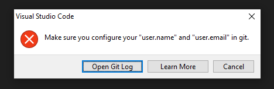
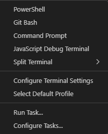
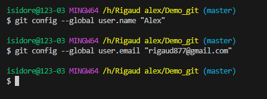
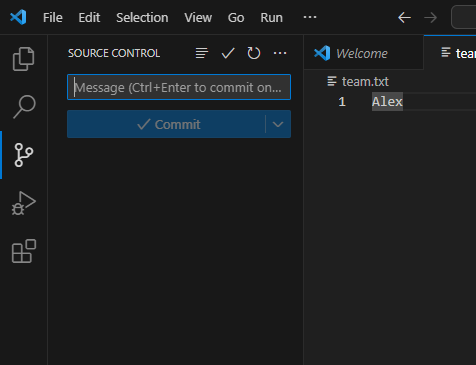
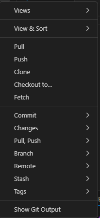
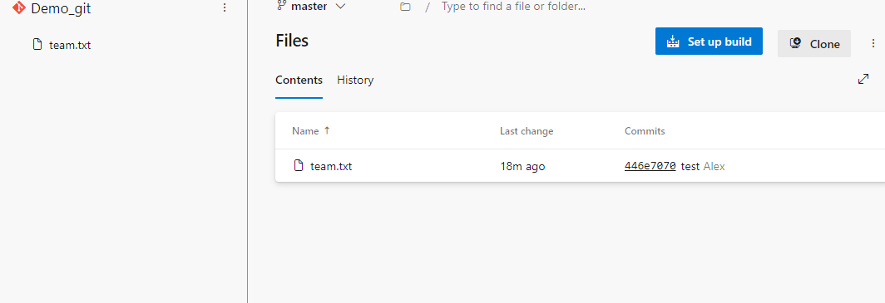

Configuration

Commande si cet erreur apparaît

git config user.name "Your Name"

git config user.email "[youremail@yourdomain.com"](mailto:youremail@yourdomain.com)

Cet commande permet de s'authentifier sur git afin de pouvoir enregistrer et mettre à jour le repos

Allez dans terminal sur visualstudio Code

Taper les commandes précédente dans le terminal

Pour mettre le fichier team.txt sur Azure cliquez sur l'icône git sur VScode

Cliquer sur les 3 petit points et cliquez sur "push"

Allez sur azure réactualiser la page et vérifier si le fichier team.txt est dedans

