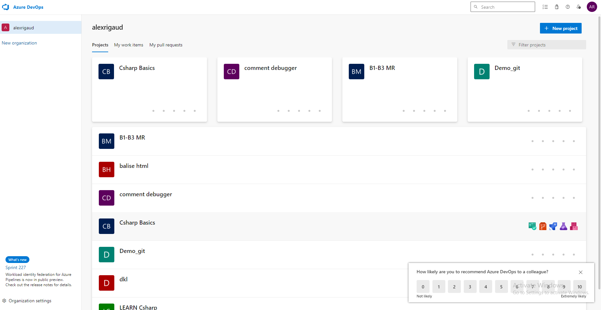
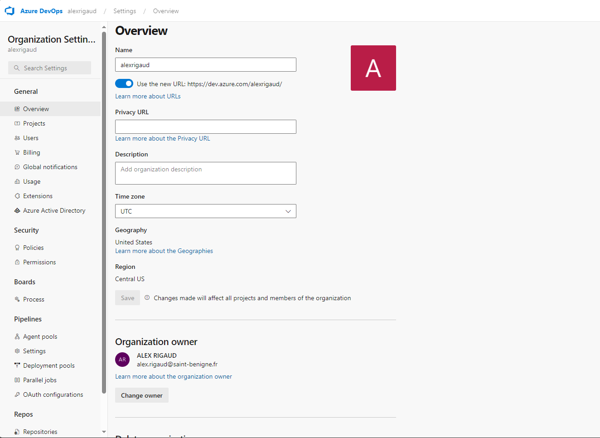
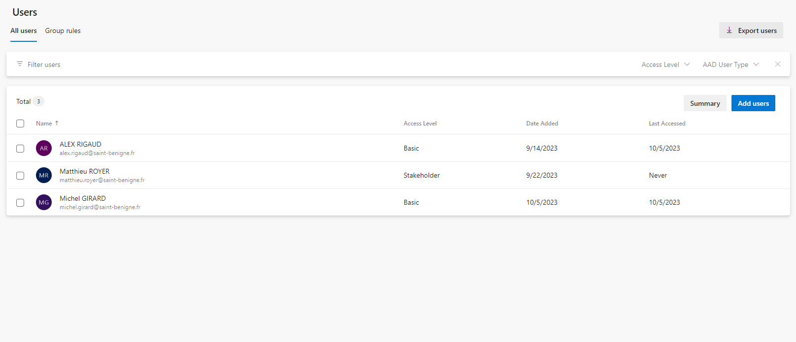
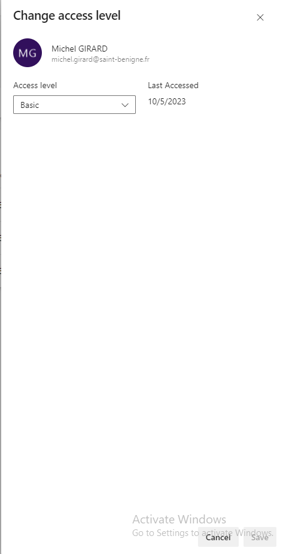

Cours 6
Thursday, October 5, 2023
8:07 AM

TDD : Teste driven developement soit dévolepement piloter par test

Dans le projet distribuer on à des environement en anglais

Plusieurs librairy sont présents + un dossier .gitignore ce qui signifie que c'est un repos git

Vscode : Un fichier vscode pour la configuration de l'environnement

Dans le fichier csharp basics on peut trouver des informations donné sur notre environnement
En ouvrant le bloc-notes par défaut de Windows

Comment réaliser un test unitaire

Commande

dotnet test "chemin du fichier"

Création de test en .dll

Commande

dotnet build

Ajouter un membre utilisateur ayant les permissions de droit d'accès dans azure dev ops allez dans Organizations settings

Dans User

Ajouter un utilisateur et attribuer les droits choisis

Attribuer les droits choisis

Cliquez sur save
