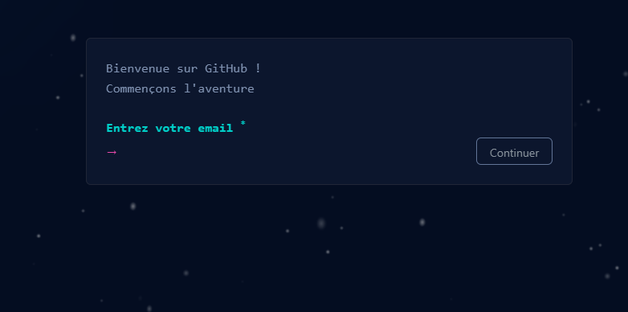
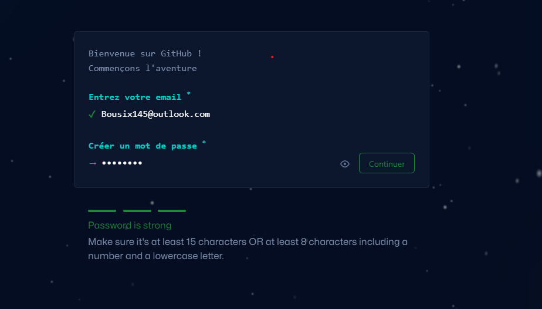
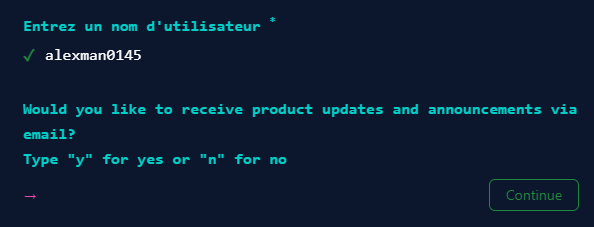
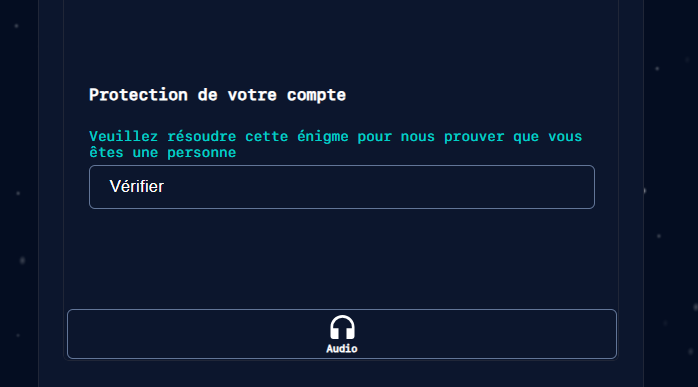
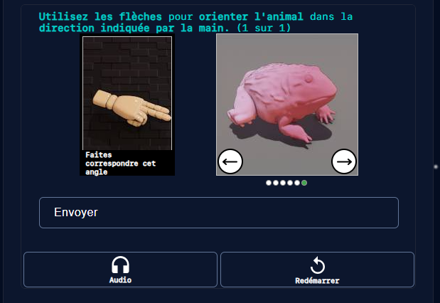

Création du compte Github

Ajout du mot de passe et de l'adresse mail

Création d'un nom d'utilisateur on demande aussi si je souhaite recevoir des mise à jour de produit
Pour cela taper y pour oui ou n pour non

Vérification du compte par boite email un message est envoyer automatiquement pour la finalisation de la création du compte GitHub on peut utiliser le système audio pour valider le compte ou vérfier à l'aide d'un test classique

Méthode de vérification un teste obligatoire est nécessaire pour valider le compte on peut redémarrer si le test est difficile ce qui peut arriver parfois

Une fois que toutes les étapes ont été effectuer le compte peut se créer

Un code est envoyer via e-mail
