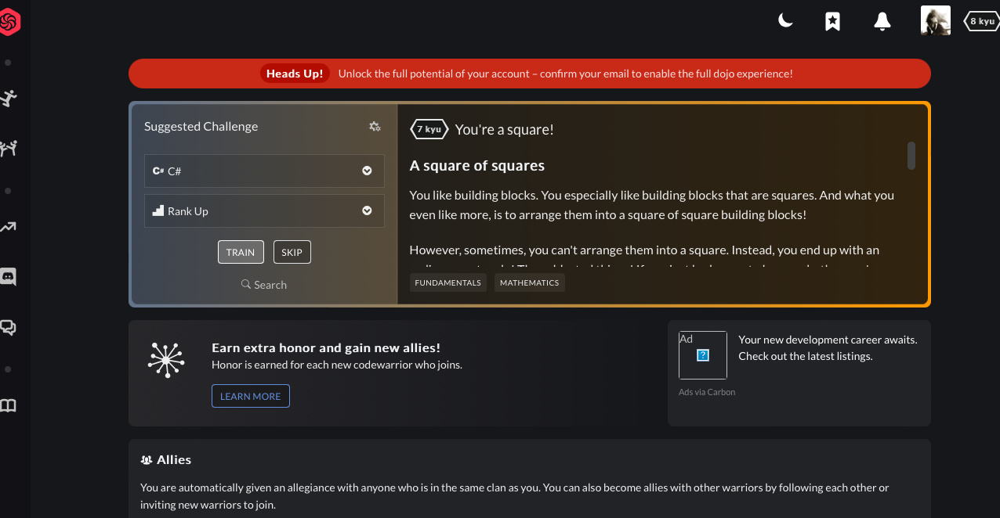

Tous les évaluations qui ont été donner doivent être finie

Créer des branches

Si j'ai effectué une PR

Pas d'archivage de code qui ne fonctionne pas

Teste unitaire va permettre de tester l'intégralité du code coverage

Décrire le code en ajoutant les trois /

Valider le premier test

Commite pas push

Une fois que tous test réussi push

Et ensuite PR.

