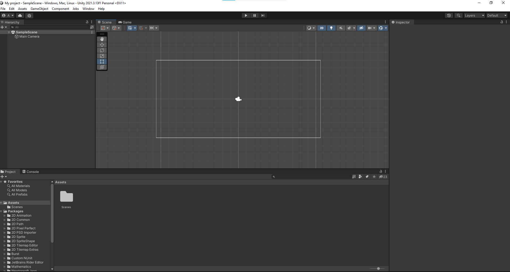
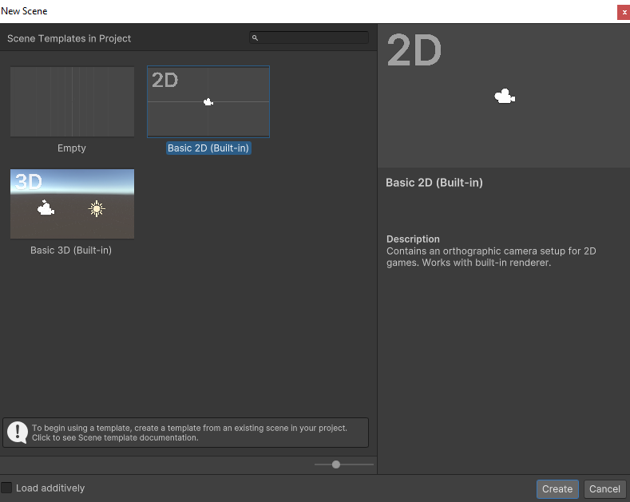
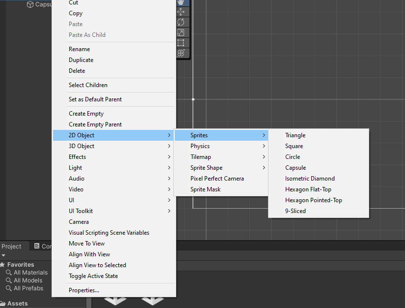
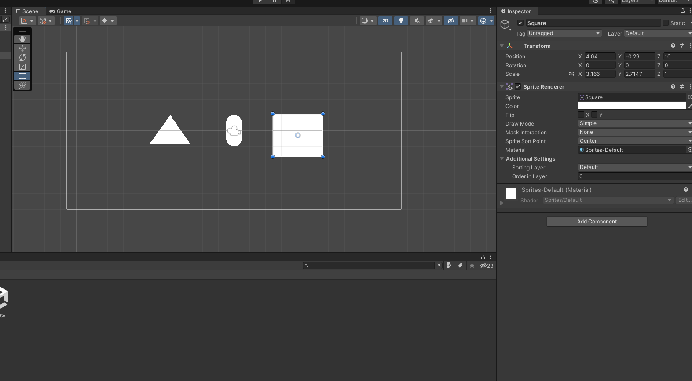
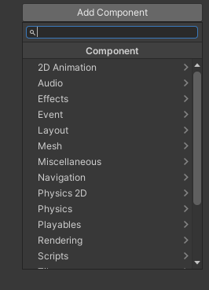

Unity 1 09/11/2023
Thursday, November 9, 2023
8:00 AM

Objectif :

Découvert environement de Unity

L'intérêt de utiliser unity pour créer des jeux fluide entre 30 et 60fps

Unity permet de faire du multiplatforme

Création d'un projet 2D core

Unity est composer d'une scene pour la création du jeux

Dans nos scene on a une option camera

On a également des outil permettant

Pour créer une nouvelle scene allé dans new new scene

Cliquez sur create

Pour créer des objet en 2D 2D object sprites selectionnez par exemple capsule

On peut faire run en live

Créer un composant script on peut l'appeler scriptcontroller par exemple

Une variable privé sera accessible dans la classe
Et public accessible à unity
