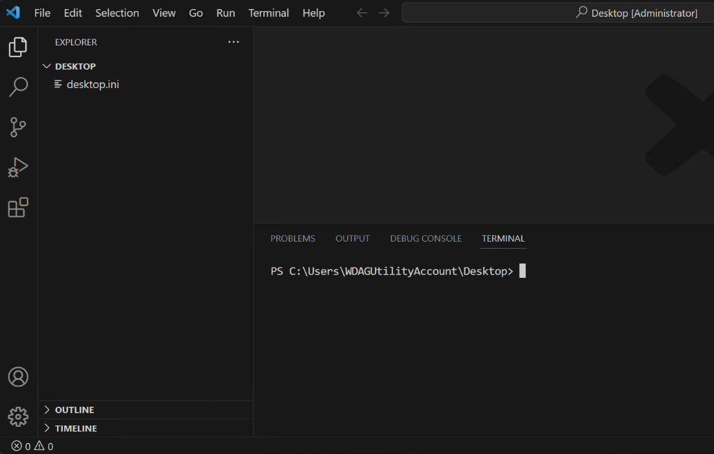
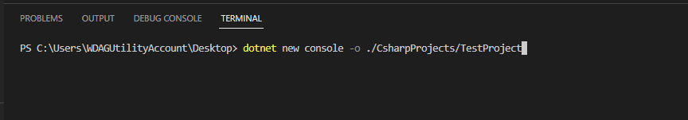

synthèse
Thursday, September 21, 2023
8:03 AM

Installation de git instruction config version, automatisé

Installation d'un éditeur de code visual studio code

Création d'une organisation d'Azure de Ops qui est un cloud de microsoft

-création d'une organisation

-d'un projet soit un depot

-créer des accès (organisation)

-Donner des droits (projet)

1er operation

Clonage de dépôt

Commit

Push partager le fichier sur le server dev ops

Pull récupérer une version du fichier

Action

1

- Apprendre le code C# soit création d'un projet dev ops

=\> LEARN C#

- Aller sur vscode installer configurer l'environement de l'éditeur

2 reprendre apprentissage (Vscode)

Demo

Commencement de la création du code csharp

- Assurez-vous queVisual Studio Codeest ouvert.  
  Vous pouvez utiliser le menu Démarrer de Windows pour localiser et ouvrir Visual Studio Code.

- Dans le menu Fichierde code Visual Studio, sélectionnezOuvrir le dossier.  
  Une boîte de dialogue Ouvrir le dossier s'affichera.Vous pouvez utiliser la boîte de dialogue Ouvrir le dossier pour créer un nouveau dossier pour votre projet C#.

- Dans la boîte de dialogueOuvrir le dossier, accédez au dossier Windows Desktop.  
  Si vous disposez d’un autre emplacement de dossier dans lequel vous conservez les projets de code, vous pouvez utiliser cet emplacement de dossier à la place.Pour cette formation, l'important est d'avoir un endroit facile à localiser et à mémoriser.

- Dans la boîte de dialogueOuvrir le dossier, sélectionnezSélectionner un dossier.  
  Si une boîte de dialogue de sécurité s'affiche vous demandant si vous faites confiance aux auteurs, sélectionnezOui.

- Dans le menu Terminalde Visual Studio Code, sélectionnezNouveau Terminal.

- À l'invite de commande Terminal, pour créer une nouvelle application console dans un dossier spécifié, entrez la commande suivante:

