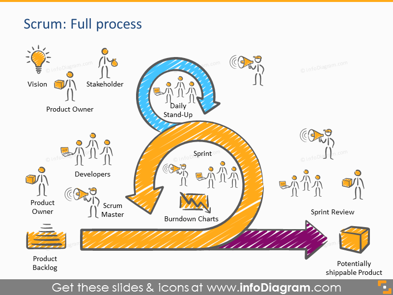

Objectif :

Les 3 impacts dans le monde de l'entreprise :

- Les Badge
- Les Forums

Les solutions apporté pour cette année à apporté pour cet année sera par exemple de s'avoir utilisé l'IA générative de manière efficiente comme par exemple pour améliorer mon CV.

-------------------------------------------------------------------------------------------------------------------------------

==Objectifs pour le stage :==

- ==S'avoir identifier le type de société==
- ==Les contraintes==
- ==Mise en place du plan d'actions==

==Développer son projet professionnel :==

- ==Identifier le métier==
- ==Quelles sont les conditions d'accès==
- ==Recherche de solutions==

==Pour la semaine prochaine s'avoir mettre en place une routine pour la recherche de stage==

Entreprise à postuler : ESN, Editeur logiciel

Examen du BTS : épreuves

E4 : Support et mise à disposition de services informatiques ( 10 + 30 ) ORAL
- Présenter son dossier numérique
- Son portfolio
- Tableau de synthèse du portfolio

E5 : (30 + 20, 1h + 20) ORAL

2 réalisation professionnelles démontrables

Veille technologique à présenter

Veille informationnel

- Sources
- Outils
- Sujets

Les livrables

Onenotes

Blog

Réseaux Sociaux

S'avoir travailler en mode projet en utilisant la méthode agile

Développer la présence en ligne de l'organisation

Référencer les services en ligne de l'organisation et mesurer leur visibilité

Participer à l'évolution d'un site web

SCRUM est une méthode permet de définir le projet qui est représenter en schéma

Backlogs représente toute une liste des d'activité définie

