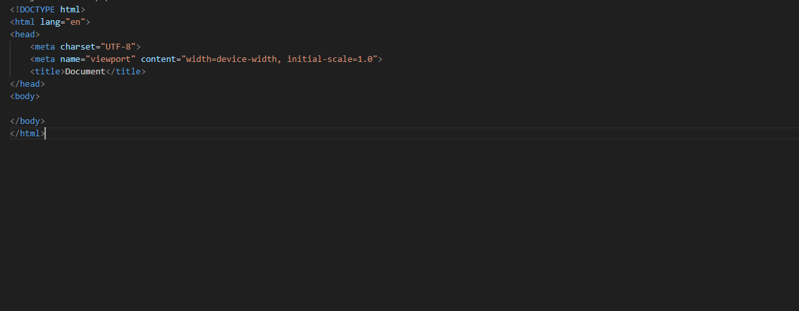
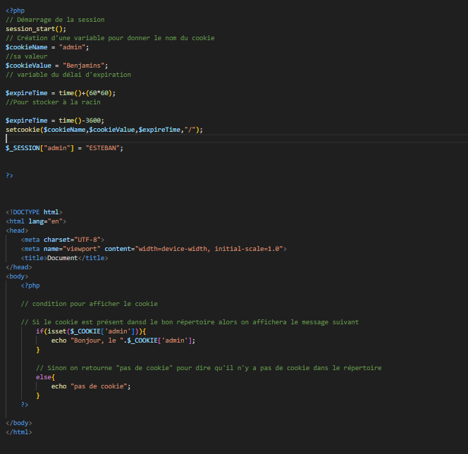
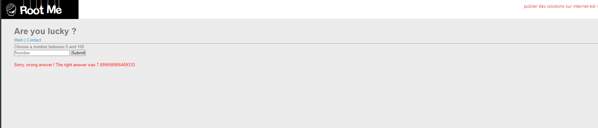

12/04/2024
Friday, April 12, 2024
7:58 AM

- Faille XSS

- Exploiter une faille de type XSS

Exercice Rootme : Récupérer le cookie de la personne

Création d'une page php

Que veux dire la méthode decodeURIComponent(document.cookie) en javascript

*From \<<https://chat.openai.com/c/29aa9f30-1c7e-4b22-990e-04982e3233aa>\>*

Dans le contexte de document.cookie, cela signifie que document.cookie renvoie une chaîne de caractères contenant les cookies associés au document actuel, et ces cookies peuvent être encodés (par exemple, pour traiter des caractères spéciaux de manière appropriée). decodeURIComponent() est utilisé pour décoder ces cookies afin de les rendre lisibles et manipulables par JavaScript.

*From \<<https://chat.openai.com/c/29aa9f30-1c7e-4b22-990e-04982e3233aa>\>*

Exercice Root-me trouver le bon nombre

D'après le code source les nombre sont sont aléatoire et son des nombre réelle donc impossible de prédire le nombre exacte

Premier étape

1.  Injection

'+alert("1")+'
'+number +'

var number = '';
var number = "number"

Qu'est ce que XSS-DOM BASED

- Cross Site Scripting

Quels sont les 3 types de faille XSS ?

XSS stocker : qui sont stocker dans une base de donné
XSS reflechie : informations que l'on n'a pas
XSS DOM : Pas d'interaction avec le serveur seulement sur le site en lui même.

Pepdream

