1 HTML vide

2.  Création btn pour lancer

3.  Ajouter une fonction addvent sur le bouton
4.  Création d'une array avec les images
5.  Creation d'une fonction pour random URL Type
6.  Creation dynamique d'une table HTML pour placer les images

Pour commencer on créait une fonction et la page html doit être vide  

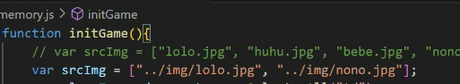

Dans l'exemple pour pour placer les images on peut utiliser dans l'exemple du code return permettant

De stopes si toutes les images sont retiré

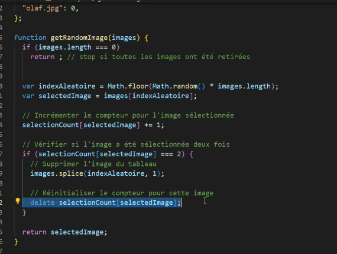

Dans le site mozilla developer la methode splice permet d'ajouter ou soit suprimer des élément dans le tableau  

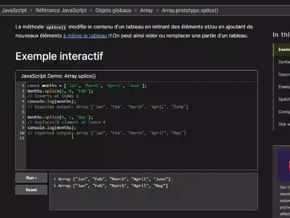

Si on prend 0 en indice dans la méthode splice 0 les autres élément seront remplacé

Premier test :

Créer une fonction appeler initGame

On créer un tableau pour ajouter les images
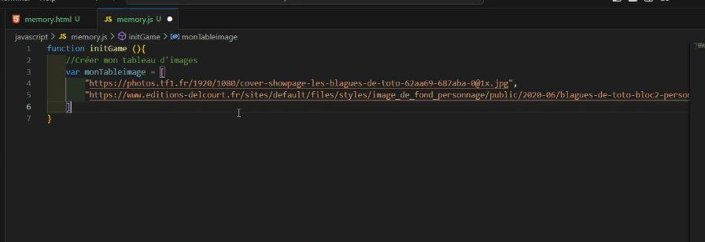

Methode à assigner dans un tableau pour en générer un autre appeler concat  

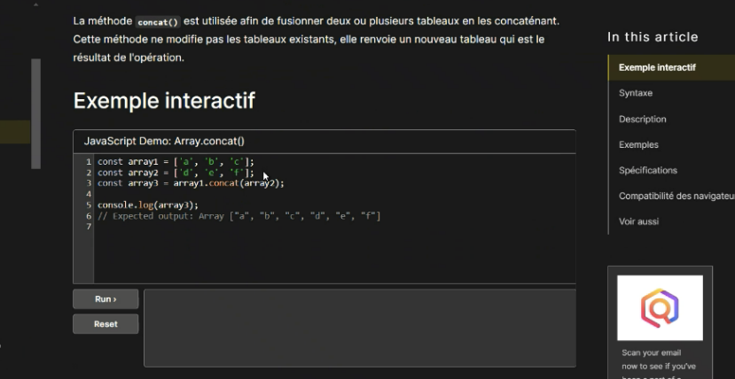

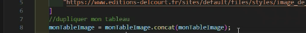

Attention pour mélanger un tableau on ne peut pas utiliser directement la méthode shuffle

Il est vraie que cet méthode fonctionne mais est "deprecated" depuis

Pour cela on utilise la méthode sort

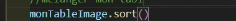

On utilise en paramètre a, b pour cela qui va être égale ou supérieur à la fonction math.random()  

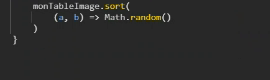

Voici la documentation pour la fonction sort  

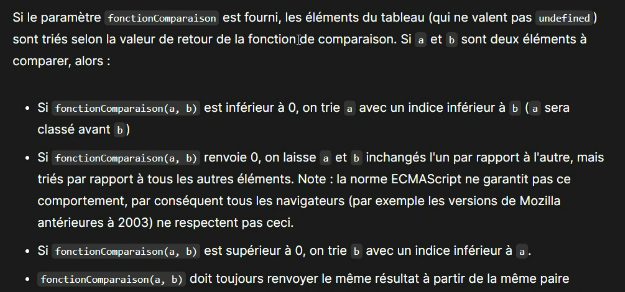
Voici comment on doit procéder pour mélanger les images
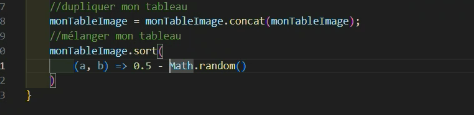
Le code renvoie un nombre aléatoire qui va comparer ce nombre aléatoire au image
Ces nombres vont être assigner à chaque image et vont être comparer par la suite

Si a et b sont inférieur à 0 renvoyer a, b

Dans le cas contraire sont supérieur à 0 renvoyer à b, a

Créer une fonction qui créer le document HTML

Attention à ne pas oublier d'appeler la fonction suivante

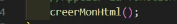

Pour que cela donne

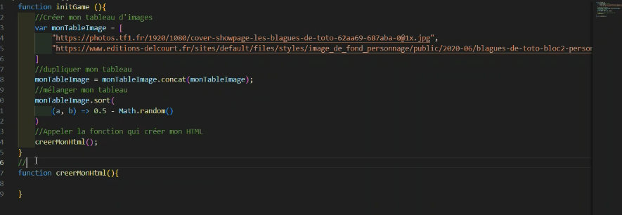
La fonction suivante créer un tableau HTML pour les images dans le tableau

On attribut le tebleau d'image en paramètre par exemple image

En revanche on met dans la fonction créer mon tableau qui est appeler prédament monTableImage  

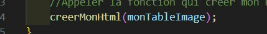

La suite ettandue sont les suivante

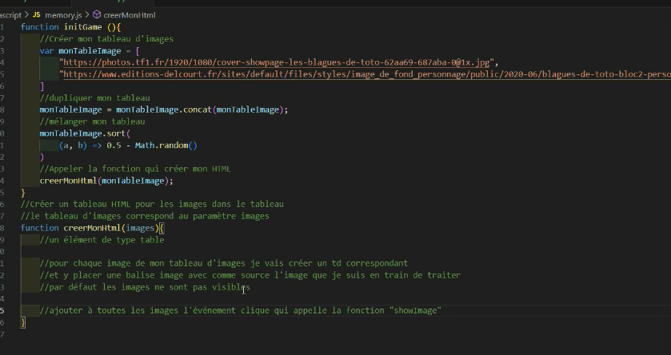
On peut créer un élément en html directement depuis js

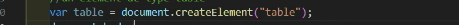

On ajoute pour cela par la suite
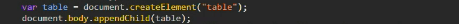

Voilà le procéder comme suit :

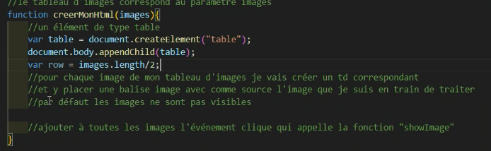

Il faut que l'utilisateur puisse choisir le nombre d'images (faire cela à 13h00)
