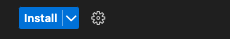
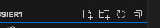
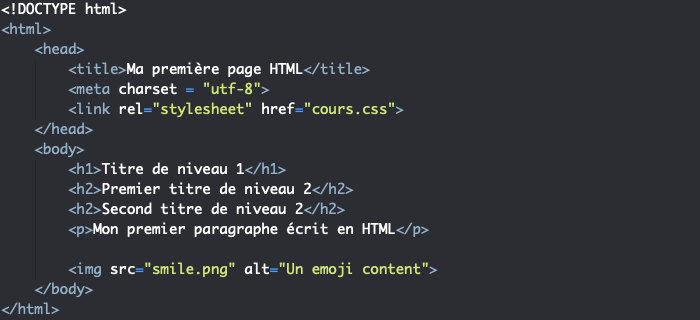
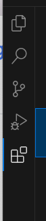
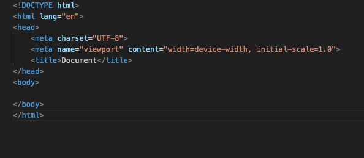

Cours 1 15/09/2023
Friday, September 15, 2023
8:09 AM

B1 : Support et mise à disposition
1.1 Gestion du patrimoine informatique

1.2 Réponse aux incidents et aux demandes d'assistance et évolution

1.3 Dévelopement de la présence en ligne de l'orgnaisation

B3 : Cybersécurité des services informatiques deux option SISR et SLAM

Aujourd'hui B1

Configuration de VS code ajouter une extension comme live server prettier code

Installer l'extension en appuyant sur install pour install l'extension

Créer un dossier B1B3MR vous pouvez créer un fichier txt

Dans l'exemple créer un dossier sur VSCODE cliquer sur le bouton dossier avec le +

Votre dossier est stocker sur le répertoire ou vous avez creer votre fichier txt

Le web est représenter par du balisage HTML, du CSS , du JS PHP

Internet est un ensemble de server permettant d'accèder à des informations

Internet est un réseaux soit un système d'interconnection entre ordinateur et server.

Le Web soit 3 W qui veut dire World Wide Web (www)

Un web fonctionne avec un navigateur

Evolution du Web

Web 1.0

Soit unidiractionnel pour obtenir des informations

Web 2.0

Les médias sociaux, blog, wikis, bidirectionnel et consomation et création de contenue

Web 3.0

Web Sementique, Moteur de recherche plus inteligents, recherches des résultats personnalisés Data Maning

Web 4.0

-IOT

-IA

-Web personnaliser

L'impact des mobiles

- Utilisation constante
- Site Web adaptatif (responsive design)
- Application web progressive (PWA)
  - Experience utilisateur améliorer
- Performance et optimisation
- SEO Mobile
- Interactivité et fonctionnalité native

Fondamentaux du HTML

Rappels languages pour déveloper
Sont HTML CSS et JS

HTML = HyperText Markup Language
Language de balisage
Structure d'une page web

Standard pour la créatop, de page Web

\<!doctypehtml\>\<html\>\<head\>\<metacharset="utf-8"/\>\<title\>Intitulé de ma page\</title\>\<linkhref="https://fonts.googleapis.com/css?family=Open+Sans+Condensed:300\|Sonsie+One"rel="stylesheet"type="text/css"/\>\<linkrel="stylesheet"href="style.css"/\>

*From \<<https://developer.mozilla.org/fr/docs/Learn/HTML/Introduction_to_HTML/Document_and_website_structure>\>*

CSS =\> style sheet language
Pour la présentation

Javascript

Language de programmation de script dans une page web principalement Manipulation d'objets
Rendre plus interactif
Peut être utilisé côté serveur

Pour s'avoir si le code ci-dessous est du HTML par exemple si on aperçoit la premier balise
\<!DOCTYPE html\> cela signifie que le script est en HTML

\<head\> par exemple est une balise et est en bleu foncer sur Vscode pour certain theme elle sont repérer de différente couleur selon les préférence.

Si la balise possède un / cela signifie que la balise est fermer comme par exemple si on ajouter une ouverture \<html\> et on la ferme avec \</html\>

\<head\> est l'en-tête de la page html qui est également fermer avec cet balise \</head\>

UTF-8 signifie l'encodage de la page

La balise \<title\>\</title\> définie le titre de l'onglet

Le body soit la balise \<body\>\</body\> affiche toute les informations sur la page

Création d'une page HTML

Sur visual Studio Code taper html:5 pour mac par exemple double cliquer ou taper la touche tabulations. Cela devrait ajouter ce code

Sauvegarder votre balise

