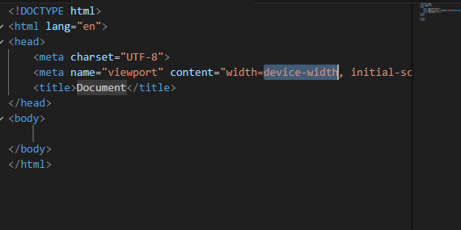
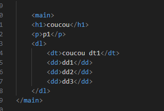
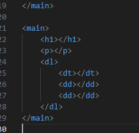
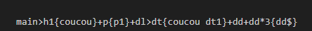

Cours 3 29/09/2023
Friday, September 29, 2023
9:17 AM

Introduction création d'une page web

En tapant html:5 sur vscode on à un début de codage html

Si admet on on veut faire un code comme ceci en mode rapide

On peut taper main\>h1+p+dl\>dt+dd+dd

Ce qui afficherait ceci

Pour afficher du texte on peut inserez des acollade

On peut également multiplier le nombre de balise en ajoutant \*3

Pour plus d'information voir sur le site

<https://docs.emmet.io/cheat-sheet/>

