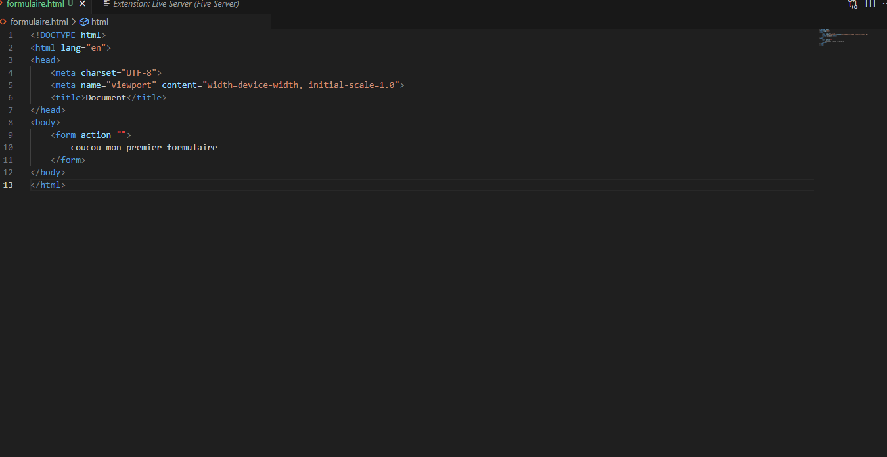
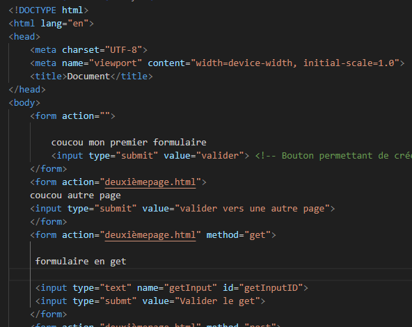

AM

Qu'est ce qu'un formulaire

Un Formulaire permet de saisir des données pour les transmets au serveur par le biai du formulaire passant par un protocole HTTP

Création du formulaire de type balise \<forme\>\</form\>

Pour une utilisation optimal installer l'extension Live server (File server)

En créant notre premier formulaire ce qui donne ci-dessous

En page web

Ceci resemble à un texte basique mais si on ajoute un bouton submit

Ce qui donnera un bouton sur une page html

En cliquant sur valider on ne voit aucun changement seulement un envoie de requette qui à été fait.

Si on ajoute un second bouton avec un second cela permetera de renvoyer sur une autre page html

Pour cela ont créait un deuxième formulaire qui nous permet de ce mettre sur la deuxième page comme ceci

Sur la deuxième page qui est celle-ci

Soit une page comme celle-là

