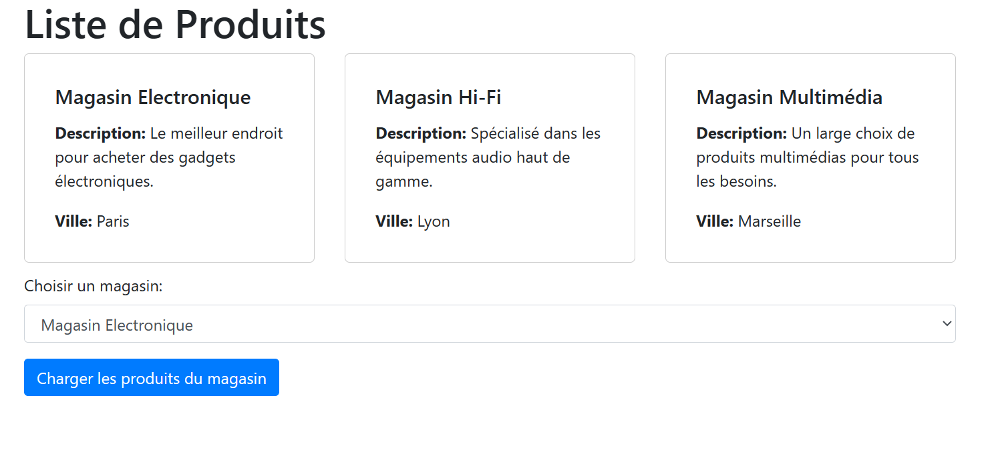
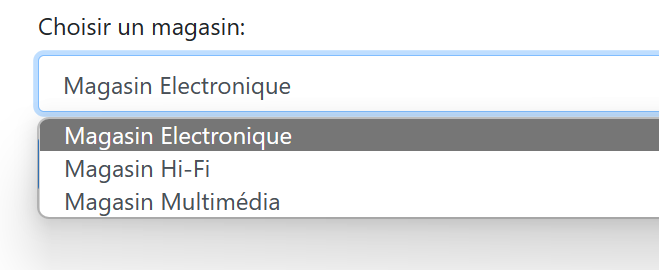
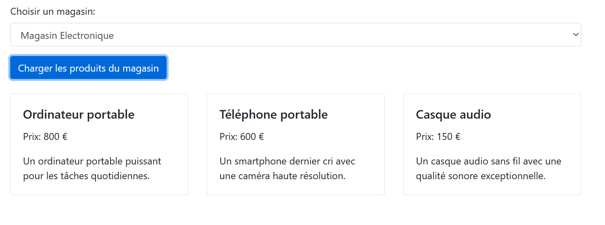

Sujet 1 : Magasin
Friday, March 15, 2024
7:29 AM

==LE CODE HTML EST GENERE DEPUIS LE JS==

==Depuis le json suivant :==

// Objets JSON représentant les magasins et leurs produits
var magasins = {
 "magasin1": {
  "id": 1,
  "nom": "Magasin Electronique",
  "description": "Le meilleur endroit pour acheter des gadgets électroniques.",
  "ville": "Paris",
  "produits":
   {
    "nom": "Ordinateur portable",
    "prix": 800,
    "description": "Un ordinateur portable puissant pour les tâches quotidiennes."
   }
   {
    "nom": "Téléphone portable",
    "prix": 600,
    "description": "Un smartphone dernier cri avec une caméra haute résolution."
   }
   {
    "nom": "Casque audio",
    "prix": 150,
    "description": "Un casque audio sans fil avec une qualité sonore exceptionnelle."
   }
 },
 "magasin2": {
  "id": 2,
  "nom": "Magasin Hi-Fi",
  "description": "Spécialisé dans les équipements audio haut de gamme.",
  "ville": "Lyon",
  "produits":
   {
    "nom": "Enceinte Bluetooth",
    "prix": 200,
    "description": "Une enceinte portable avec un son cristallin."
   }
   {
    "nom": "Amplificateur stéréo",
    "prix": 500,
    "description": "Un amplificateur haut de gamme pour les audiophiles."
   }
 },
 "magasin3": {
  "id": 3,
  "nom": "Magasin Multimédia",
  "description": "Un large choix de produits multimédias pour tous les besoins.",
  "ville": "Marseille",
  "produits":
   {
    "nom": "Smart TV",
    "prix": 1000,
    "description": "Une télévision intelligente avec une qualité d'image 4K."
   }
   {
    "nom": "Console de jeux",
    "prix": 500,
    "description": "Une console de jeux de dernière génération pour une expérience de jeu immersive."
   }
 }
};

==Réaliser la page Html :==

\

 \<h1\>Liste de Produits\</h1\>
 \

  \<!-- Les magasins seront ajoutés ici --\>
 \</div\>
 \

  \<label for="select-magasin"\>Choisir un magasin:\</label\>
  \<select id="select-magasin" class="form-control"\>
   \<!-- Options des magasins seront ajoutées ici --\>
  \</select\>
 \</div\>
 \<button class="btn btn-primary"\>Charger les produits du magasin\</button\>
 \

  \<!-- Le contenu JSON des produits sera ajouté ici --\>
 \</div\>
\</div\>

==Réaliser la page HTML==

==La div des magasins va afficher les magasins sous forme de "card"==
==Le magasin est un titre h5, et les informations sont dans un paragraphe chaque intitulé est en gras==

==Pour choisir un magasin et afficher ses produits vous pouvez utiliser la liste de choix, et ensuite cliquer sur Charger les produits du magasin :==

==Les produits sont affichés de la même manière que les magasins==

==Etape finale :==
==Pour afficher les articles vous pouvez aussi cliquer sur la div du magasin==

