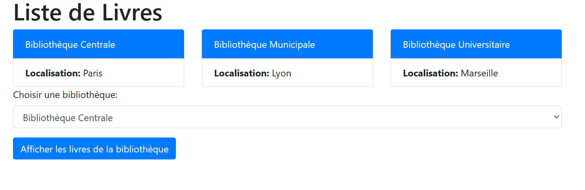
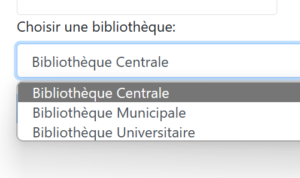
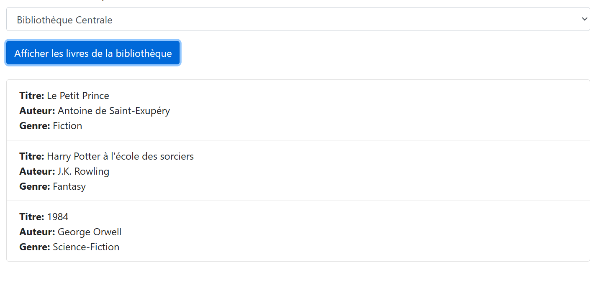

Sujet 2 : Biblio
Friday, March 15, 2024
7:37 AM

var bibliotheques = \[
 "bibliotheque1": {
  "id": 1,
  "nom": "Bibliothèque Centrale",
  "localisation": "Paris",
  "livres": \[
   {
    "titre"= "Le Petit Prince",
    "auteur"= "Antoine de Saint-Exupéry",
    "genre"= "Fiction"
   },
   {
    "titre"= "Harry Potter à l'école des sorciers",
    "auteur"= "J.K. Rowling",
    "genre"= "Fantasy"
   },
   {
    "titre"= "1984",
    "auteur"= "George Orwell",
    "genre"= "Science-Fiction"
   }
  \]
 },
 "bibliotheque2": {
  "id": 2,
  "nom": "Bibliothèque Municipale",
  "localisation": "Lyon",
  "livres": \[
   {
    "titre"= "L'Étranger",
    "auteur"= "Albert Camus",
    "genre"= "Fiction"
   },
   {
    "titre"= "Les Misérables",
    "auteur"= "Victor Hugo",
    "genre"= "Classique"
   }
  \]
 },
 "bibliotheque3": {
  "id": 3,
  "nom": "Bibliothèque Universitaire",
  "localisation": "Marseille",
  "livres": \[
   {
    "titre"= "Le Seigneur des Anneaux: La Communauté de l'Anneau",
    "auteur"= "J.R.R. Tolkien",
    "genre"= "Fantasy"
   },
   {
    "titre"= "Le Meilleur des mondes",
    "auteur"= "Aldous Huxley",
    "genre"= "Science-Fiction"
   }
  \]
 }
\];

\

 \<h1\>Liste de Livres\</h1\>
 \

  \<!-- Les bibliothèques seront ajoutées ici --\>
 \</div\>
 \

  \<label for="select-bibliotheque"\>Choisir une bibliothèque:\</label\>
  \<select id="select-bibliotheque" class="form-control"\>
   \<!-- Options des bibliothèques seront ajoutées ici --\>
  \</select\>
 \</div\>
 \<button class="btn btn-primary"\>Afficher les livres de la bibliothèque\</button\>
 \

  \<!-- Le contenu JSON des livres sera ajouté ici --\>
 \</div\>
\</div\>

==Réaliser la page HTML==

==La div des bibliothèque va afficher les bibliothèque sous forme de liste==
==Le nom de la bibliothèque est un titre de la liste, et les informations sont des items==

==Pour choisir une bibliothèque et afficher ses livres vous pouvez utiliser la liste de choix, et ensuite cliquer sur Charger les livres de la bibliothèque :==

==Les livres sont affichés de la même manière que les bibliothèque==

==Etape finale :==
==Pour afficher les livres vous pouvez aussi cliquer sur la div de la bibliothèque==

