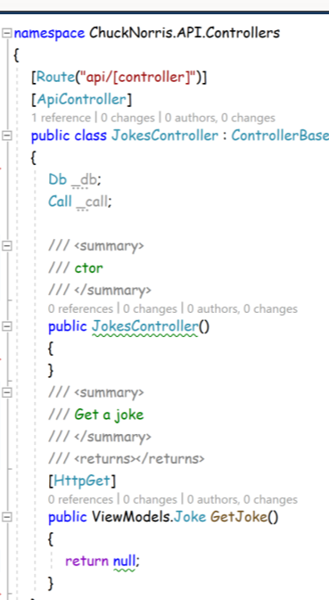

Le fichier dockerfile : est un fichier qui exécute des instructions pour build une image

Localhost:8080 : Adresse principale de l'hôte avec le port à mapper

Conteneur utiliser :

Base : Contien l'image ASP.NET

Le port 8888 doit être utiliser pour le projet car il est utilise pour executer des serveurs Docker en interne.

Différence entre du code PHP et asp.NET =\> leurs compilations

Comment récupérer le contenue de l'application construit ? (à cherchez)

Différence entre dockerfile et dockercompose

Dockercompose : Utiliser pour automatiser des ligne de commandes

---------------------------------------------------------------------------------------------------------------------------------------

Petit application utilisant docker

Lien entre azuredevops et le code

==Étapes un projet :==

==1 : Agile==
==2: Repos==
==3 : initialisation==
==4 : branches==
==5 : clone==
==6 : code==
==7 : tests==
==8 : commit + message==
==9 : push==

==10 : Créer ensuite une PR (pull request)==

==Et ensuite ru==

==11 :pipeline==

==12 : Mise en production==

==A l'aide de L'IA verifier le niveau de la blague de chuck Norris==

Exercice B2 SLAM 2024

L'onglet **ChuckNorris.API** concerne la gestion de du projet API (ajout des controlleur Back end…).

L'onglet **ChuckNorris.MsTests** concerne le test du projet

L'onglet **ChuckNorris.Tools** concerne toutes les fonctionnalités et outils pour la création du projet.

L'onglet **ChuckNorris.WebSite** concerne le déployement su site web du projet front end.

Ce code permet de créer un controlleur de l'API de chunk Norris il contient

Une class public nomé JokesController : ControllerBase

----------------------------------------------------------------------------------------------

Dans cette classe on met Db permettant de configurer une base de donné.
Cependant il semble que pour le moment il n'y a aucune Database relier
Call est aussi défini pour appeler la Database.
Tous comme le paramètre permettant de configurer la base donné n'est pas définie également.

On peut voir une methode JokesController mais qui ne semble pas être définie

\[HttpGet\] : Permet envoyer une requête HTTP à une URL

**public ViewsModels.Joke GetJoke()**

**ViewModels.Joke** retourne la méthode Joke au nom de la class ViewModels.

**GetJoke** : C'est le nom de la méthode permettant de retourner la blague Chuck Norris.

**return null** : La méthode ne retourne aucune instance valide

Ce code concerne la partie du models API

Cette class est nommé Joke et possède des chaine de caractère définie dont Id et Content
Attribué à get et set.

3 récits utilisateurs ou feature

- Récupération de l'API

- Stocker les informations dans la base de donné

- Afficher la blague

- Catégorisation des blague à l'aide de l'IA générative

Dataanottation :

Dynamic :

Generic :
