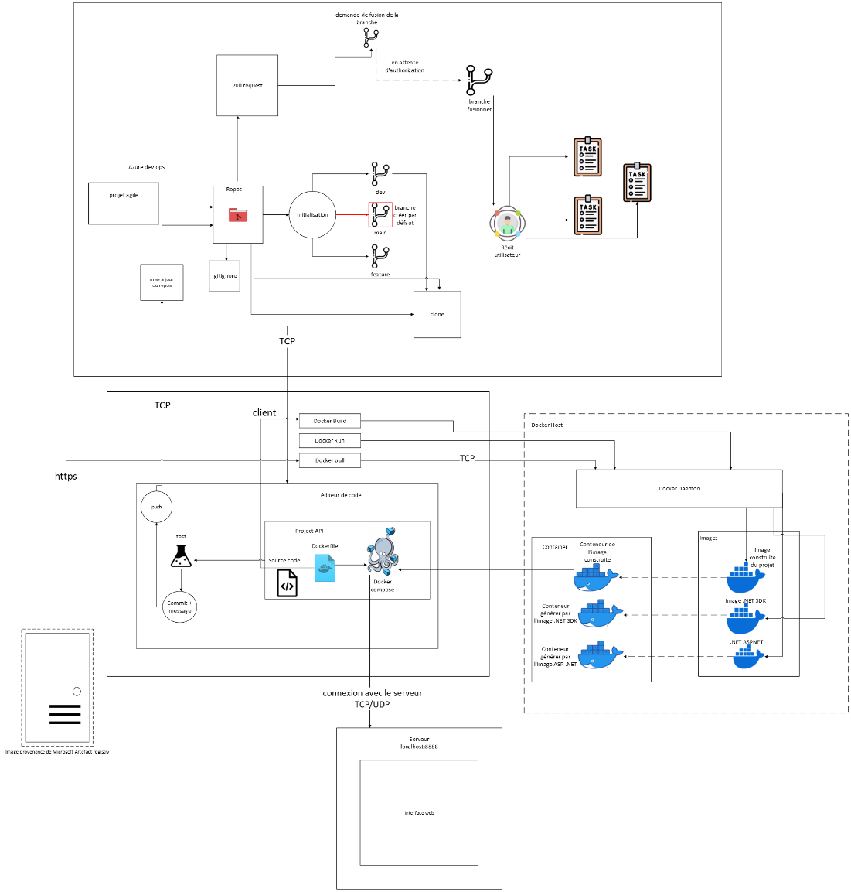
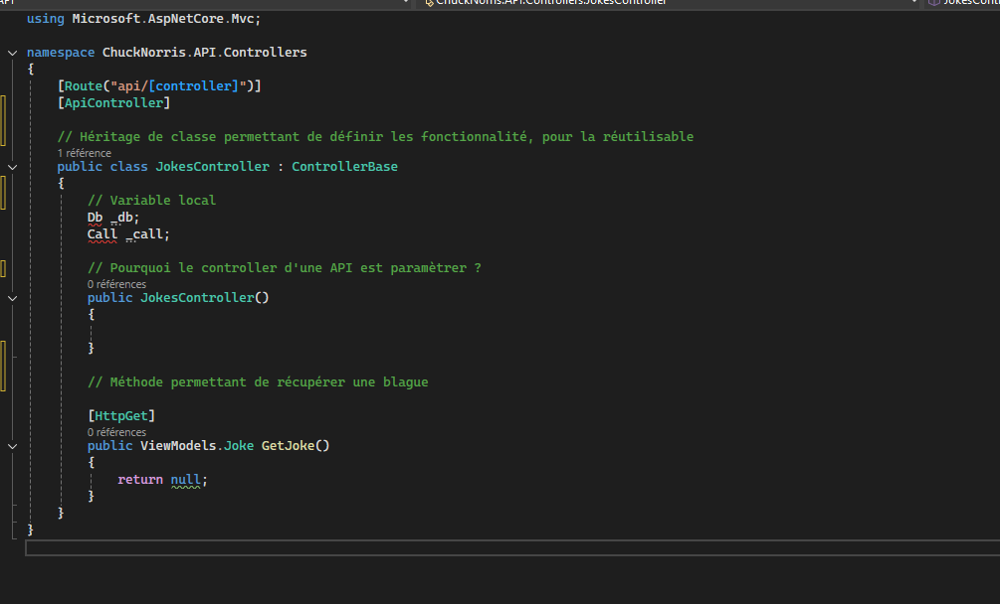

- Container : 3

- Serveur Web -\> API
- Base de donné
Architecture : Communication TCP/IP
- 80 : Port servant pour communiquer en HTTP
- 1433 : Servant à la connexion de la base de donné
- 8080 : communication local avec une application en mode serveur

-\> .net

Écrire la chaine de connexion pour se connecter entre l'API et le serveur de base de donné

- L'adresse IP du serveur pour faire fonctionner le service : 127.0.0.1
- Port du service : port: 1433
- Authentification : Sa Pasword123456789
- Accès au service : en mode pont

connectionString : Data Source=mssqlserver.database.windows.net;Initial Catalog=mssqlserver_e2e_db;Integrated Security=False;User ID=mssqluser;Password123456789=mssqlpassword

*À partir de l’adresse \<<https://experienceleague.adobe.com/fr/docs/experience-platform/sources/api-tutorials/create/databases/sql-server>\>*

Connection string

Démontrer l'accès dynamique

Mettre une stratégie de sauvegarde

Décrire les intégrations dans les composants

Un Controller est un exemple de composants.

- Mettre les méthode dans les Controller
- Des Modèles
- Interconnexion entre Controller
- Échange d'URL avec exemple

Comment configurer le format de retour dans une API.

Site.js : Gérer le call et les requêtes SQL
Joke.js :

Démontrer l'utilisation d'une promesse insachrone sans utilisation d'API

Test Unitaire :

- Permet de tester une méthode ou une fonctionnalité
- Tester des composant API

Toute les connexion entrante doivent être fermer.
Ce test doit être connecté sans la base de donné.

Test d'intégration

Teste l'intégralité de l'application.

Test end to end :

Pour tester le réseau

1er Teste qui est unitaire car on va vérifier une méthode 'var url = "https"

2ème Teste intégration pour vérifier l'intégralité du fonctionnement de la base de donné

Transaction : permet de la valide ou pas valider les modification dans la base de donée.

GetJoke : Méthode permettant de récupérer une joke

GetDatafromAPI : Récupération des donné depuis l'API

Comment faire une seule méthode avec ces 2 méthodes

Quelle est la problématique d'une chaine de connexion

