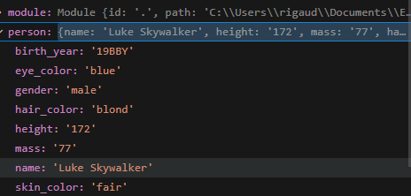

16/5/2024
Thursday, May 16, 2024
8:57 AM

Q/A : /

1.  Le type qu'est "person" est de type object car il composé de plusieurs
Valeurs don’t : name, height, mass, hair_color, skin_color, eye_color, birth_year et gender.

2.  Lors du débug la variable personne renvoie la description complète de ce contient la variable personne.

3.  

