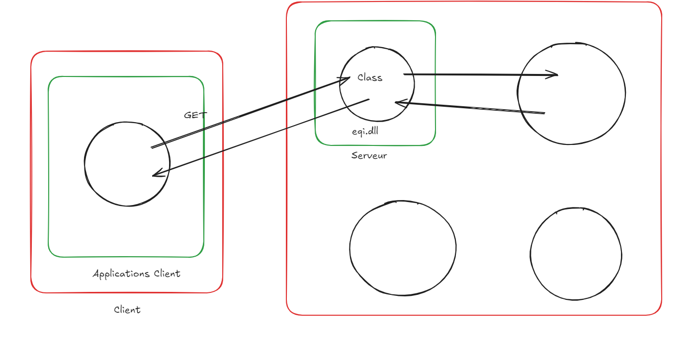

Q/A :

1.  Comment fonctionne les testes ?

2.  Pourquoi écrire les test unitaire avant ?

3.  Plan de sauvegarde ?

4.  Comment utiliser les classes et les méthode pour faire le schéma applicatif ? (composant dans le schéma applicatif)

Faire a notion entre client et serveur

5.  Comment faire les organisations des tests ?

Notion test unitaire : elle teste une méthode et un cas

6.  Demo pour utiliser les librairie ?

C'est un ensemble de méthode, classe propriété dont du code que l'on va pouvoir réutiliser.

7.  Qu'est ce que le Mocking ?

A partir de l'analyse de cet méthode démontrer qu'elle n'est pas bien écrite pour qu'elle soit réutilisable :

public int ReturnMinus(List\<int\> values) {

return values.Count;

}

Tester, c'est douter

Test driven development

*À partir de l’adresse \<<https://www.google.com/search?q=TDD&oq=TDD&gs_lcrp=EgZjaHJvbWUyCQgAEEUYORiABDIHCAEQABiABDIHCAIQABiABDIHCAMQABiABDINCAQQLhivARjHARiABDIHCAUQABiABDIHCAYQABiABDIHCAcQABiABDIJCAgQLhgKGIAEMgcICRAAGIAE0gEJMzQzNWowajE1qAIAsAIA&sourceid=chrome&ie=UTF-8>\>*

Faire un schéma d'infrastructure

1.  Créer la class player

2.  Class Teams
3.  Class Service
Écrire les test unitaires

Class Player : Ajout des joueurs

Identifiant du joueur noter en nombre id

Nom : Ajouter

Clas

Schéma d'architecture applicatif

Cas Player team créer les tests unitaire

Le cas Chuck Norris

PR

Créer ses propres exception métier

Prendre un outil permettant de voir comment le code n'est pas bon

SonarCloud

La programmation orienté objet est un modèle de programmation reposant sur le concept de classes ou d'objets qui permet d'être réutilisable.

Snyk

