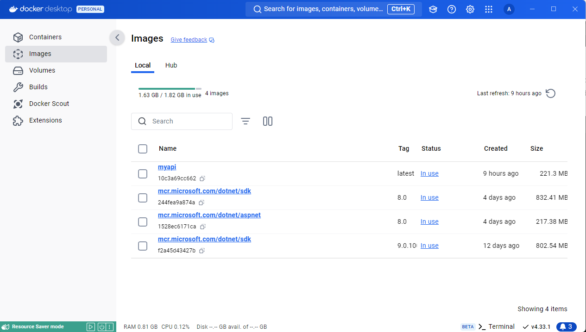

Définir les avantages dans le SAAS

SAAS

Avantages et inconvénients

- Moins d'activité (Inconvénients)
- Plus de pratique (avantages)
- Plus adaptable (avantages)

On Promises

Editeur logiciel

- Resette mensuel payer par le client

2 types de licences :
-\> user (consommation de jeton)

-\> site (payement mensuel ou annuelle)

-\> paramètre
-\> développement spécifique

Cominments =\>

Consistensing =\> Faire la cohérence entre éléments

----------------------------------------------------------------------------------------------------------------------------------

Environnement de travail -\> IDE
-\> Debug

Outils collaboratif : code -\> Git, Github
Projet -\> Azuredevops, Github

1 la version (librairie)

2 Reste environnement execution

- Serveur web
- Serveur Data

Image : Package léger et autonome qui inclut tout ce dont une application a besoin pour fonctionner

Conteneur : Une instance en cours d'exécution d'une image Docker. C'est une unité légère, isolée et portable qui exécute une application.

Objectifs

Tirer parti de GitHub Actions pour publier sur GitHub Packages

<https://learn.microsoft.com/fr-fr/training/modules/github-actions-packages/>

**Déployer et exécuter une application web conteneurisée avec Azure App Service**

*À partir de l’adresse \<<https://learn.microsoft.com/fr-fr/training/modules/deploy-run-container-app-service/>\>*
**
*Objectif*
**
*Executer une image docker run SDK depuis une API en utilisant NET 8.0*

Pour remédier à cela j'ai créer un projet web api sur Vscode

On utilise pour cela la comande

dotnet new webapi -n MyAPi

Cet commande permet de créer un projet webApi que j'aurais besoin pour l'initialisation des images et conteneurs Docker.

J'aurais besoin ensuite de deux images Docker dont .NET SDK et ASP.NET qui sont deux images Stocker dans Microsoft artifact registery

Microsoft Artifact Registery est un site de stockage de image docker de Microsoft.

Le .NET SDK gérer toute la gestion du projet, c'est une image qui est lourd

Le .NET Aspnet est une image léger qui permet seulement d'exécuter le projet de manière optimale.

Pour télécharger ces deux images on peut utiliser la comande

docker pull \<Nom-de-l'image\>

Pour télécharger l'image Docker

Les deux images que j'ai utiliser sont mcr.microsoft.com/dotnet/sdk:8.0 et mcr.microsoft.com/dotnet/aspnet:8.0

Pour ce test on utilisera la version 8.0 du .NET qui la plus récente et propose plus de fonctionnalité

Une que les images on été télécharger les deux images apparaîtront dans la liste "Images" dans docker Desktop

Après cela dans le projet webAPi on va créer un fichier nomé "Dockerfile"

Ce fichier sera créer au même endroit du fichier de projet de solution car si ce dernier est ailleurs la construction du projet ne fonctionnera pas

Le fichier Dockerfile permet d'utiliser les images Microsoft qui sont téléchargé

Une fois que cela est fait on execute la commande "docker build" pour construire le projet dans une image docker.

Soit la commande : docker build -t myapi:latest . "On peut nommé l'image qui sera par exemple myapi"

Après avoir executer cet commande l'image sera générer sans erreur

Après cela on utilise la commande

docker run -d -p 8080:80 --name myapi_container myapi:latest

Cet commande permet de démarrer un conteneur basé sur l'image créer et utilisera le port 8080:80

Cela devrais retourner un l'id du conteneur.

Une fois que cela est fait il faudras utiliser la commande

curl <http://localhost:8080/weatherforecast> "pour accèder à l'API"

Cependant cela ne marchera pas car cela retournera un message d'erreur

curl : La connexion sous-jacente a été fermée : La connexion a été interrompue de manière inattendue.
Au caractère Ligne:1 : 1
\+ curl <http://localhost:8080/weatherforecast>
\+ \~\~\~\~\~\~\~\~\~\~\~\~\~\~\~\~\~\~\~\~\~\~\~\~\~\~~
\+ CategoryInfo : InvalidOperation : (System.Net.HttpWebRequest:HttpWebRequest) \[Invoke-WebRequest\], WebException
\+ FullyQualifiedErrorId : WebCmdletWebResponseException,Microsoft.PowerShell.Commands.InvokeWebRequestCommand

L'erreur indique que la connexion a été fermer de manière inattendue en raison d'un problème de connexion entre l'hôte et le conteneur.

Pour vérifier cela il faudra s'assurer que l'API fonctionne à l'intérieur du conteneur

Pour cela on démarre une fenêtre de commande

Dans le bureau en cliquant sur démarrer

Il faut entré terminal ou invite de commande pour accèder au shell de L'OS.

Il faudra s'assurer que le conteneur est démarrer pour cela on entre la commande

docker ps "Commande permettant de voir si un conteneur est en cours d'exécution"

Si le conteneur n'est pas afficher alors cela signifie que le conteneur n'est pas démarrer.

Pour résoudre ce problème dans le logiciel Docker Desktop

Démarrer le conteneur gérer le projet WebAPI en cliquant sur la flèche à droite dans la section Action.

On demandera si on veut exécuter l'image il faudra cliquer sur "Run"

Après cela un logs aparaîtra pour dire que le conteneur est démarrer et que le projet peut répondre en utilisant le port 8080 à l'adresse de l'hôte.

En executant une nouvelle fois docker ps dans le shell

On constatera par la suite que l'image est belle est bien en cours d'execution

Si cela ne fonctionne toujours pas on peut mettre

builder.WebHost.ConfigureKestrel(options =\> { options.ListenAnyIP(80); // Port que Docker utilisera});

Ce bout de code C# permetra au projet d'écouter sur toute les interface réseau en port 80

Si cela ne marche toujours pas il faudra entré dans le conteneur pour vérifier si le projet fonction à l'intérieur de ce dernier.

Pour cela on utilise la commande

docker exec -it myapi_container /bin/bash "commande permettant d'accèder au conteneur".

Il faut s'assurer avant tout que le conteneur est bien en cours d'exécution

Pour cela si après l'erreur indiquer afiche ceci

Try Docker Debug for seamless, persistent debugging tools in any container or image → docker debug myapi_container
Learn more at <https://docs.docker.com/go/debug-cli/>
Error response from daemon: container f3d83058db1aac399aa79e9e69b91333411184247381100bb46aa8cdbc7afbfb is not running

Une fois que cela est fais en executant la commande

docker exec -it myapi_container /bin/bash

On accède aux shell du conteneur

root@f3d83058db1a:/app# "A noter que le conteneur créer utilise une distribution basé sur Linux"

Il faudra installer le paquet curl si ce n'est pas déjà fait en utilisant la commande

apt-get install curl

Après l'installation on peut maintenant utiliser la commande

curl <http://localhost:8080/weatherforecast>

Si cela ne fonctionne toujours pas executer un nouveau conteneur

Au lieu d'utiliser le port 8080:80 on utilisera le port 8080:8080 pour forcer l'application sur le port 8080

Soit la commande

docker run -d -p 8080:8080 --name myapi_container myapi:latest

Il faudra s'assurer d'utiliser la commande "docker stop" pour arrêter le conteneur et le suprimer "docker rm"

Pour suprimer le conteneur il suffit d'entrer l'ID ou son nom exacte.

Après cela on peut revenir dans le conteneur et executer la commande "curl"

Si cela fonctionne cela devrait renvoyer un fichier JSON affichant les température En dégré Celcius et Faraneinth avec une chaine caractère nomé Froid, Gélé, Chaud etc…

Voici ce que cela doit retourné

\[{"date":"2024-09-09","temperatureC":23,"summary":"Hot","temperatureF":73},{"date":"2024-09-10","temperatureC":30,"summary":"Cool","temperatureF":85},{"date":"2024-09-11","temperatureC":9,"summary":"Sweltering","temperatureF":48},{"date":"2024-09-12","temperatureC":20,"summary":"Warm","temperatureF":67},{"date":"2024-09-13","temperatureC":-18,"summary":"Chilly","temperatureF":0}\]

Description le fichier JSON permet de générer des température en celcius et faraneinth des prochain jours et une chaine de caractère de manière aléatoire.

Si cela marche dans le conteneur s'est que l'hôte est censé lire le fichier JSON également il faudra executé la même commande sur l'hôte

On peut vérifier également à l'aide d'un naviguateur au choix pour voir si cela fonctionne

Conclusion :

Ce projet permet d'afficher des température avec une valeur summary de manière aléatoire et affiche les dattes avenir.
On utilise les images .NET SDK et asp .NET pour que le projet fonctionne corectement.
Il fallait s'assurer que le projet fonctionne à l'intérieur du conteneur et sur l'hôte ce qui à provoquer des erreur de connexion lors de mes tentatives.

