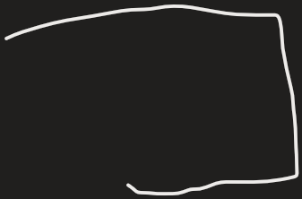
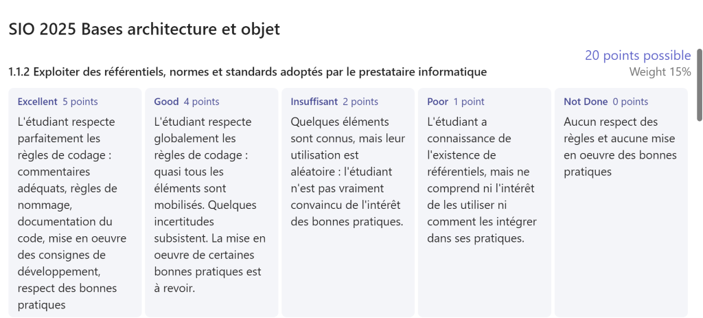
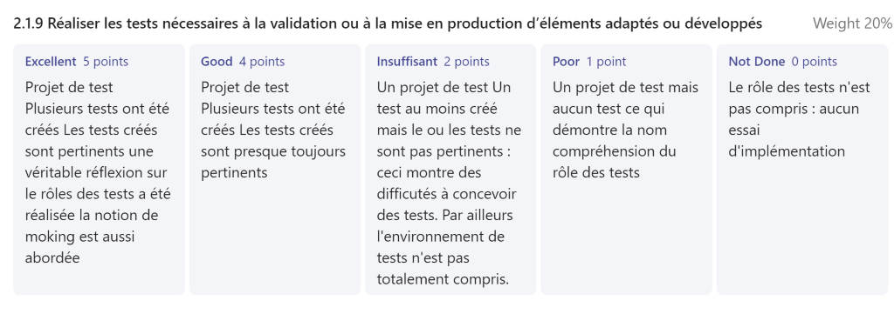

- Q/A: /0

Quelle est l'indicateur et sa valeur qui permet de déterminer l'éfficacité des test ?

TDD

Quelle est l'approche utiliser dans cet évaluation ?

- Code Coverage : 100%

Approche applicative :

Entities : M

Tests : V

Services : C

Entities
Services

1 : Solution

3 projets :

- Teamplayer.Entities
- Services
- Tests

2 classes Teamplayer.Entities
3 classes dans tests
1 classe dans services

Qu'est ce que les exceptions ?

Elle permette de corriger les erreurs

Toutes exception doit être lever

Dans les PR , explications descommentaires

\#cmt = \>commentairesmanquants
\#opti =\>optimisationdu code (algorithmique)
\#refact =\> refactoringnécessaire
\#CV , \#IAG =\> code copiercollerd'internetnonjustifié,non pertinent
\#naming =\> non respect des conventions denommage
\#codeX =\> codeincompréhensible
\#param =\>paramètragedu codenécessaire

remarques : dansunePR on ne livre pas du code quitechniquementnefonctionnepas !!!!

<table>
<colgroup>
<col style="width: 10%" />
<col style="width: 12%" />
<col style="width: 14%" />
<col style="width: 26%" />
<col style="width: 10%" />
<col style="width: 14%" />
<col style="width: 11%" />
</colgroup>
<thead>
<tr class="header">
<th>
Lesniveaux

Comentaire manquants
</th>
<th>
❌ nonréalisé

Les commentaire n'ont pas été mis
</th>
<th>☢ nonévaluable</th>
<th>⚠noncomprisàretravailler</th>
<th>✔Valider</th>
<th>💹àaméliorer</th>
<th>🧨A ne pasreproduire</th>
</tr>
</thead>
<tbody>
</tbody>
</table>

<table>
<colgroup>
<col style="width: 10%" />
<col style="width: 11%" />
<col style="width: 14%" />
<col style="width: 26%" />
<col style="width: 10%" />
<col style="width: 14%" />
<col style="width: 11%" />
</colgroup>
<thead>
<tr class="header">
<th>
Lesniveaux

Naming
</th>
<th>❌ nonréalisé</th>
<th>☢ nonévaluable</th>
<th>⚠noncomprisàretravailler</th>
<th>
✔Valider

Les convention de nommage on été maîtriser
</th>
<th>💹àaméliorer</th>
<th>🧨A ne pasreproduire</th>
</tr>
</thead>
<tbody>
</tbody>
</table>

<table>
<colgroup>
<col style="width: 10%" />
<col style="width: 11%" />
<col style="width: 14%" />
<col style="width: 26%" />
<col style="width: 10%" />
<col style="width: 14%" />
<col style="width: 11%" />
</colgroup>
<thead>
<tr class="header">
<th>
Lesniveaux

</th>
<th>
❌ nonréalisé

</th>
<th>☢ nonévaluable</th>
<th>⚠noncomprisàretravailler</th>
<th>✔Valider</th>
<th>💹àaméliorer</th>
<th>🧨A ne pasreproduire</th>
</tr>
</thead>
<tbody>
</tbody>
</table>

<table>
<colgroup>
<col style="width: 14%" />
<col style="width: 13%" />
<col style="width: 15%" />
<col style="width: 23%" />
<col style="width: 9%" />
<col style="width: 11%" />
<col style="width: 11%" />
</colgroup>
<thead>
<tr class="header">
<th>Réalisation</th>
<th>
❌

nonréalisé
</th>
<th>
☢

nonévaluable
</th>
<th>
⚠

noncomprisàretravailler
</th>
<th>
✔

Valider
</th>
<th>
💹

àaméliorer
</th>
<th>🧨A ne pasreproduire</th>
</tr>
</thead>
<tbody>
<tr class="odd">
<td>Commentaire manquant :</td>
<td>Les commentaire n'ont pas été mis</td>
<td></td>
<td></td>
<td></td>
<td></td>
<td></td>
</tr>
<tr class="even">
<td>Optimisation du code :</td>
<td></td>
<td></td>
<td></td>
<td>Le code est optimisé</td>
<td></td>
<td></td>
</tr>
<tr class="odd">
<td>Naming Convention</td>
<td></td>
<td></td>
<td></td>
<td>Les convention de nommage ont été respecté</td>
<td></td>
<td></td>
</tr>
<tr class="even">
<td>Code imcompréemsible</td>
<td></td>
<td>Comme il n'y a pas de code le code est impompréhensible</td>
<td></td>
<td></td>
<td></td>
<td></td>
</tr>
<tr class="odd">
<td></td>
<td></td>
<td></td>
<td></td>
<td></td>
<td></td>
<td></td>
</tr>
<tr class="even">
<td></td>
<td></td>
<td></td>
<td></td>
<td></td>
<td></td>
<td></td>
</tr>
<tr class="odd">
<td></td>
<td></td>
<td></td>
<td></td>
<td></td>
<td></td>
<td></td>
</tr>
</tbody>
</table>

*À partir de l’adresse \<<https://euc-onenote.officeapps.live.com/o/onenoteframe.aspx?ui=en-US&rs=fr-FR&wopisrc=https%3A%2F%2Fgroupesb.sharepoint.com%2Fsites%2FSIO2025SLAM%2F_vti_bin%2Fwopi.ashx%2Ffiles%2F549dabc889864db3a255835a76b3c962&wd=target%282025%20eval%201%2030%5C%2F09%5C%2F2025%7C2e2a99a9%2D2d14%2D428a%2D832b%2D78c6f0705cf2%2F%29&wdorigin=NavigationUrl&wdenableroaming=1&wdfr=1&mscc=1&hid=B94255A1-2012-9000-CD9B-CA84336867D3.0&uih=sharepointcom&wdlcid=en-US&dchat=1&sc=%7B%22pmo%22%3A%22https%3A%2F%2Fgroupesb.sharepoint.com%22%2C%22pmshare%22%3Atrue%7D&wdhostclicktime=1727684065192&jsapi=1&jsapiver=v1&newsession=1&corrid=cacf63ff-ba0d-9563-2a17-b2ea96c6eb3d&usid=cacf63ff-ba0d-9563-2a17-b2ea96c6eb3d&sftc=1&sams=1&cac=1&mtf=1&sfp=1&hch=1&hwfh=1&uihit=docaspx&muv=1&wdredirectionreason=Force_SingleStepBoot&rct=Normal&ctp=LeastProtected>\>*

*À partir de l’adresse \<<https://euc-onenote.officeapps.live.com/o/onenoteframe.aspx?ui=en-US&rs=fr-FR&wopisrc=https%3A%2F%2Fgroupesb.sharepoint.com%2Fsites%2FSIO2025SLAM%2F_vti_bin%2Fwopi.ashx%2Ffiles%2F549dabc889864db3a255835a76b3c962&wd=target%282025%20Eval%202%2030%5C%2F09%5C%2F2025%20Code%20review%7Cdef7f923%2D53cf%2D471f%2Da2ad%2D6cdc6a1ef268%2F%29&wdorigin=NavigationUrl&wdenableroaming=1&wdfr=1&mscc=1&hid=384955A1-0061-A000-229C-CC4D76DCC576.0&uih=sharepointcom&wdlcid=en-US&dchat=1&sc=%7B%22pmo%22%3A%22https%3A%2F%2Fgroupesb.sharepoint.com%22%2C%22pmshare%22%3Atrue%7D&wdhostclicktime=1727690877886&jsapi=1&jsapiver=v1&newsession=1&corrid=98922c73-3d6a-372d-6511-6677900fb66c&usid=98922c73-3d6a-372d-6511-6677900fb66c&sftc=1&sams=1&cac=1&mtf=1&sfp=1&hch=1&hwfh=1&uihit=docaspx&muv=1&wdredirectionreason=Force_SingleStepBoot&rct=Normal&ctp=LeastProtected>\>*

*À partir de l’adresse \<<https://euc-onenote.officeapps.live.com/o/onenoteframe.aspx?ui=en-US&rs=fr-FR&wopisrc=https%3A%2F%2Fgroupesb.sharepoint.com%2Fsites%2FSIO2025SLAM%2F_vti_bin%2Fwopi.ashx%2Ffiles%2F549dabc889864db3a255835a76b3c962&wd=target%282025%20Eval%202%2030%5C%2F09%5C%2F2025%20Code%20review%7Cdef7f923%2D53cf%2D471f%2Da2ad%2D6cdc6a1ef268%2F%29&wdorigin=NavigationUrl&wdenableroaming=1&wdfr=1&mscc=1&hid=384955A1-0061-A000-229C-CC4D76DCC576.0&uih=sharepointcom&wdlcid=en-US&dchat=1&sc=%7B%22pmo%22%3A%22https%3A%2F%2Fgroupesb.sharepoint.com%22%2C%22pmshare%22%3Atrue%7D&wdhostclicktime=1727690877886&jsapi=1&jsapiver=v1&newsession=1&corrid=98922c73-3d6a-372d-6511-6677900fb66c&usid=98922c73-3d6a-372d-6511-6677900fb66c&sftc=1&sams=1&cac=1&mtf=1&sfp=1&hch=1&hwfh=1&uihit=docaspx&muv=1&wdredirectionreason=Force_SingleStepBoot&rct=Normal&ctp=LeastProtected>\>*

Le code doit comporté plusieurs lignes

On refactor player en utilisant :

Ajoutez player à la classe PlayerNotFoundException

Cherchez refactorisation ???

- Réecriture du code source permettant à la faciliter de sa relecture, son débogage et son extension.

