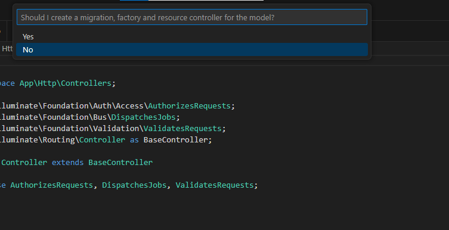

Cours 2 4/04/2024
Thursday, April 4, 2024
8:57 AM

Intro PHP MVC

Utilisation du framwork LARAVEL

Model View Controller

Séparation des couches de présentation et business logic
Web page avec le mnimum

Model : structure de donnée avec php, html et une base de donné fonctionnel

View : Informations à présenter soit à afficher

Controller : Qui est la pièce maitresse du site, qui va permettre d'échanger les Data et va faire un appelle de view pour afficher les donné. La logique métier doit être respectée.

Pas d'interaction entre la view et le model

LARAVEL lien :

Framework utilisant des biliothèques objets.

On peut faire des teste unitaire.

Artisan qui va permettre de structurer notre code

Installation de framework Laravelle

Se rendre sur la page :

<https://laravel.com/docs/4.2>

Il est possible que xdebug empêche l'installation du framework Laravelle pour résoudre le problème, on commente les lignes xdebug

\[Xdebug\]
;xdebug.remote_enable=1
;xdebug.remote_autostart=1

On créait ensuite un projet laravel

Une fois que tout est installer cela affichera se message

Welcome.blade.php : permet de faire du code en php de manière simple

Le dossier public seront tous les fichier que l'utilisateur peut créer

