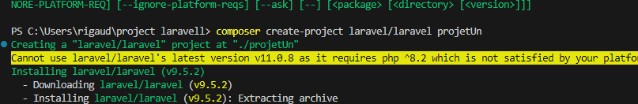
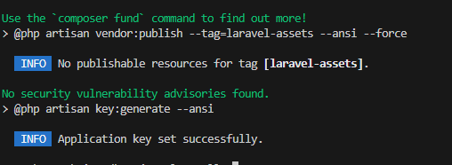
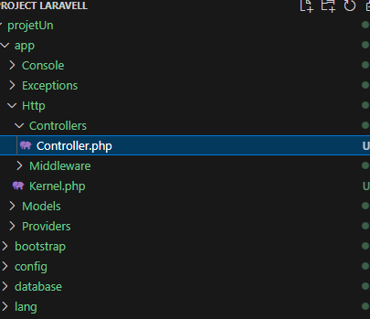
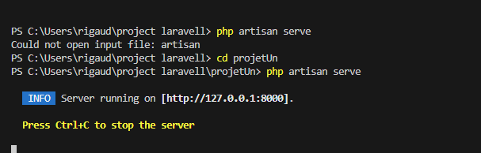
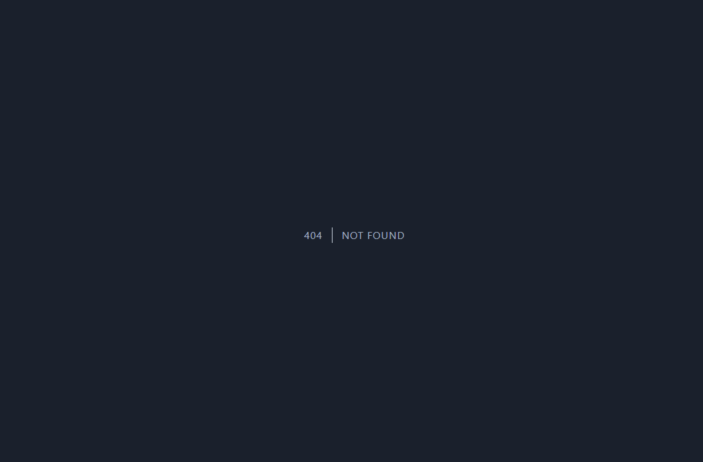
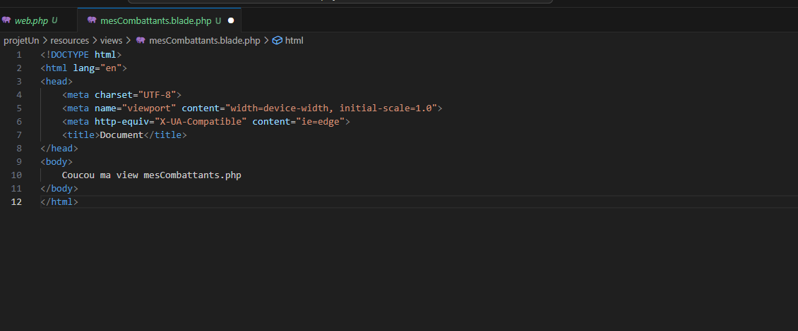

AM

Mis en place des différente requête permettant de retourner des résultat sur une base de donné :

\$req = "SELECT \[Id\]
"\[collone mis dans la base de donné\]"

Création d'un projet

Dans Vs code new terminal

Création du projet

Cela créer un projet Laravell

Une fois terminer le message Application key set successfully

Tous les projet Laravell on un controller

Lancer la page de base dans le bon répertoire

Pour charger la page ce qui peut provoquer cet erreur  

Affichage des Combattants

Ajout combattant

Ajout dans un combat
