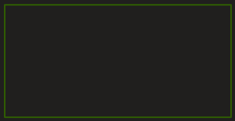

AM

- identifier les non respects des règles de nommage

Erreur de violation de convention de nommage non respecter car ~~tout doit être en camelCase~~, pas de underscore. Mauvaise orthographe des colonnes, des tables et des champs.

- identifier les erreurs potentielles

- Clé primaire manquantes
- ID créer n'importe ou
- Collonne inutile
- Attributs manquants
- Une collone mets une clé primaire id sur les deux collones

- énumérer à quels besoins fonctionnels cette base est supposée répondre

- Gestion des quiz

- Les quiz ont des questions et les questions ont des réponses

- Parmi ces réponses certaine son bonne ou mauvaise

- modifier la base de données en conséquence
- générer le jeu d'essai qui démontre la viabilité du modèle

Je dois enregistrer une réponse pour la stocker

PlayResponse

Booleen pour une valeur vrai ou faux mettre attribut "bit"

Introduire une date mettre "datetime2(7)"

Afficher le nombre de bonne reponse dans la question 12

Pour calculer le score Comparer pour chacune des question, si toute les bonne réponse ont été donner.

