Début de la démonstration de l'exercice précédente :

2.3 Question ? Ø

- 11h 13h

Parties :

- Reponses aux questions

- Query

- modelisation

2.1 Architecture applicative

Architecture applicative :

Service météo

Machine calculateur

Application \<--------\> Service Météo & Machine de calcule

Désérialisation : permet de prendre le Fichier JSON pour le transférer et avoir le résultat de la site des objets.

Sérialisation : On va prendre un objet et le renvoyer au server au format JSON.

Exercice :

Déterminier une API gratuite sur un sujet intéressant pour déployment une équipe.

Utilisation de DBEAVER

Je dois ouvrir DBEAVER  

ensuite me connecter à ma DATABASE  

Je clique sur l'icone du câble  

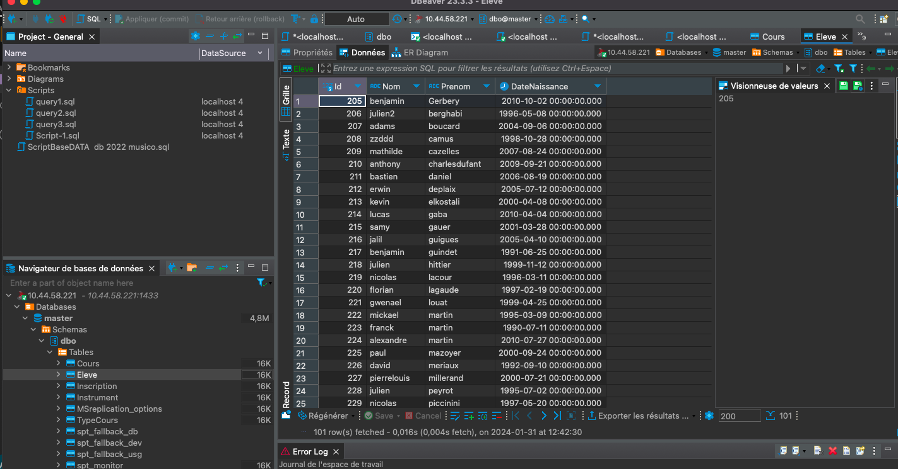

Je clique sur SQL Server

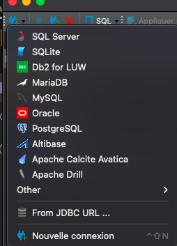

Dans La feunêtre choisir Miscrosoft SQL server

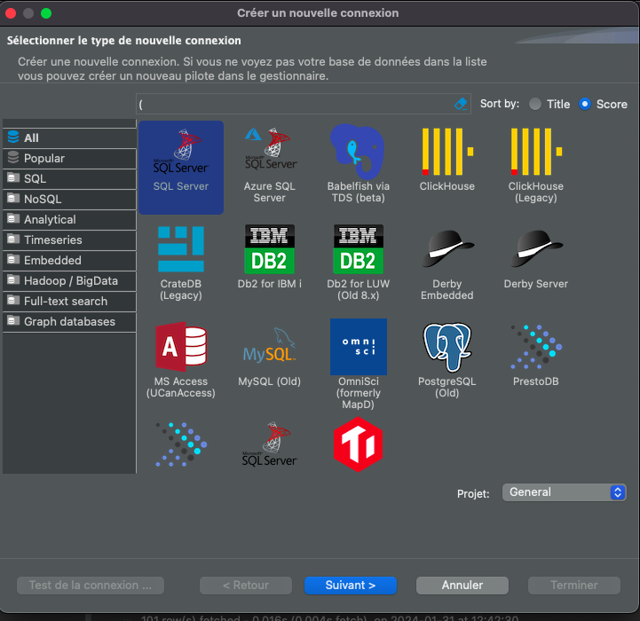
Etape suivante

Dans la feunêtre dans host mettez votre adress IP ou localhost dans database si on ne connait pas sa database ne rien mettre elle s'affichera une fois la connexion efffectuer.

Nom d'utilisateur pas défaut c'est SA
Et le mot passe celui qui à été configurer

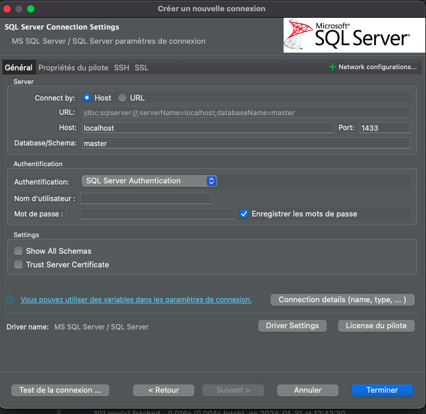
Cliquez sur terminer

Pour trouver le schéma de votre base de donné

Dépliez dans DBO faite un clique droit dessus Table

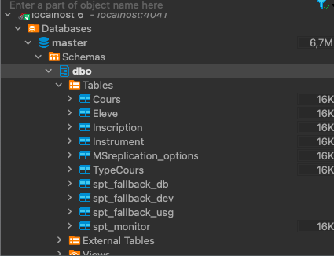

Selectionnez View diagrams

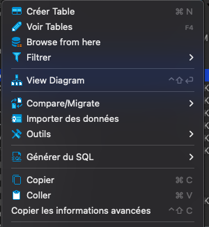

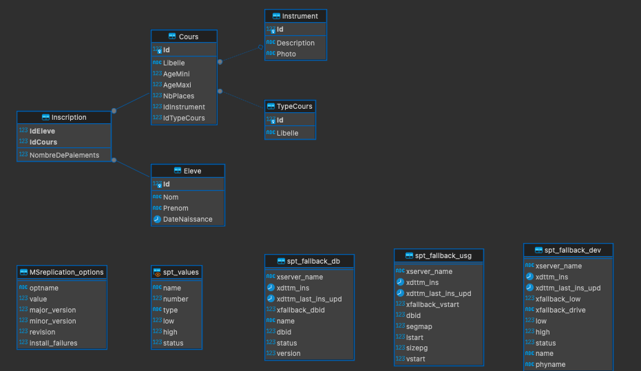

Pour ajouter un script sur Dbeaver aller dans cet onglet à gauche

Developer en faisant clique gauche sur le dossier script

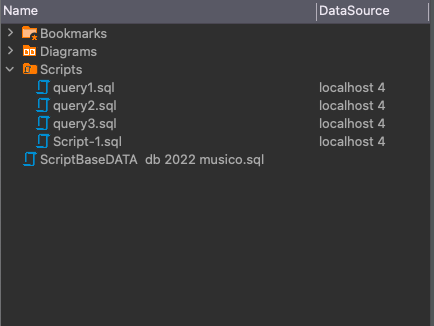

Pour créer un script faite clique gauche sur la flèche à coté de SQL

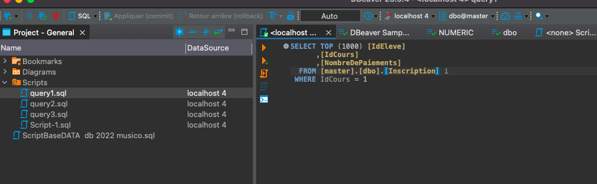

Selectionnez Script SQL

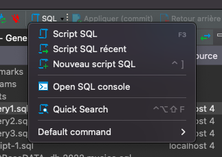

Cela vas générez un nouveau script SQL

On peut copier un script remplis ou le basculer simplement dans le dossier script

Dans notre exemple on va selectionnez les donné dans eleves

Pour cela on tape cet commande

Master.dbo.Eleve est la base de donné recherche mettez votre propre base de donné si elle différente de celle-ci

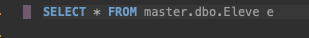

Executer à l'aide de flèche orange le script pas celui avec le + en vert

Dans cet exemple on peut voire une liste de nom et prenom avec la date de naissance qui apparaît

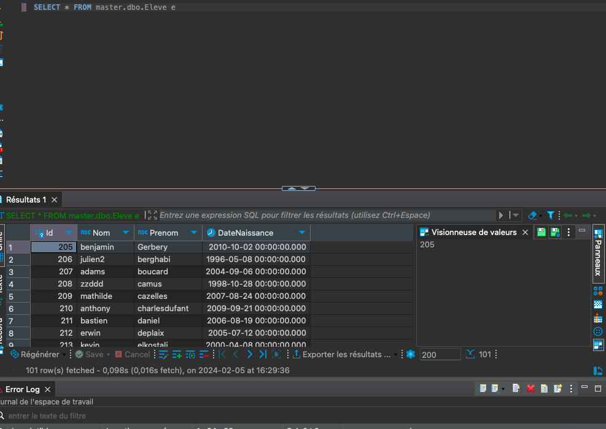

Les erreur apparaissent toute en bas et le nombre de contenue s'affiche en rows ici nous avons
101 rows

Dans cet exercice je devais afficher le nombre de paiement par élève pour cela ont utilise cet commande

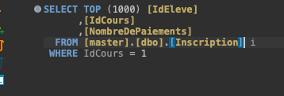

Executer le scipt  

Etudions ce qui l'en ressort  

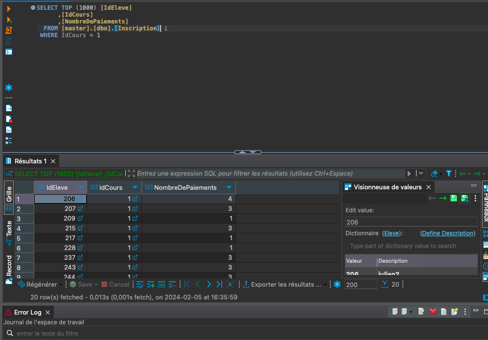
On peut voire dans ce tableau l'ID de l'élève et du Cours ainsi que du nombre de paiement éffectuer
Il 20 rows au total

2ème script voici le contenu  

  

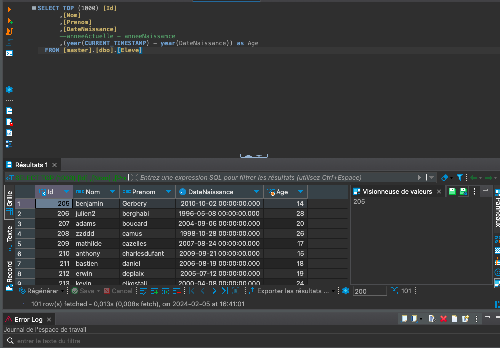

Ce script nous permet d'afficher la date de naissance de tous les étudiants soit 101 rows

On peut voir que le contenue est similaire par rapport à la fois ou on à ajouter

SELECT \* FROM master.dbo.eleve e seulement on à ajouter la date en plus en lui attribuant

Year\[DateNaissance\] as Age

Troisième script permet d'afficher le nombre d'instrument qu'un élève peut jouer  

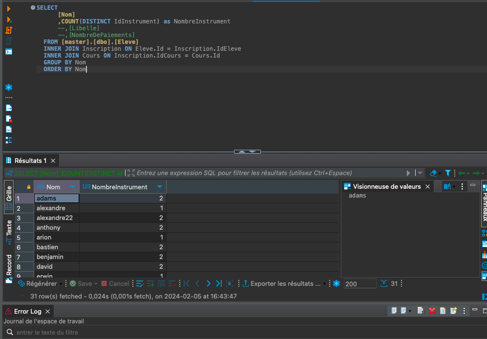

31 contenue
