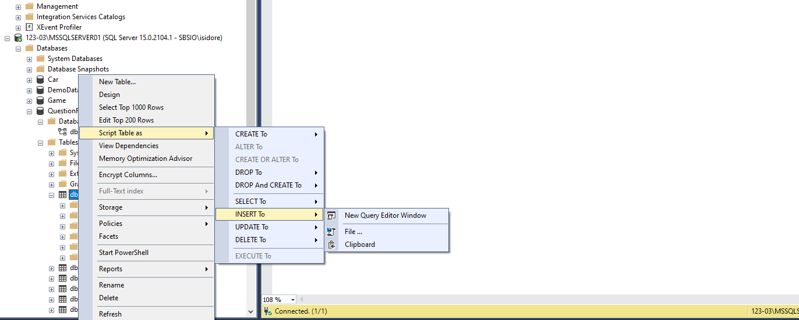

AM
Q/A : /

- 2.3 finalisation base

- 2.1 interpreter WEB

Question et réponse et quiz sont les 3 tables de références

Il faut entrer des données dans ces 3 tables

Pour créer un script à partir d'une table

Script -\> Insert To -\> ClipBoard

QuestionReponse

8 insertion

3 resultat

Playresponse 3\*2

SELECT ('nombredebonReponse')

SELECT ('nombredequestions')

FK_play_user quiz selection

Exemple de display

| 1   | 100 | A   |
|-----|-----|-----|
| 1   | 200 | A   |
| 2   | 100 | A   |
| 2   | 200 | B   |

