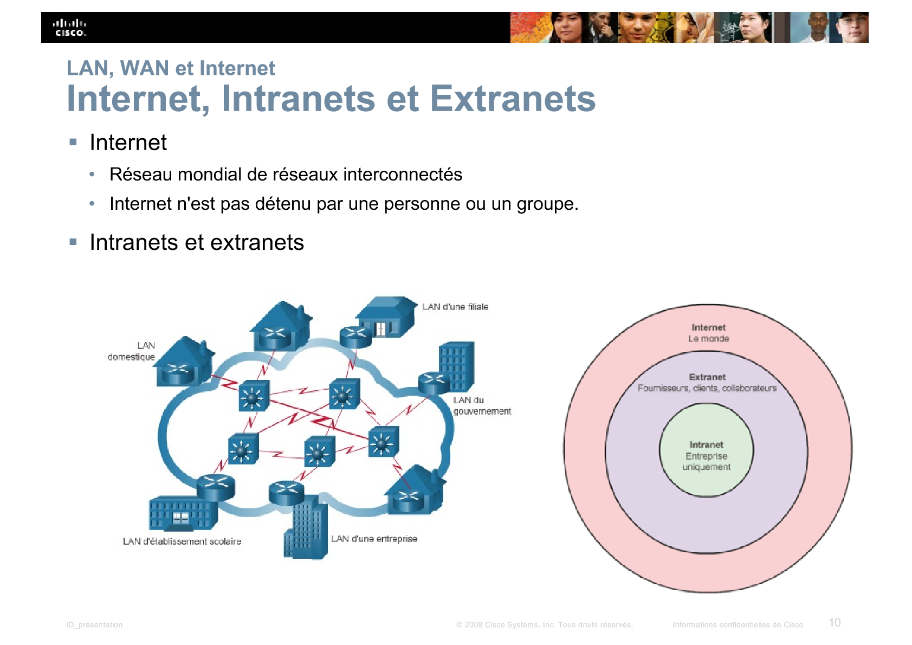

[01 Cours Découverte du réseau.pdf](resources/10caea2f460341eeb6b91bcb729c26e3.pdf)
<table>
<colgroup>
<col style="width: 13%" />
<col style="width: 86%" />
</colgroup>
<thead>
<tr class="header">
<th><strong>Compétences du référentiel</strong></th>
<th><table>
<colgroup>
<col style="width: 100%" />
</colgroup>
<thead>
<tr class="header">
<th><mark>1.2.2 Traiter des demandes concernant les services réseau et système</mark></th>
</tr>
</thead>
<tbody>
<tr class="odd">
<td><mark>2.2.1 Installer et configurer des éléments d’infrastructure</mark></td>
</tr>
<tr class="even">
<td><mark>2.2.6 Déployer une solution d’infrastructure</mark></td>
</tr>
<tr class="odd">
<td><mark>2.3.1 Administrer sur site et à distance des éléments d’une infrastructure</mark></td>
</tr>
</tbody>
</table></th>
</tr>
</thead>
<tbody>
<tr class="odd">
<td>Durée</td>
<td>30 min</td>
</tr>
<tr class="even">
<td>Titre + Contenu</td>
<td>
Cours réseau - <strong>1 - Découverte du réseau</strong>

1.1 Connecté au monde entier 
1.2 Réseaux locaux, réseaux étendus et Internet 
1.3 Le réseau en tant que plate-forme 
1.4 L'environnement réseau changeant

</td>
</tr>
<tr class="odd">
<td>Objectifs</td>
<td>
Expliquer comment les réseaux affectent la façon dont nous interagissons, apprenons, travaillons et jouons

Expliquer comment les périphériques hôtes peuvent être utilisés comme des clients, des serveurs ou les deux

Expliquer l'utilisation des périphériques réseau

Comparer les topologies et les périphériques d'un réseau local aux périphériques et aux topologies d'un réseau étendu

Décrire la structure de base d'Internet

Expliquer comment les réseaux locaux et étendus se connectent à Internet

Expliquer le concept d'un réseau convergent

Décrire les quatre conditions de base pour disposer d'un réseau fiable

Expliquer comment les tendances telles que le BYOD, la collaboration en ligne, la vidéo et le cloud computing changent la façon dont nous interagissons

Expliquer comment les technologies réseau modifient l'environnement domestique

Identifier les menaces pour la sécurité et les solutions de base pour les petits et les grands réseaux

Expliquer pourquoi il est important de comprendre l'infrastructure de commutation et de routage sous-jacente d'un réseau 

</td>
</tr>
<tr class="even">
<td>Indicateurs de performance</td>
<td>
Des tests pertinents d’intégration et d’acceptation sont rédigés et effectués.

Les outils de test sont utilisés de manière appropriée.

Un rapport de test du service est produit.

Un support d’information est disponible.

Les modalités d’accompagnement sont définies.

Le service déployé est opérationnel et donne satisfaction à l’utilisateur.

La documentation est à jour et disponible.

Une procédure claire de déploiement de la solution d'infrastructure est rédigée.

La solution d’infrastructure est déployée selon la procédure et la planification définies.

</td>
</tr>
<tr class="odd">
<td>Savoirs</td>
<td>
Services et protocoles réseaux standard et de base

Principes des architectures réseau : modèles de référence, normes et technologies, périmètres de réseau, routage, plans d’adressage

Bases du réseau : modèles de référence, médias d’interconnexion, protocoles de base et services associés, adressage, nommage, routage, principaux composants matériels, notion de périmètres réseau

</td>
</tr>
<tr class="even">
<td>Transversalités CEJMA</td>
<td>
Accord de niveau de service (en anglais SLA - Service Level Agreement)

</td>
</tr>
<tr class="odd">
<td>Liens ressources (externes)</td>
<td>
Cours système et réseaux d’OpenClassRoom : <a href="https://openclassrooms.com/fr/search?page=1&amp;categories=Syst%C3%A8mes%20%26%20R%C3%A9seaux">https://openclassrooms.com/fr/search?page=1&amp;categories=Syst%C3%A8mes%20%26%20R%C3%A9seaux</a>

La bibliothèque numérique ENI : <a href="https://www.editions-eni.fr/livres-numeriques">https://www.editions-eni.fr/livres-numeriques</a>

L’internet rapide et permanent : <a href="http://irp.nain-t.net/doku.php">http://irp.nain-t.net/doku.php</a>
</td>
</tr>
</tbody>
</table>

