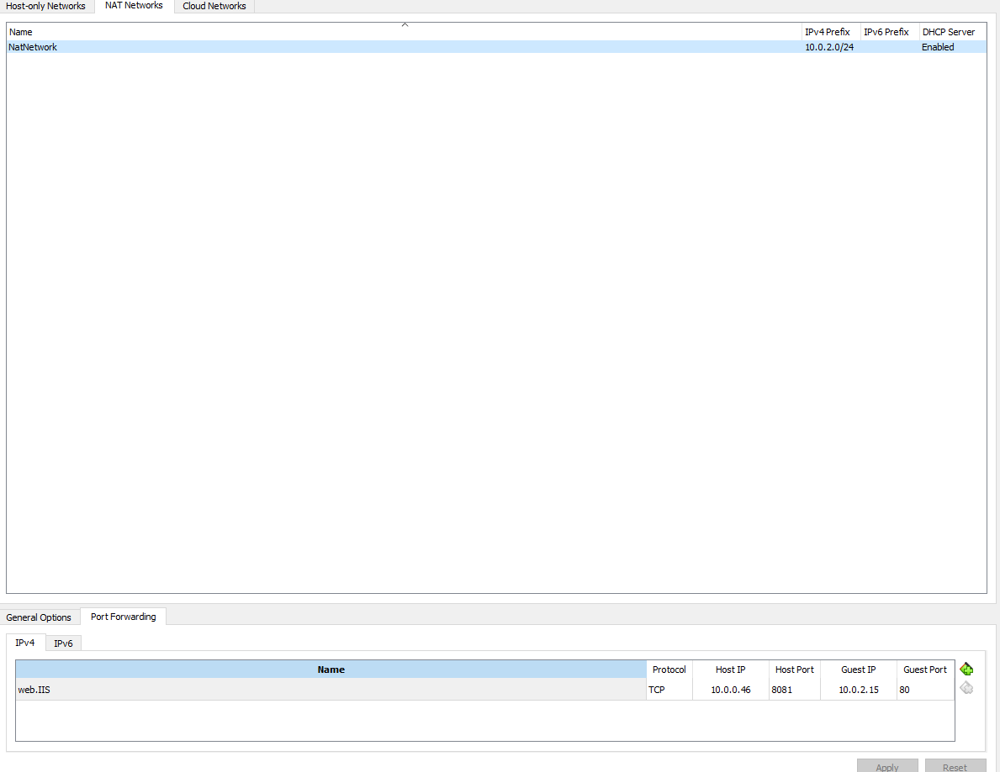
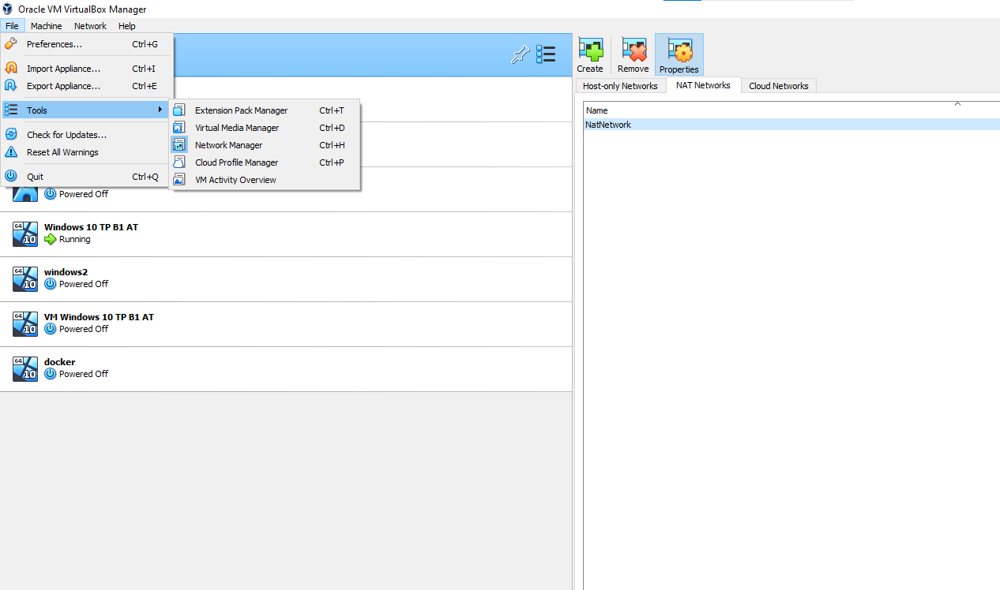
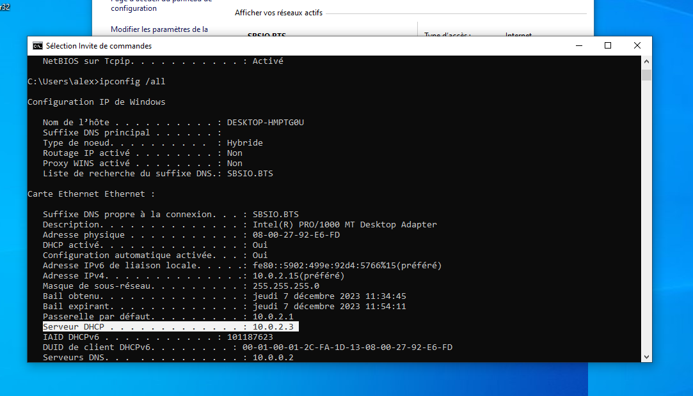

Les serveurs sont isolé des machine avec d'autre ip

Création de redirection de ports

Nom : web.IIS
Protocole : TCP
IP hôte : 192.168.1.4
Port hôte : 8081
IP VM : 10.0.215
Port VM : 80

Un switch virtuelle créait un NAT/PAT

Menu permettant d'aller configurer la redirection de port

On peut trouvé ces paramètres dans network manager

Trouver la configuration ip de la machine grâce à ipconfig /all

