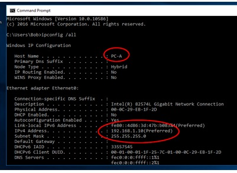

**Travaux pratiques– Découverte d'un réseau simple**

**Objectifs**

**Étape1: Représenter la topologie du réseau**
- Connaître l’architecture du réseau auquel on est connecté.
**Étape2: Consulter la configuration des hôtes (PC)**
- Consultez les informations d'adresseIP dynamique sur l'interface LAN des hôtes.

- Vérifiez que les ordinateurs peuvent communiquer au moyen de l'utilitaire **ping**.
**Contexte/Scénario**

Les réseaux s'articulent autour de trois composants principaux: les hôtes, les commutateurs et les routeurs. Au cours de ces travaux pratiques, vous allez utiliser un réseau simple avec des hôtes, un commutateur et un routeur. Dans le cadre de ces travaux pratiques, vous obtiendrez automatiquement l'adressageIP nécessaire aux ordinateurs pour permettre la communication entre plusieurs appareils. Utilisez l'utilitaire **ping** pour vérifier la connectivité.

**Ressources requises**
- 1 PC connecté au réseau.
- **Représenter la topologie réseau**
Représentez sous forme de schéma le réseau dans lequel vous vous trouvez.

- Votre ordinateur est connecté au réseau via un câble ethernet
- Le câble est relié à un commutateur (switch), lui-même relié à un routeur
- Le routeur est connecté à Internet

- **Consulter la configuration des hôtes (PC)**
  1.  **Configurer l'adressageIP dynamique sur les ordinateurs.**
      1.  Cliquez sur **Démarrer**, puis sur **Paramètres**.

- Dans la fenêtre Paramètres, cliquez sur **Réseau et Internet**.

- Dans le panneau de gauche, sélectionnez **votre carte réseau**, puis cliquez sur le lien **Modifier les options de l'adaptateur**.

- La fenêtre Connexions réseau affiche les interfaces réseau disponibles sur l'ordinateur. Faites un clic droit sur votre interface réseau, puis sélectionnez **Propriétés**.

- Sélectionnez **Protocole Internet version4 (TCP/IPv4)**, puis cliquez sur **Propriétés**.

**Remarque**: vous pouvez également cliquer deux fois sur **Protocole Internet version4 (TCP/IPv4)** pour afficher la fenêtre Propriétés.
- Sélectionnez **Obtenir une adresseIP automatiquement**. Sélectionnez **Obtenir l'adresse du serveur DNS automatiquement**. Cliquez sur **OK**.

- Avant de cliquer sur **Fermer** dans la fenêtre Propriétés, répondez aux questions suivantes:
Quels sont le nom et le numéro de modèle de la carte réseau affichés dans la zone «Connexion en utilisant»?

\_\_\_\_\_\_\_\_\_\_\_\_\_\_\_\_\_\_\_\_\_\_\_\_\_\_\_\_\_\_\_\_\_\_\_\_\_\_\_\_\_\_\_\_\_\_\_\_\_\_\_\_\_\_\_\_\_\_\_\_\_\_\_\_\_\_\_\_\_\_\_\_\_\_\_\_\_\_\_\_\_\_\_\_

Quels sont les deux premiers éléments répertoriés dans la zone «Cette connexion utilise les éléments suivants:» et à quoi servent-ils?

\_\_\_\_\_\_\_\_\_\_\_\_\_\_\_\_\_\_\_\_\_\_\_\_\_\_\_\_\_\_\_\_\_\_\_\_\_\_\_\_\_\_\_\_\_\_\_\_\_\_\_\_\_\_\_\_\_\_\_\_\_\_\_\_\_\_\_\_\_\_\_\_\_\_\_\_\_\_\_\_\_\_\_\_

- **Vérifiez les paramètres et la connectivité des PC.**
Utilisez l'invite de commandes pour vérifier les paramètres et la connectivité du PC.
- Cliquez avec le bouton droit de la souris sur **Démarrer**, puis sélectionnez **Invite de commandes**.

- La fenêtre cmd.exe vous permet de saisir les commandes directement sur l'ordinateur et d'afficher le résultat de ces commandes. Vérifiez les paramètres de votre ordinateur à l'aide de la commande **ipconfig /all**. Cette commande affiche le nom d'hôte de l'ordinateur et les informations liées à l'adresseIPv4. Repérer le nom de votre ordinateur et son adresse IP.

Examinez ensuite les informations détaillées de votre configuration réseau:

Quelle est l'adresse IPv4 de l'ordinateur?

\_\_\_\_\_\_\_\_\_\_\_\_\_\_\_\_\_\_\_\_\_\_\_\_\_\_\_\_\_\_\_\_\_\_\_\_\_\_\_\_\_\_\_\_\_\_\_\_\_\_\_\_\_\_\_\_\_\_\_\_\_\_\_\_\_\_\_\_\_\_\_\_\_\_\_\_\_\_\_\_\_\_\_\_

Quel est le masque de sous-réseau de l'ordinateur?

\_\_\_\_\_\_\_\_\_\_\_\_\_\_\_\_\_\_\_\_\_\_\_\_\_\_\_\_\_\_\_\_\_\_\_\_\_\_\_\_\_\_\_\_\_\_\_\_\_\_\_\_\_\_\_\_\_\_\_\_\_\_\_\_\_\_\_\_\_\_\_\_\_\_\_\_\_\_\_\_\_\_\_\_

Quelle est la passerelle par défaut de l'ordinateur?

\_\_\_\_\_\_\_\_\_\_\_\_\_\_\_\_\_\_\_\_\_\_\_\_\_\_\_\_\_\_\_\_\_\_\_\_\_\_\_\_\_\_\_\_\_\_\_\_\_\_\_\_\_\_\_\_\_\_\_\_\_\_\_\_\_\_\_\_\_\_\_\_\_\_\_\_\_\_\_\_\_\_\_\_

Quels sont les serveurs DNS de l'ordinateur?

\_\_\_\_\_\_\_\_\_\_\_\_\_\_\_\_\_\_\_\_\_\_\_\_\_\_\_\_\_\_\_\_\_\_\_\_\_\_\_\_\_\_\_\_\_\_\_\_\_\_\_\_\_\_\_\_\_\_\_\_\_\_\_\_\_\_\_\_\_\_\_\_\_\_\_\_\_\_\_\_\_\_\_\_

Quelle est l'adresse MAC physique de l'ordinateur?

\_\_\_\_\_\_\_\_\_\_\_\_\_\_\_\_\_\_\_\_\_\_\_\_\_\_\_\_\_\_\_\_\_\_\_\_\_\_\_\_\_\_\_\_\_\_\_\_\_\_\_\_\_\_\_\_\_\_\_\_\_\_\_\_\_\_\_\_\_\_\_\_\_\_\_\_\_\_\_\_\_\_\_\_

DHCP est-il activé?

\_\_\_\_\_\_\_\_\_\_\_\_\_\_\_\_\_\_\_\_\_\_\_\_\_\_\_\_\_\_\_\_\_\_\_\_\_\_\_\_\_\_\_\_\_\_\_\_\_\_\_\_\_\_\_\_\_\_\_\_\_\_\_\_\_\_\_\_\_\_\_\_\_\_\_\_\_\_\_\_\_\_\_\_

Quelle est l'adresseIP du serveur DHCP?

\_\_\_\_\_\_\_\_\_\_\_\_\_\_\_\_\_\_\_\_\_\_\_\_\_\_\_\_\_\_\_\_\_\_\_\_\_\_\_\_\_\_\_\_\_\_\_\_\_\_\_\_\_\_\_\_\_\_\_\_\_\_\_\_\_\_\_\_\_\_\_\_\_\_\_\_\_\_\_\_\_\_\_\_

À quelle date le bail a-t-il été obtenu?

\_\_\_\_\_\_\_\_\_\_\_\_\_\_\_\_\_\_\_\_\_\_\_\_\_\_\_\_\_\_\_\_\_\_\_\_\_\_\_\_\_\_\_\_\_\_\_\_\_\_\_\_\_\_\_\_\_\_\_\_\_\_\_\_\_\_\_\_\_\_\_\_\_\_\_\_\_\_\_\_\_\_\_\_

À quelle date le bail arrive-t-il à expiration?

\_\_\_\_\_\_\_\_\_\_\_\_\_\_\_\_\_\_\_\_\_\_\_\_\_\_\_\_\_\_\_\_\_\_\_\_\_\_\_\_\_\_\_\_\_\_\_\_\_\_\_\_\_\_\_\_\_\_\_\_\_\_\_\_\_\_\_\_\_\_\_\_\_\_\_\_\_\_\_\_\_\_\_\_
- **Testez la pileTCP/IP de l'interface réseau du PC.**
  1.  Pour vérifier que le protocole TCP/IP fonctionne, envoyez une requête ping à votre adresse de bouclage (127.0.0.1). À l'invite, saisissez la commande ping127.0.0.1.
C:\Users\Bob\> **ping127.0.0.1**
- Vous pouvez également envoyer une requête ping à votre adresseIP. Dans cet exemple, saisissez la commande **ping10.11.3.146** (à remplacer par votre propre adresse IP).

- Notez une des réponses produites par votre commande ping.
\_\_\_\_\_\_\_\_\_\_\_\_\_\_\_\_\_\_\_\_\_\_\_\_\_\_\_\_\_\_\_\_\_\_\_\_\_\_\_\_\_\_\_\_\_\_\_\_\_\_\_\_\_\_\_\_\_\_\_\_\_\_\_\_\_\_\_\_\_\_\_\_\_\_\_\_\_\_\_\_\_\_\_\_

Si la commande ping a échoué, demandez de l'aide au formateur.

- **Testez la connectivité avec votre voisin**

a\. Saisissez **ping** suivi de l’adresse IP de votre voisin et appuyez sur Entrée.

Les requêtes ping ont-elles abouti? \_\_\_\_\_\_\_\_\_\_\_\_\_\_\_\_\_\_\_\_\_\_

Si ce n'est pas le cas, il est possible que le **pare-feu de Windows** bloque les requêtes d'écho ICMP (ping). Cliquez sur **Démarrer**\> **Paramètres**\> **Réseau et Internet**\> **Sans-fil**\> **Pare-feu Windows** pour le désactiver. N'oubliez pas de réactiver le pare-feu quand vous avez terminé!

**Remarque**: si vous ne recevez pas de réponse, essayez d'envoyer à nouveau une requête. Si vous ne parvenez toujours pas à obtenir de réponse, essayez d'envoyer une requête ping à 8.8.8.8. Si vous ne parvenez pas à obtenir de réponse, demandez à votre formateur de vous aider à résoudre le problème.

A quoi correspondent toutes les informations données par le ping?

Bytes = 32? \_\_\_\_\_\_\_\_\_\_\_\_\_\_\_\_\_\_

Time \< 1 ms? \_\_\_\_\_\_\_\_\_\_\_\_\_\_\_\_\_

TTL = 128? \_\_\_\_\_\_\_\_\_\_\_\_\_\_\_\_\_\_\_

Packets Sent = 4, Received = 4, Lost = 0 (0% loss)? \_\_\_\_\_\_\_\_\_\_\_\_\_\_\_\_\_\_\_

Approximate round trip times in milli-seconds :

Minimum = 0 ms, Maximum = 0 ms, Average = 0 ms ? \_\_\_\_\_\_\_\_\_\_\_\_\_\_\_\_\_\_\_
