**Travaux pratiques- Configuration avancée du pare-feu**
- **Introduction**
Au cours de ces travaux pratiques, vous apprendrez à explorer le pare-feu Windows et à configurer quelques paramètres avancés.
- **Matériel conseillé**
- Deux ordinateurs connectés directement ou connectés via un réseau
- Windows installé sur les deux ordinateurs
- Les ordinateurs doivent appartenir au même groupe de travail ou être dans le même domaine et partager le même masque de sous-réseau
  1.  **Créez et partagez un dossier sur PC-1.**
      1.  Ouvrez une session sur **PC-1** en tant que membre du groupe des administrateurs. Demandez le nom d'utilisateur et le mot de passe à votre instructeur.
      2.  Sur **PC-1**, cliquez avec le bouton droit sur le Bureau, puis sélectionnez **Nouveau\> Dossier**. Baptisez ce dossier **Cisco**.
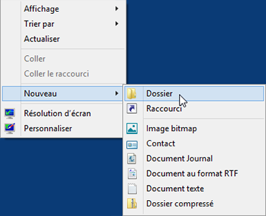
- Cliquez avec le bouton droit sur le dossier Cisco, puis sélectionnez **Propriétés\> Partage\> Partage avancé**. La fenêtre **Partage avancé** s'affiche. Cliquez sur **Partager ce dossier** et utilisez le nom par défaut **Cisco**. Cliquez sur **OK**. Fermez la fenêtre **Propriétés Cisco**.
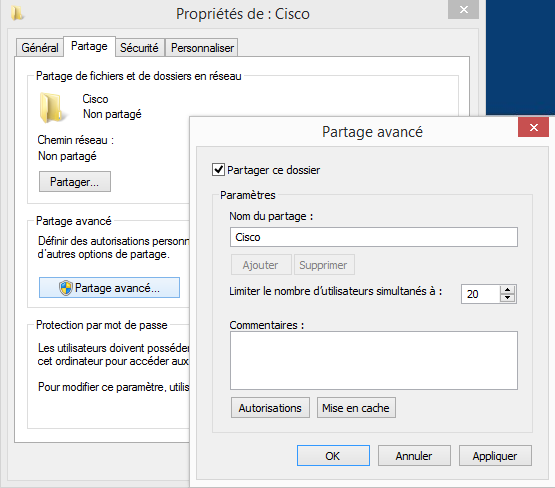
- **Utilisez l'Explorateur de fichiers pour afficher le dossier partagé sur PC-1.**
  1.  Ouvrez une session sur **PC-2** en tant que membre du groupe des administrateurs. Demandez le nom d'utilisateur et le mot de passe à votre instructeur.
  2.  Ouvrez la fenêtre de l'**Explorateur de fichiers**. Dans le volet de gauche, sous **Réseau**, développez **PC-1**.
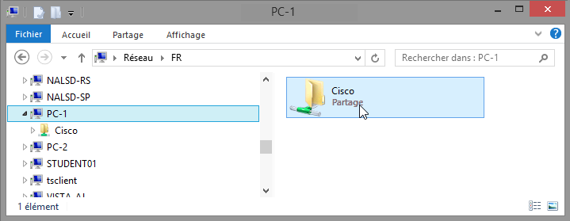

Sous PC-1, voyez-vous le dossier partagé **Cisco**?

**Remarque**: si vous avez répondu non, demandez à l'instructeur de vous aider.
- Fermez l'**Explorateur de fichiers**.
- **Ouvrez le pare-feu Windows sur PC-1.**
**Remarque**: sauf indication contraire, utilisez **PC-1**pour le reste de ces travaux pratiques.
- Pour ouvrir la fenêtre **Pare-feu Windows**, cliquez sur **Panneau de configuration\> Pare-feu Windows**.
- L'état normal du pare-feu Windows est **Activé**.
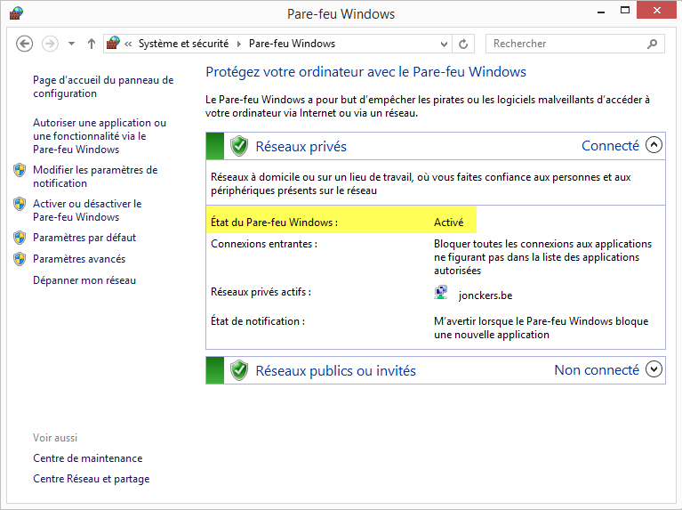
- Quels sont les avantages du pare-feu Windows?
Bloquer les connexions entrantes

Sécurisé des données

Gestion politique et sécurisé

Surveillance de trafic
- **Étudiez la fonctionnalité Programmes autorisés du pare-feu Windows.**
  1.  Cliquez sur **Autoriser une application ou une fonctionnalité via le Pare-feu Windows**.
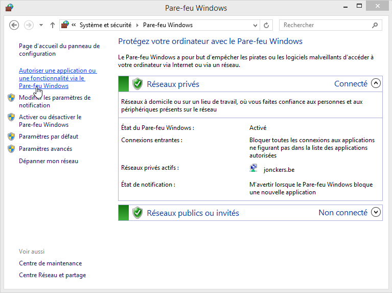
- La fenêtre **Applications autorisées** s'affiche. Les programmes et services que le pare-feu Windows ne bloque pas sont cochés dans la liste suivante. Cliquez sur **Quels sont les risques si une application est autorisée à communiquer?**
**Remarque**: vous pouvez ajouter des applications à cette liste. Cela peut être nécessaire si vous disposez d'une application qui nécessite des communications avec l'extérieur, et que le pare-feu Windows, pour une raison quelconque, ne parvient pas à effectuer automatiquement la configuration.

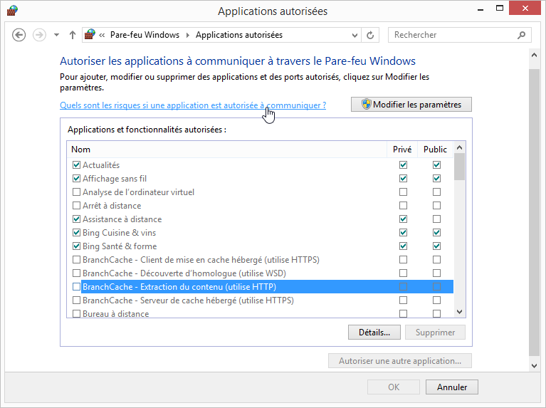

La création de trop nombreuses exceptions dans votre fichier Programmes et services peut avoir de graves conséquences.

Décrivez l'une d'entre elles.

Affaiblissement de la sécurité : si on contourne le filtrage du pare-feu cela peut affecter la sécurité du réseau

Augmentation de risque de sécurité : des informations peuvent être vers votre pc via par-feu. Ce qui signifie que le pc sera plus vulnerable façe aux logiciel malveillant

Difficulté de gestion : gestion de pare-feu difficile entraînant des charges suplémentaire.

Perte de mise à jour ou faille de sécurité et problème de performances

Impact sur les performances :
- Fermez la fenêtre **Aide et support Windows**.
- **Configurez la fonction Applications autorisées par le pare-feu Windows.**
  1.  Cliquez dans la fenêtre **Applications autorisées** afin de l'activer. Cliquez sur **Modifier les paramètres**. Désactivez la case à cocher **Partage de fichiers et d'imprimantes**. Cliquez sur **OK**.
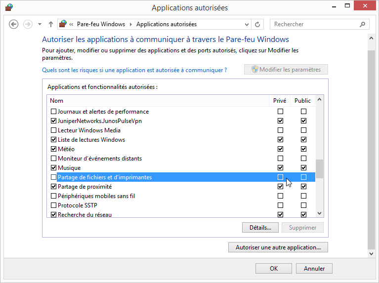
- Sur **PC-2**, à l'aide de l'**Explorateur de fichiers**, essayez d'ouvrir la connexion réseau à **PC-1**.
Pouvez-vous vous connecter à PC-1 et afficher le dossier partagé Cisco?

Avez-vous reçu un message d'erreur sur PC-2? Si oui, quel était le message d'erreur?

non
- Fermez toutes les fenêtres ouvertes sur **PC-2**.
- Sur **PC-1**, ajoutez une coche à **Partage de fichiers et d'imprimantes**. Cliquez sur **OK**.
**Remarque**: vous devriez pouvoir ajouter la coche sans avoir à cliquer sur **Modifier les paramètres**.
- Sur **PC-2**, rouvrez l'Explorateur de fichiers et tentez de vous connecter à **PC-1**.
Pouvez-vous vous connecter à l'ordinateur1? Pourquoi?

\_\_\_\_\_\_\_\_\_\_\_\_\_\_\_\_\_\_\_\_\_\_\_\_\_\_\_\_\_\_\_\_\_\_\_\_\_\_\_\_\_\_\_\_\_\_\_\_\_\_\_\_\_\_\_\_\_\_\_\_\_\_\_\_\_\_\_\_\_\_\_\_\_\_\_\_\_\_\_\_\_\_\_\_
- Fermez toutes les fenêtres ouvertes sur **PC-2** et fermez la session.
- Fermez toutes les fenêtres sur **PC-1**.
- **Configurez les fonctions de sécurité avancées du Pare-feu Windows.**
**Remarque**: utilisez **PC-1** jusqu'à la fin de ces travaux pratiques.
- Cliquez sur **Panneau de configuration\> Outils d'administration\> Pare-feu Windows avec fonctions avancées de sécurité**.
- La fenêtre **Pare-feu Windows avec fonctions avancées de sécurité** s'ouvre. Dans le panneau de gauche, vous pouvez sélectionner les éléments pour configurer les **Règles de trafic entrant**, les **Règles de trafic sortant** ou les **Règles de sécurité de connexion**. Vous pouvez également cliquer sur **Analyse** pour afficher l'état des règles configurées. Cliquez sur **Règles de trafic entrant**.
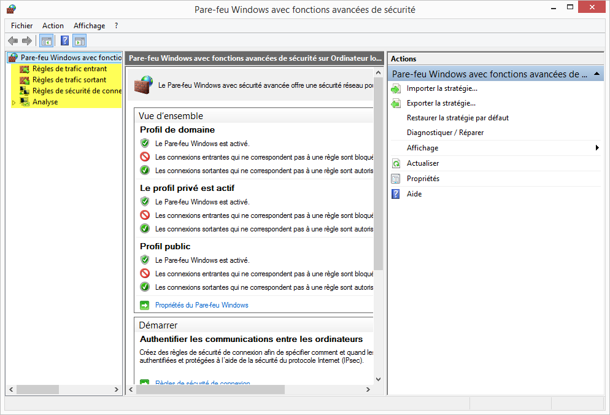
- Dans le volet central, faites défiler l'écran jusqu'à ce que vous trouviez la règle entrante **Partage de fichiers et d'imprimantes (Demande d'écho- Trafic entrant ICMPv4)**. Cliquez avec le bouton droit sur la règle, sélectionnez **Propriétés**, puis l'onglet **Avancé**.
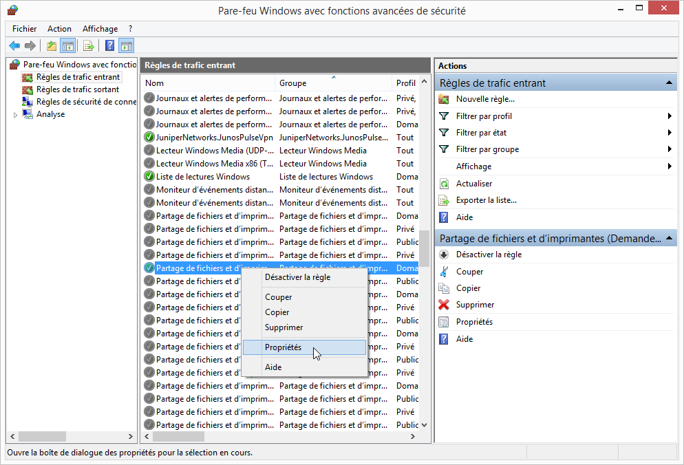
- L'onglet **Avancé** affiche le ou les profils utilisés par l'ordinateur. Cliquez sur **Personnaliser** dans la zone **Types d'interfaces** de la fenêtre.
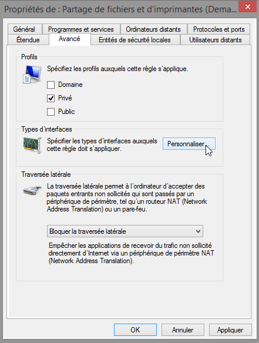

- La fenêtre **Personnaliser les types d'interfaces** s'affiche. Elle affiche les différentes connexions configurées sur votre ordinateur. Laissez **Tous les types d'interface** sélectionné, puis cliquez sur **OK**.
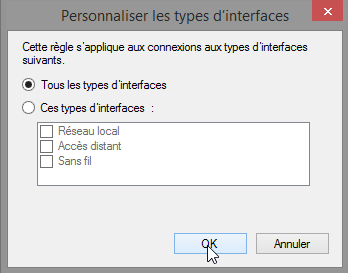

- Cliquez sur l'onglet **Programmes et services**. Dans la section **Services**, cliquez sur **Paramètres**.
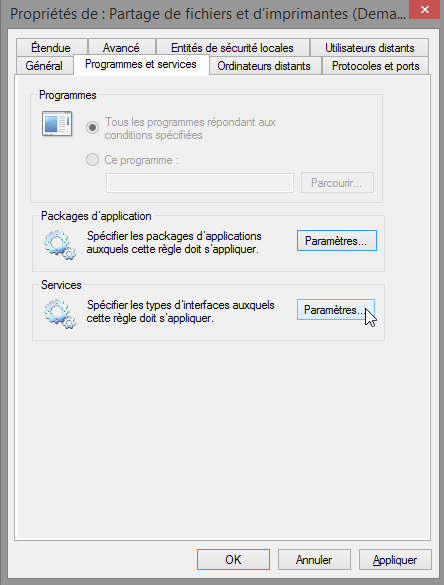

- La fenêtre **Personnaliser les paramètres des services** s'affiche.
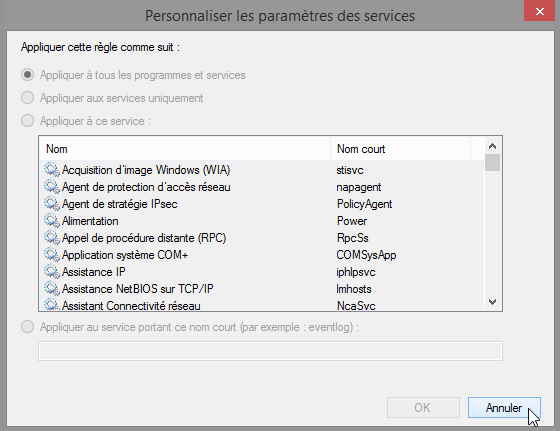

- Citez le nom abrégé de quatre services disponibles.
\_\_\_\_\_\_\_\_\_\_\_\_\_\_\_\_\_\_\_\_\_\_\_\_\_\_\_\_\_\_\_\_\_\_\_\_\_\_\_\_\_\_\_\_\_\_\_\_\_\_\_\_\_\_\_\_\_\_\_\_\_\_\_\_\_\_\_\_\_\_\_\_\_\_\_\_\_\_\_\_\_\_\_
- Cliquez sur **Annuler** pour fermer la fenêtre **Personnaliser les paramètres des services**.
- Cliquez sur l'onglet **Protocoles et ports**.
**Remarque**: il existe de nombreuses applications, généralement invisibles pour l'utilisateur, qui doivent également transiter par le pare-feu Windows pour accéder à votre ordinateur. Il s'agit de programmes au niveau du réseau chargés d'acheminer le trafic sur le réseau et sur Internet.

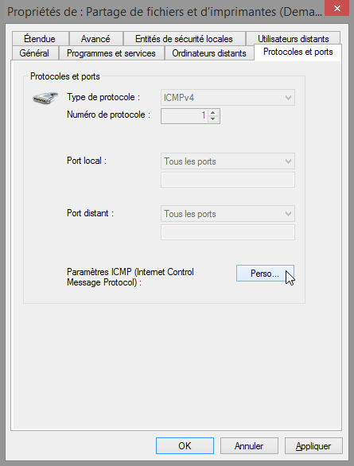
- Pour accéder aux paramètres ICMP, cliquez sur le bouton **Personnaliser**.
- La fenêtre **Personnaliser les paramètres ICMP** s'affiche. Le fait d'autoriser les requêtes d'écho entrantes est ce qui permet aux utilisateurs du réseau d'envoyer une commande ping vers votre ordinateur afin de déterminer s'il est présent sur le réseau.
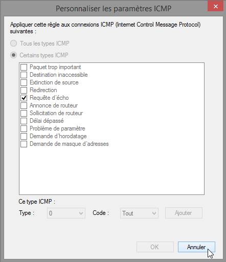

Dressez la liste de quatre types ICMP spécifiques.

TTL 28ms ping passé

Délai de demande dépasser

Echec defaillance générale

Impossible de communique avec l'hôte distant
- Fermez toutes les fenêtres ouvertes sur **PC-1**.
- Cliquez avec le bouton droit sur le dossier **Cisco**sur le Bureau, puis sélectionnez **Supprimer**.
- **Remarques générales**
Quelles sont les raisons possibles pour que vous deviez apporter des modifications au pare-feu?

\_\_\_\_\_\_\_\_\_\_\_\_\_\_\_\_\_\_\_\_\_\_\_\_\_\_\_\_\_\_\_\_\_\_\_\_\_\_\_\_\_\_\_\_\_\_\_\_\_\_\_\_\_\_\_\_\_\_\_\_\_\_\_\_\_\_\_\_\_\_\_\_\_\_\_\_\_\_\_\_\_\_\_\_\_\_\_

\_\_\_\_\_\_\_\_\_\_\_\_\_\_\_\_\_\_\_\_\_\_\_\_\_\_\_\_\_\_\_\_\_\_\_\_\_\_\_\_\_\_\_\_\_\_\_\_\_\_\_\_\_\_\_\_\_\_\_\_\_\_\_\_\_\_\_\_\_\_\_\_\_\_\_\_\_\_\_\_\_\_\_\_\_\_\_

\_\_\_\_\_\_\_\_\_\_\_\_\_\_\_\_\_\_\_\_\_\_\_\_\_\_\_\_\_\_\_\_\_\_\_\_\_\_\_\_\_\_\_\_\_\_\_\_\_\_\_\_\_\_\_\_\_\_\_\_\_\_\_\_\_\_\_\_\_\_\_\_\_\_\_\_\_\_\_\_\_\_\_\_\_\_\_

\_\_\_\_\_\_\_\_\_\_\_\_\_\_\_\_\_\_\_\_\_\_\_\_\_\_\_\_\_\_\_\_\_\_\_\_\_\_\_\_\_\_\_\_\_\_\_\_\_\_\_\_\_\_\_\_\_\_\_\_\_\_\_\_\_\_\_\_\_\_\_\_\_\_\_\_\_\_\_\_\_\_\_\_\_\_\_

\_\_\_\_\_\_\_\_\_\_\_\_\_\_\_\_\_\_\_\_\_\_\_\_\_\_\_\_\_\_\_\_\_\_\_\_\_\_\_\_\_\_\_\_\_\_\_\_\_\_\_\_\_\_\_\_\_\_\_\_\_\_\_\_\_\_\_\_\_\_\_\_\_\_\_\_\_\_\_\_\_\_\_\_\_\_\_
