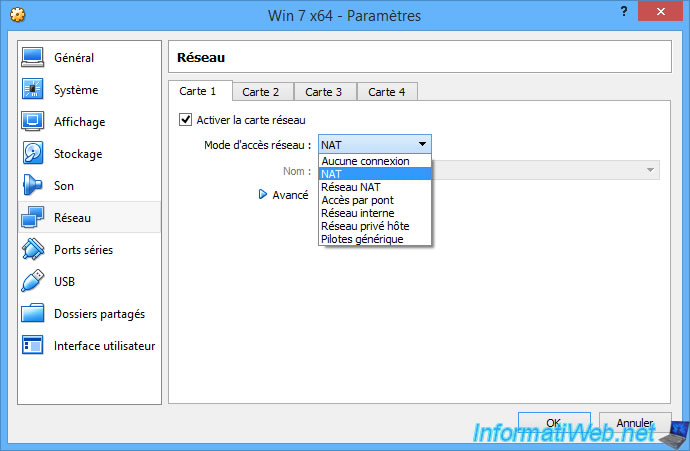
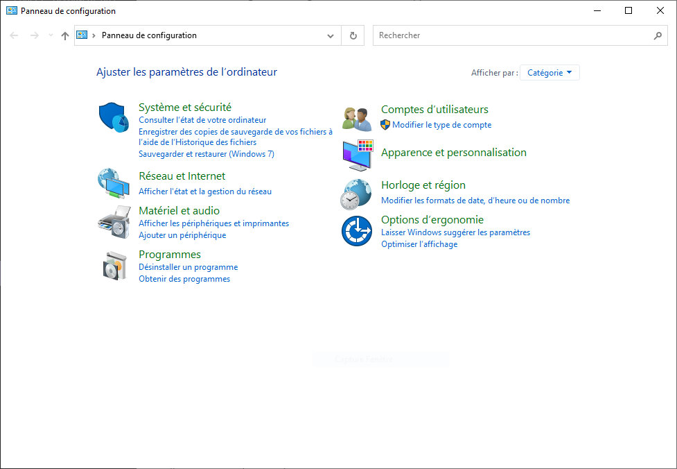
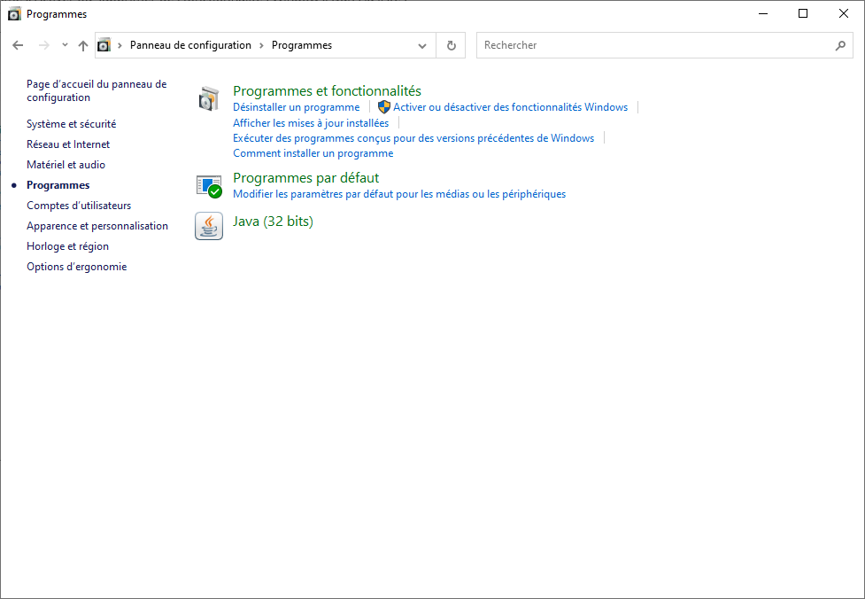
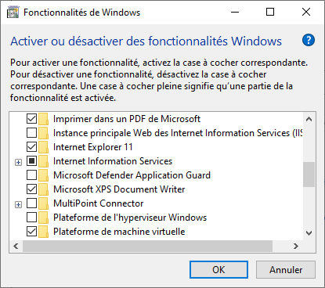
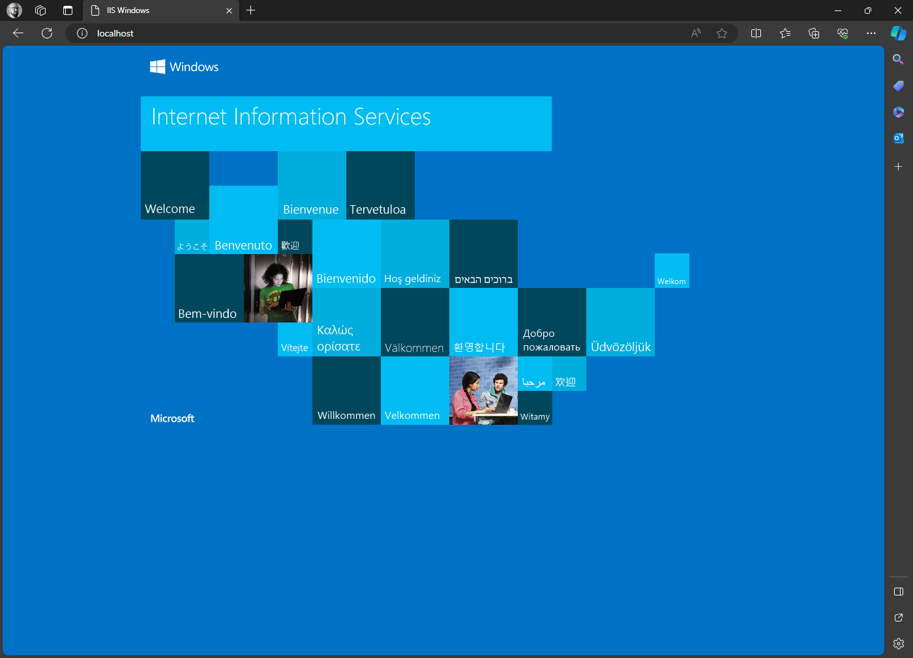
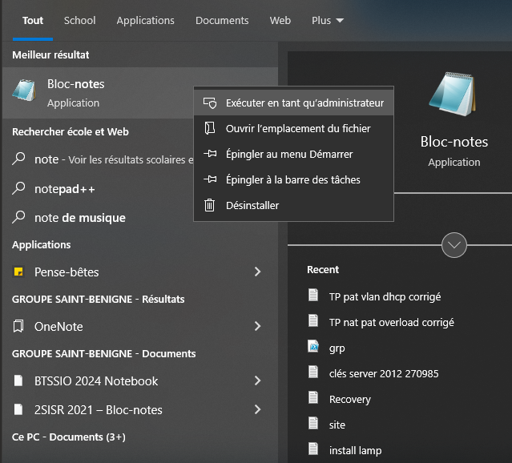
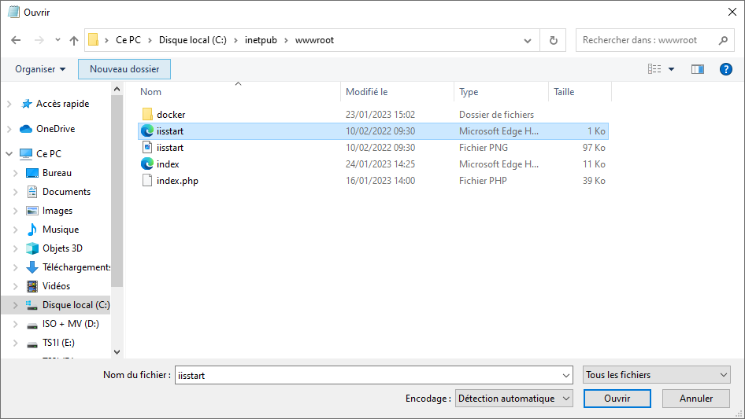
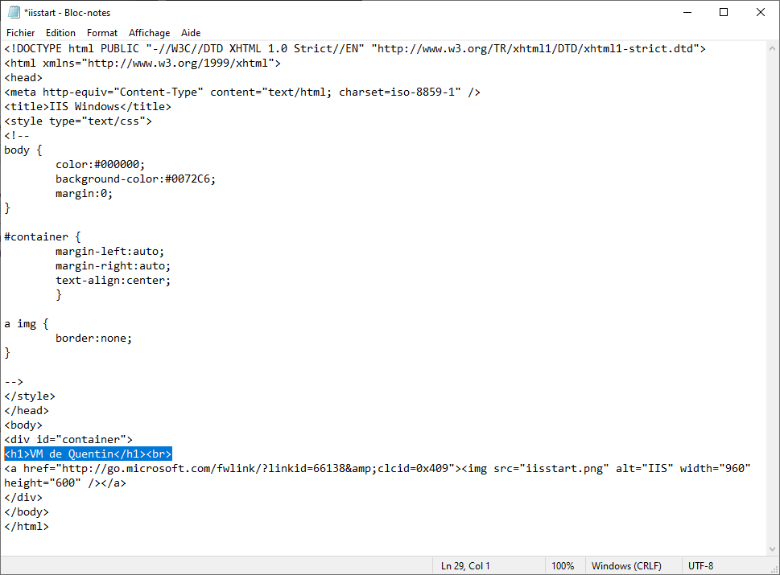
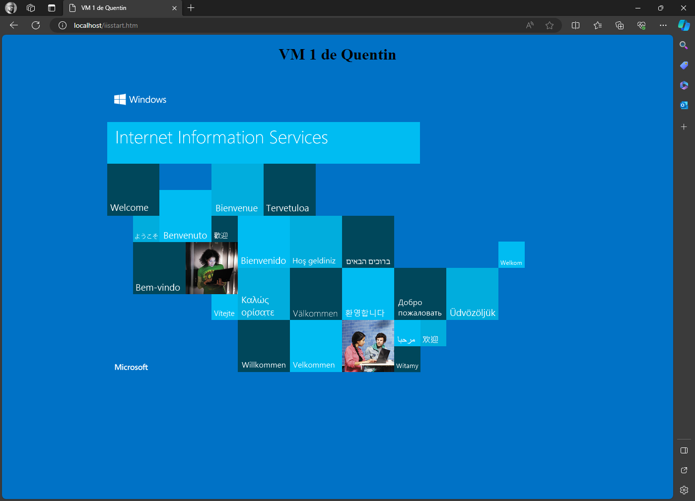

**Travaux pratiques– Comparaison des modes de mise en réseau d'une machine virtuelle**

**Objectifs**

**TP11.1: Comprendre et tester le mode de mise en réseau "accès par pont"**
- Comprendre l’architecture du réseau auquel est connectée une VM en mode pont.
**TP11.2: Comprendre et tester le mode de mise en réseau "réseau privé hôte"**
- Comprendre l’architecture du réseau auquel est connectée une VM en mode réseau privé hôte.
**TP11.3: Comprendre et tester le mode de mise en réseau "réseau interne"**
- Comprendre l’architecture du réseau auquel est connectée une VM en mode réseau interne.
**TP11.4: Comprendre et tester le mode de mise en réseau "NAT"**
- Comprendre l’architecture du réseau auquel est connectée une VM en mode NAT.

**Contexte/Scénario**

Dans les paramètres des machines virtuelles créées avecVirtualBox, vous pouvez voir que les cartes réseau peuvent être connectées au réseau de différentes façons.

Cela est valable quel que soit le logiciel de virtualisation ou l'hyperviseur utilisé pour gérer les machines virtuelles. Le choix d'un mode de mise en réseau n'est pas sans conséquence sur la VM et son accès depuis et vers le réseau local et les autres machines, qu'elles soient physiques ou virtuelles, ainsi que pour l'accès depuis et vers Internet.

Dans le cadre de ces travaux pratiques, vous comparerez les principaux modes de mise en réseau des machines virtuelles et en observerez les conséquences.

**Ressources requises**
- 1 PC hôte connecté au réseau local et à Internet
- VirtualBox installé
- 2 Machines virtuelles Windows installées avec IIS installé (serveur web fourni par défaut avec Windows. IIS = Internet Information Services)

**IIS - Internet Information Services**

IIS (prononcé "2 I S") est un serveur Web de Microsoft fourni par défaut sous Windows pour héberger des sites Web statiques, des applications Web dynamiques et des sites de transferts de fichiers FTP.

Il est désactivé par défaut, mais bien présent dans le système, il faut juste l'activer.

**Activation de IIS**

Créez deux nouvelles VM Windows ou utilisez deux VM existantes

Allez dans Panneau de configuration, Programmes, Activer ou supprimer des fonctionnalités Windows. Dans la liste , cherchez Internet Information Services, cochez la case, validez et redémarrez la VM à la fin si c'est demandé.

**Après l'installation**

**En local**

Depuis la VM, ouvrez le navigateur web et connectez-vous à l'URL :

<http://localhost/>

Si IIS fonctionne bien, la page d'accueil de IIS doit s'afficher

**Personnalisation**

Pour effectuer des tests, il va falloir personnaliser votre page par défaut de IIS afin de la différencier de celles des autres étudiants.

Ouvrez le bloc-note (notepad) avec les droits administrateur

Faites Ouvrir et naviguez dans C:\inetpub\wwwroot\\ puis cliquez sur Tous les fichiers et ouvrez iistart.htm

Dans le code source de la page web, ajoutez la ligne \<h1\>VM 1 de votre_prénom\</h1\>\<br\> et enregistrez (et dans l'autre VM mettez \<h1\>VM 2) de votre_prénom\</h1\>\<br\>

Dans le navigateur de la VM, actualisez la page localhost et vérifiez la prise en compte de la personnalisation de la page

Vous avez maintenant deux VM qui jouent le rôle de serveurs web et qui vont servir à tester les modes de mise en réseau des machines virtuelles dans les 4 prochains TP
