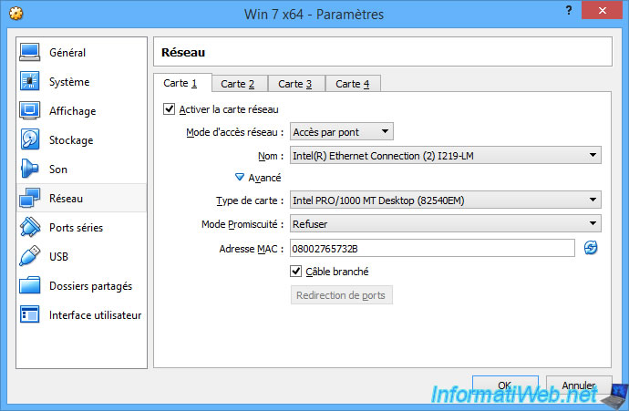
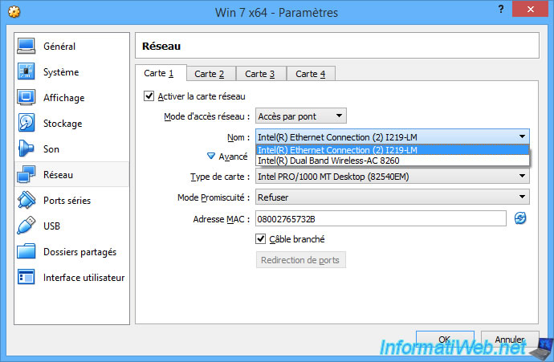
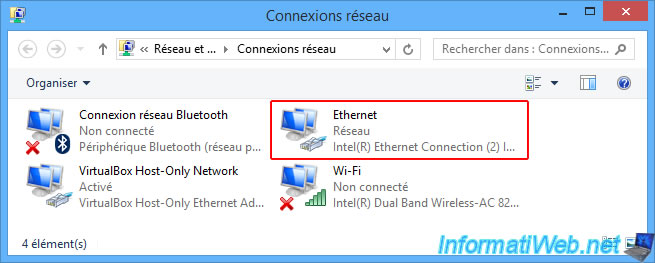
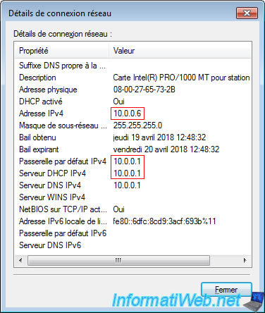

# 1 - Accès par pont

## 1.1 - Présentation

Le mode "Accès par pont", aussi appelé mode "pont" ou "bridge" permet de **placer virtuellement votre machine virtuelle dans votre réseau physique**.

Lorsque vous sélectionnez le mode "Accès par pont", VirtualBox vous permet de sélectionner quelle interface réseau physique il devra utiliser pour connecter cette machine virtuelle sur le réseau physique souhaité, quel type de carte il va simuler et l'adresse MAC de la carte virtuelle.

Dans cet exemple, l'ordinateur possède 2 interfaces réseau (cartes réseau) :
- la carte réseau filaire : Intel(R) Ethernet Connection (2) I219-LM
- la carte réseau sans-fil (Wi-Fi) : Intel(R) Dual Band Wireless-AC 8260

**

**

Si vous ne savez pas quelle carte réseau sélectionner, allez dans le panneau de configuration de Windows pour afficher vos connexions réseau.

Pour les afficher, vous avez 2 possibilités :
- ouvrir le panneau de configuration et allez dans : Réseau et Internet -\> Centre Réseau et partage -\> Modifier les paramètres de la carte
- ou faire un clic droit sur l'icône réseau de la barre des tâches et cliquez sur "Ouvrir le Centre Réseau et partage". Ensuite, cliquez sur "Modifier les paramètres de la carte".

Comme vous pouvez le voir ci-dessous, notre carte réseau Ethernet est connectée au réseau, alors que la carte Wi-Fi n'est pas connectée pour le moment.

Nous avons donc sélectionné la carte réseau "Intel(R) Ethernet Connection (2) I219-LM" dans les paramètres réseau de notre machine virtuelle.

Maintenant, notre machine virtuelle a reçu une adresse IP depuis le serveur DHCP présent dans notre vrai réseau physique.

## 1.2 - Travail à faire

- Configurez une de vos machines virtuelles en mode pont, en sélectionnant l'interface physique connectée au réseau physique.

- Configurez la carte réseau de votre machine virtuelle en client DHCP.

- Proposez et effectuez les tests nécessaires à la validation des affirmations suivantes :

- votre machine virtuelle a reçu une configuration réseau de la part du serveur DHCP de votre réseau local
- votre machine virtuelle apparait sur votre réseau comme une machine à part entière
- vous pouvez accéder aux services hébergés sur votre machine virtuelle comme si votre machine virtuelle était une vraie machine (rappel, vous devez installer WAMP dans la VM)
- votre machine virtuelle peut accéder aux machines du réseau physique, aux autres machines virtuelles en mode pont et à Internet (rappel, vous devez installer WAMP dans l'autre VM, à mettre en mode pont)

- Quel sont les résultats ? Qu'observez-vous ? Que pouvez-vous en conclure ?

Après avoir installer et configurer WAMP server on peut constater que :

Lors de la communication entre la machine physique vers la machine virtuelle le server nous renvoit un messager d'erreur disant que on n'a pas la permissions pour accèder à la machine virtuelle.

