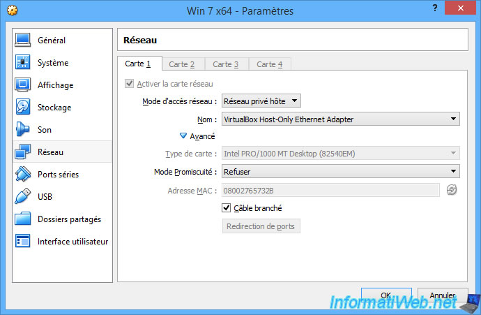
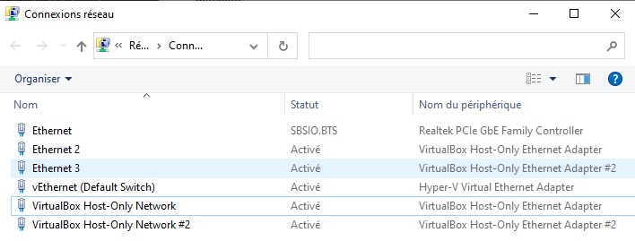
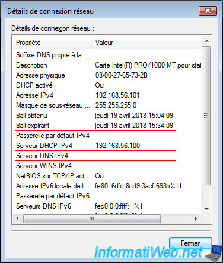
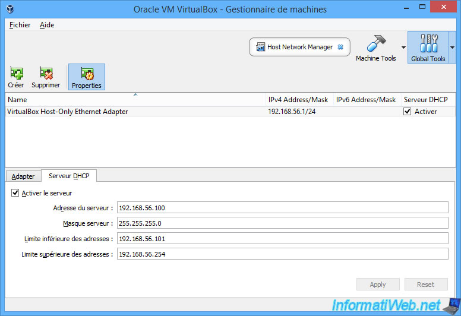
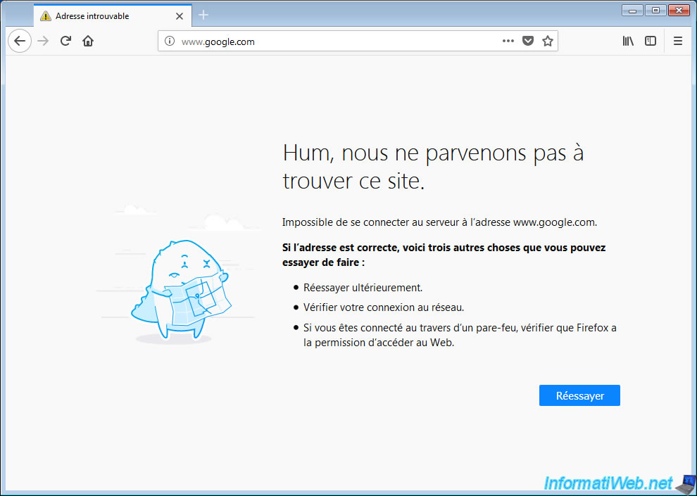

# 2 - Réseau privé hôte

## 2.1 - Présentation

Le mode "Réseau privé hôte" permet de **créer un réseau entre la machine virtuelle et la machine physique**.

Lorsque vous sélectionnez le mode "Réseau privé hôte", VirtualBox vous permet de sélectionner quelle interface réseau virtuelle il devra utiliser pour connecter cette machine virtuelle à la machine physique.

Ce qui veut dire que votre machine virtuelle ne pourra communiquer qu'avec la machine hôte et qu'elle n'aura pas accès à Internet. D'ailleurs, il est impossible d'accéder à Internet sans connaitre la passerelle. De plus, sans serveur DNS, impossible de connaitre l'adresse IP correspondant à un nom de domaine comme google.com.

Pour changer les paramètres du mode "Réseau privé hôte", il suffit d'accéder aux propriétés de l'adaptateur réseau : VirtualBox Host-Only Ethernet Adapter.

Pour cela, dans VirtualBox, cliquez sur : File -\> Host Network Manager.

Ensuite, sélectionnez l'adaptateur réseau "VirtualBox Host-Only Ethernet Adapter" et cliquez sur l'icône "Properties".

Dans l'onglet "Serveur DHCP", vous pourrez changer la plage d'adresses IP à distribuer si vous le souhaitez.

Comme prévu, la machine virtuelle n'a pas accès à Internet via ce mode d'accès réseau.

En effet, elle ne peut parler qu'avec la machine hôte (votre PC physique).

**
## 2.2 - Travail à faire

1.  Configurez une de vos machines virtuelles en mode réseau privé hôte.

2.  Configurez la carte réseau de votre machine virtuelle en client DHCP.

3.  Proposez et effectuez les tests ou configurations nécessaires pour répondre aux questions suivantes :

- votre machine virtuelle a-t-elle reçu une configuration réseau de la part du serveur DHCP de votre réseau local ? De qui a-t-elle reçu une configuration réseau ? Comment le vérifier et où modifier ces paramètres ? Modifiez-les et vérifiez le résultat.

- votre machine virtuelle apparait-elle sur votre réseau physique comme une machine à part entière ?
- pouvez-vous accéder aux services hébergés sur votre machine virtuelle comme si votre machine virtuelle était une vraie machine, depuis la machine hôte ? Depuis une autre machine physique ? (rappel : WAMP est installé dans votre VM)
- votre machine virtuelle peut-elle accéder aux machines du réseau physique, aux autres machines virtuelles et à Internet ? (rappel : WAMP est installé dans l'autre VM)

4.  Quel sont les résultats ? Qu'observez-vous ? Que pouvez-vous en conclure ?

