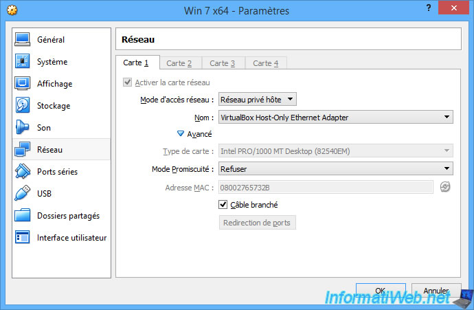

# 2 - Réseau privé hôte

## 2.1 - Présentation

Le mode "Réseau privé hôte" permet de **créer un réseau entre la machine virtuelle et la machine physique**.

Lorsque vous sélectionnez le mode "Réseau privé hôte", VirtualBox vous permet de sélectionner quelle interface réseau virtuelle il devra utiliser pour connecter cette machine virtuelle à la machine physique.

Ce qui veut dire que votre machine virtuelle ne pourra communiquer qu'avec la machine hôte et qu'elle n'aura pas accès à Internet. D'ailleurs, il est impossible d'accéder à Internet sans connaitre la passerelle. De plus, sans serveur DNS, impossible de connaitre l'adresse IP correspondant à un nom de domaine comme google.com.

Pour changer les paramètres du mode "Réseau privé hôte", il suffit d'accéder aux propriétés de l'adaptateur réseau : VirtualBox Host-Only Ethernet Adapter.

Pour cela, dans VirtualBox, cliquez sur : File -\> Host Network Manager.

Ensuite, sélectionnez l'adaptateur réseau "VirtualBox Host-Only Ethernet Adapter" et cliquez sur l'icône "Properties".

Dans l'onglet "Serveur DHCP", vous pourrez changer la plage d'adresses IP à distribuer si vous le souhaitez.

Comme prévu, la machine virtuelle n'a pas accès à Internet via ce mode d'accès réseau.

En effet, elle ne peut parler qu'avec la machine hôte (votre PC physique).

**
## 2.2 - Travail à faire

Effectuez les tests ou configurations nécessaires pour répondre aux questions suivantes :

- votre machine virtuelle a-t-elle reçu une configuration réseau de la part du serveur DHCP de votre réseau local ?
Non

- De qui a-t-elle reçu une configuration réseau ?
De la part de virtualbox

- Comment le vérifier ?

Avec IP config /all dans la VM et dans l'outil gestionnaire de réseau dans network manager de Virtualbox
- Où modifier ce paramètres dans le Gestionnaire de réseau de Virtual Box ?
dans l'outil gestionnaire de réseau dans network manager de Virtualbox
- Modifiez-les et vérifiez le résultat (ne pas modifier la carte existante mais en créer une nouvelle)

- Pouvez-vous accéder aux services hébergés sur votre machine virtuelle comme si votre machine virtuelle était une vraie machine :
depuis la machine hôte ?

Oui

depuis une autre machine physique ? (rappel : IIS est installé dans votre VM)

Non

- votre machine virtuelle peut-elle accéder aux machines du réseau physique, aux autres machines virtuelles et à Internet ? (rappel : IIS est installé dans l'autre VM)
Non
