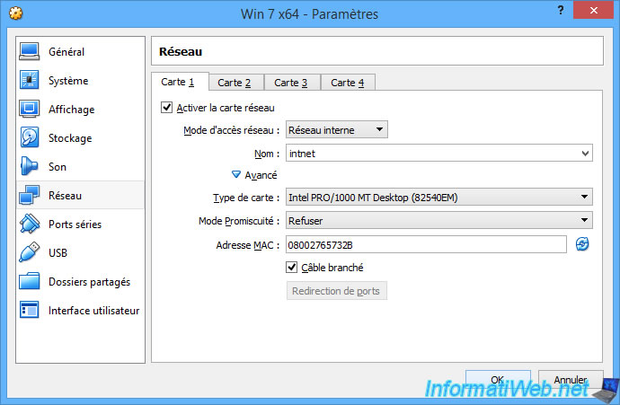

# 3 - Réseau interne

## 3.1 - Présentation

Comme son nom l'indique, le mode d'accès réseau "Réseau interne" permet de créer un réseau interne pour interconnecter vos machines virtuelles entre elles.

Ce qui veut aussi dire que vos machines virtuelles n'auront pas accès à Internet et elles ne recevront pas de configuration réseau (adresse IP, masque, passerelle, DNS) non plus, car il n'y a pas de serveur DHCP pour ce type de réseau.

Pour résumer, cela revient à brancher vos machines virtuelles sur un simple switch (un genre de multi-prises, mais pour les câbles réseau). Il n'y a donc pas de passerelle (ni d'accès à Internet) ni de distribution d'adresse IP (car il n'y a pas de serveur DHCP dans les switchs).

Comme dit précédemment, lorsque vous choisissez ce type de réseau, votre machine virtuelle ne recevra aucune adresse IP.

Windows lui attribuera donc automatiquement une adresse IP APIPA (Automatic Private Internet Protocol Addressing).

En d'autres termes, comme votre machine virtuelle n'a pas reçu d'adresse IP et que vous ne lui avez pas défini d'adresse IP statique, Windows lui assignera une adresse IP au hasard qui commencera par 169.254.x.x.

Pour vous expliquer comment utiliser ce type de réseau, nous avons créé une seconde machine virtuelle et nous l'avons aussi connecté sur le même réseau interne : intnet.

Pour que 2 machines puissent communiquer ensemble, il faut que celles-ci possèdent une adresse IP dans la même plage d'adresses IP.

Dans notre cas, nous allons attribuer :
- l'adresse IP "192.168.1.11" à notre 1ère VM
- l'adresse IP "192.168.1.12" à notre 2ème VM
- le masque de sous-réseau "255.255.255.0" pour nos 2 VM

VM 1 :

VM 2 :

Par défaut, étant donné qu'il n'y a pas de passerelle de définie sur les cartes réseau de nos machines virtuelles, il est possible que Windows choisisse "Réseau public" par défaut à cause de la mention "Réseau non identifié".

Par défaut, les communications sur le réseau local sont autorisées pour les réseaux de type : Domestique / entreprise (privé).

Pour que notre 1ère VM soit accessible depuis la 2ème VM, vous devrez :
- Autoriser les communications pour les réseaux publics
- ou mieux : changer le type de réseau détecté par Windows.

Pour changer le type de réseau en privé, ouvrez le programme : Stratégie de sécurité locale.

Allez dans "Stratégies du gestionnaire de liste de réseaux" et faites un double-clic sur : Réseaux non identifiés.

Sélectionnez :
- type d'emplacement : Privé
- autorisation des utilisateurs : L'utilisateur peut changer l'emplacement
Puis, cliquez sur OK et fermez le programme "Stratégie de sécurité locale".

Ensuite, désactivez la carte réseau de votre machine virtuelle, puis réactivez-la.

Maintenant, Windows identifiera par défaut votre réseau non identifié en tant que : Réseau de bureau.

Ce qui autorisera l'accès à distance aux services dans votre machine virtuelle.

Maintenant, nous avons accès à notre 1ère machine virtuelle depuis notre 2ème machine virtuelle et inversement.

## 3.2 - Travail à faire

- Configurez deux machines virtuelles en mode réseau interne, et connectez-les sur un switch virtuel appelé SW-TP.

- Configurez les cartes réseau de vos machines virtuelles en adressage statique dans le réseau 172.16.0.0.

- Proposez et effectuez les tests nécessaires pour répondre aux questions suivantes :

- les machines virtuelles peuvent-elles communiquer entre elles ?
- pouvez-vous accéder à vos machines virtuelles depuis une machine physique du réseau physique ?
- pouvez-vous accéder à vos machines virtuelles depuis la machine hôte ?
- votre machine virtuelle peut-elle accéder à la machine hôte ?
- votre machine virtuelle peut-elle accéder aux machines du réseau physique et à Internet ?

- Quel sont les résultats ? Qu'observez-vous ? Que pouvez-vous en conclure ?

